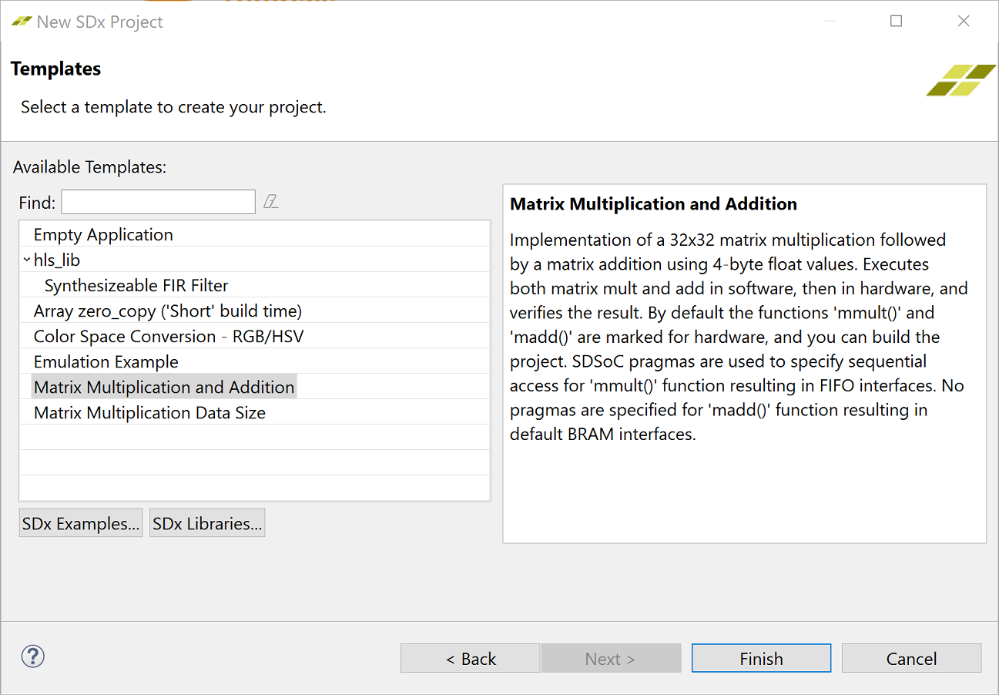
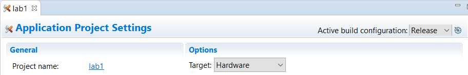
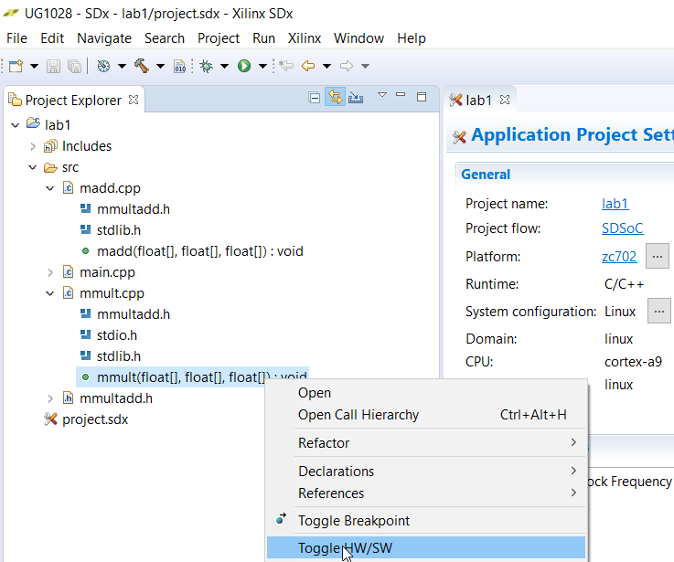

<a href="../../getting-started-tutorial/README.md">English</a> | <a>日本語</a>

<table style="width:100%">
  <tr>
<td align="center" width="100%" colspan="6"><h1>2018.3 SDSoC™ 開発環境チュートリアル</h1>
<a href="https://github.com/Xilinx/SDSoC-Tutorials/branches/all">ほかのバージョンを参照</a>
</td>
  </tr>
  <tr>
    <td colspan="5" align="center"><h2>概要</h2></td>
  <tr>
    <td align="center"><a href="README.md">概要</a></td>
    <td align="center">演習 1: SDSoC 開発環境の概要</td>
    <td align="center"><a href="lab-2-performance-estimation.md">演習 2: パフォーマンスの見積もり</a></td>
    <td align="center"><a href="lab-3-optimize-the-application-code.md">演習 3: アプリケーション コードの最適化</a></td>
    <td align="center"><a href="lab-4-optimize-the-accelerator-using-directives.md">演習 4: 指示子を使用したアクセラレータの最適化</a></td>
  </tr>
  <tr>
    <td align="center"><a href="lab-5-task-level-pipelining.md">演習 5: タスク レベルのパイプライン</a></td>
    <td align="center"><a href="lab-6-debug.md">演習 6: デバッグ</a></td>
    <td align="center"><a href="lab-7-hardware-debug.md">演習 7: ハードウェア デバッグ</a></td>
    <td align="center"><a href="lab-8-emulation.md">演習 8: エミュレーション</a></td>
    <td align="center"><a href="lab-9-installing-applications-from-github.md">演習 9: GitHub からのサンプルのインストール</a></td>
    </tr>
</table>

## 演習 1: SDSoC 開発環境の概要  

この演習では、SDSoC 環境でテンプレートを使用して新しいプロジェクトを作成し、ハードウェア インプリメンテーション用の関数をマークし、ハードウェアでインプリメントされるデザインをビルドし、ZC702 でプロジェクトを実行します。  

>**:pushpin: 注記:**  このチュートリアルは、ZC702 ボードがなくても終了できます。SDSoC プロジェクトを作成する際に、推奨されている [Matrix Multiplication and Addition] テンプレートが見つからない場合は、ボードと使用可能なテンプレートの 1 つを選択してください。たとえば、より小型の Zynq-7000 デバイスを含む MicroZed ボードなどのボードの場合、使用可能なテンプレートに [Matrix Multiplication and Addition (area reduced)] アプリケーションがリストされます。このチュートリアルの学習目標は、アプリケーションが存在していれば、別のアプリケーションを使用しても達成できます。アプリケーションは、ボードで実装済みアプリケーションを実行して、ソフトウェア ランタイム データの収集するために必ず必要です。設定情報の詳細は、ご使用のボードの資料を参照してください。

<strong>手順 1: 新規プロジェクトの作成</strong>

  1. デスクトップ アイコンをダブルクリックするか [スタート] メニューを使用して、SDx IDE 2018.2 を起動します。

  2. [Workspace Launcher] ダイアログ ボックスが表示されます。[Browse] をクリックしてプロジェクトを保存するワークスペース フォルダーを選択し、[OK] をクリックします。  

  3. SDx IDE 環境のメイン ウィンドウが表示されます。新しいワークスペースを作成した場合は、[Welcome] タブが表示されます。このタブには、[Create SDx Project]、[Add Custom Platform]、[Import Project]、[Tutorials]、および [Web Resources] などのリンクが含まれます。これらのリンクのいずれかをクリックすると、各リンクの下に使用可能なオプションがさらに表示されます。たとえば、資料およびチュートリアルを入手するには、[Tutorials] をクリックすると、SDSoC および SDAccel の関連資料へのリンクを含むチュートリアル ページが表示されます。[Welcome] タブは、[X] をクリックして閉じるか、[Minimize] アイコンをクリックして最小化できます。  

  4. SDx IDE メニュー バーから [File] → [New] → [SDx Project] をクリックします。[New SDx Project] ダイアログ ボックスが開きます。  

       

  5. デフォルトでは [Application] プロジェクトがオンになっています。[Next] をクリックします。  

  6. [Create a New SDx Project] ページでプロジェクトの名前 (`lab1`) を入力します。  

  7. [Next] をクリックします。  

  8. [Platform] ページから zc702 プラットフォームを選択します。  

       

     >**:pushpin: 注記:**  カスタム プラットフォームを使用する場合は、サポートされるプラットフォームにはリストされないので、[Add Custom Platform] をクリックしてカスタム プラットフォームを追加します。  

  9. [Next] をクリックします。  

  10. [System configuration] ドロップダウン リストから [Linux] を選択し、その他のフィールドはすべてデフォルトのままにしておきます。  

        

  11. [Next] をクリックします。  
      選択したプラットフォーム用のソース コード例をリストする [Templates] ページが表示されます。  

  12. [Available Templates] のリストから [Matrix Multiplication and Addition] を選択し、[Finish] をクリックします。  

        

  13. 標準ビルド コンフィギュレーションは [Debug] および [Release] で、追加のビルド コンフィギュレーションも作成できます。最高のランタイム パフォーマンスにするには、[Release] コンフィギュレーションに切り替えます。[Release] ビルド コンフィギュレーションでは、[Debug] ビルド コンフィギュレーションよりも高いコンパイラ最適化設定が使用されます。[Sdx Project Settings] では、アクティブ コンフィギュレーションを選択したり、ビルド コンフィギュレーションを作成したりできます。  
      [Build] アイコンには、ビルド コンフィギュレーションを選択するドロップダウン リストがあります。[Build] アイコンをクリックすると、プロジェクトがビルドされます。  
        
      [Project Explorer] ビューでプロジェクトを右クリックし、ビルド コンフィギュレーションを選択できます。  
        
      [SDx Project Settings] での [Build Configuration] ドロップダウンで、アクティブ コンフィギュレーションを選択したり、ビルド コンフィギュレーションを作成したりできます。
        
      [SDx Project Settings] にプロジェクト設定のサマリが表示されます。  

      SDx アプリケーションをビルドする際は、ビルド コンフィギュレーション (ツール設定、フォルダー、ファイルなどのコレクション) を使用します。各ビルド コンフィギュレーションの目的は異なります。[Debug] ビルドでは、ELF (コンパイルおよびリンク済みプログラム) にデバッガーを実行するのに必要な 追加情報を含めてアプリケーションがビルドされます。ELF ファイルのデバッグ情報により、ファイル サイズが増加し、アプリケーション情報が表示されるようになります。[Release] ビルドでは、同じ ELF ファイルが Debug コンフィギュレーションとして提供されますが、デバッグ情報が含まれない点が異なります。ビルド コンフィギュレーションに対して [Estimate Performance] をオンにし、そのビルド コンフィギュレーションを使用してアプリケーションのパフォーマンス見積もりを実行するモードを実行するには、別の設定および手順が必要となります。詳細は、[演習 2: パフォーマンスの見積もり](lab-2-performance-estimation.md)を参照してください。

<strong>手順 2: ハードウェア インプリメンテーション用の関数のマーク</strong>

このアプリケーションには、2 つのハードウェア関数が含まれます。1 つは `mmult` で、2 つの行列を乗算して行列積を算出します。もう 1 つは `madd` で、2 つの行列を加算して行列和を算出します。これらのハードウェア関数がまとめられ、行列の乗加算関数を計算します。`mmult` と `madd` の両方の関数をハードウェアでインプリメントされるように指定します。  

テンプレートからプロジェクトを作成すると、ハードウェア関数が自動的に指定されます。ハードウェア関数が削除されたり、指定されていない場合は、次の手順でハードウェア関数を追加します。  

>**:pushpin: 注記:**  この演習では、ハードウェア用に関数をマークする必要はありません。行列乗算と加算のテンプレート コードは既にハードウェア用にマークされています。`madd` および `mmult` 関数がハードウェア関数としてマークされていない場合は、次の手順でそれらをハードウェア関数としてマークできます。

  1. [SDx Project Settings] では、プロジェクトの値を設定できます。[lab1] タブをクリックし (タブが開いていない場合は、[Project Explorer] ビューで 1 ファイルをダブルクリック)、[HW functions] パネルで [Add HW Functions]  をクリックしてハードウェア関数を指定するダイアログ ボックスを開きます。  

  2. [Matching items] リストで Ctrl キーを押しながら `mmult` と `madd` 関数をクリックして選択します。[OK] をクリックして、両方の関数を [Hardware Functions] セクションに追加します。  

       

     または、[Project Explorer] タブで `mmult.cpp` および `madd.cpp` を展開表示し、`mmult` および `madd` 関数を右クリックして [Toggle HW/SW] をクリックします。関数が既にハードウェア用にマークされている場合は、[Project Explorer] に `mmult(float[], float[], float[]): void [H]` 関数が表示されます。ソース ファイルをエディターで開いている場合は、[Outline] タブでハードウェア関数を選択することもできます。  

       

<strong>手順 3: ハードウェア アクセラレータを使用したデザインのビルド</strong>
  

  プロジェクトをビルドして実行ファイル、ビットストリーム、SD カード ブート イメージを生成するには、次の手順に従います。  

  1. [Project Explorer] タブで [lab1] を右クリックし、[Build Project] をクリックします。   

     SDSoC システム コンパイラの標準出力 (stdout が [Console] タブに表示されます。ハードウェア用に選択された関数が Vivado® HLS を使用して IP ブロックにコンパイルされ、選択したベース プラットフォームに基づいて生成された Vivado ツール ハードウェア システムに統合されます。この後、システム コンパイラにより Vivado 合成、配置配線ツールが起動されてビットストリームがビルドされ、ARM GNU コンパイラとリンカーが起動されて、アプリケーション ELF 実行ファイルが生成されます。   

  2. [Assistant] ビューの [Project Explorer] の下で [Data Motion Network Report] をダブルクリックして開きます。  
     このレポートには、SDx システム コンパイラにで作成された接続と、ハードウェアにインプリメントされた各関数のデータ転送タイプが示されます。詳細は、[演習 3: アプリケーション コードの最適化](lab-3-optimize-the-application-code.md)を参照してください。  
       

  3. `lab1/Release/_sds/swstubs/mmult.cpp` を開き、SDx システム コンパイラにより元の `mmult` 関数が `cf_send_i` および `cf_wait` 関数を使用した FPGA に対して入出力転送を実行する `_p0_mmult_1_noasync` という関数に置き換えられたことを確認します。`mmult` への呼び出しも `lab1/Release/_sds/swstubs/main.cpp` 内の `_p0_mmult_1_noasync` に置き換えられます。SDx システム コンパイラで、これらの記述し直されたソース ファイルを使用してハードウェア関数にアクセスする ELF がビルドされます。   

  

  

  
<strong>手順 4: プロジェクトの実行</strong>

  ZC702 ボードでプロジェクトを実行する手順は、次のとおりです。  

  1. [Project Explorer] タブで `lab1/Release` を展開表示し、`sd_card` ディレクトリ内のすべてのファイルを SD カードのルート ディレクトリにコピーします。  

  2. SD カードを ZC702 に挿入し、ボードに電源を投入します。  

  3. [SDx Terminal] タブでシリアル ターミナルからボードに接続します。または、[Baud Rate]: 115200、[Data bits]: 8、[Stop bits]: 1、[Parity]: None、[Flow Control]: None に設定した Putty/Teraterm を介して接続します。 アイコンをクリックして設定を開きます。   

       

  4. [Connect to serial port] ウィンドウの設定はそのままで [OK] をクリックします。  

  5. ボードが起動したら、Linux プロンプトでアプリケーションを実行します。`/mnt/lab1.elf` と入力します。  

       

  >**:pushpin: 注記:**  関数がハードウェアでアクセラレーションされる場合、スピードアップが 8 倍になります。プロセッサで実行されるアプリケーションは 18 万 4 千サイクルかかりますが、プロセッサと FPGA 両方で実行されるアプリケーションは 2 万 2 千サイクルかかります。  

  

<strong>手順 5: その他の演習</strong>

* `Release/_sds` フォルダー内のreport フォルダーを確認してください。このフォルダーには、複数のログ ファイルとレポート ファイル (.rpt) があり、ビルドにより起動されたすべてのツールからの詳細なログおよびレポートが含まれます。  
* Vivado&reg; インテグレーターについて詳しい場合は、[Project Explorer] タブで `Release/_sds/p0/vivado/prj/prj.xpr` をダブルクリックしてください。これは、アプリケーション ソース コードから生成されたハードウェア デザインです。ブロック図を開いて、生成された IP ブロックを確認してみてください。

### まとめ  
このチュートリアルを終了すると、次ができるようになります。

  * 多くの使用可能なプラットフォームおよびプロジェクト テンプレートから、ユーザー アプリケーション用の新しい SDSoC 環境プロジェクトを作成。  
  * ハードウェア インプリメンテーション用の関数をマーク。  
  * ハードウェアにインプリメントされる関数を含むビットストリームと、このハードウェアでインプリメントされる関数を開始する実行ファイルを生成するプロジェクトをビルド。  

Copyright&copy; 2018 Xilinx

この資料は表記のバージョンの英語版を翻訳したもので、内容に相違が生じる場合には原文を優先します。資料によっては英語版の更新に対応していないものがあります。日本語版は参考用としてご使用の上、最新情報につきましては、必ず最新英語版をご参照ください。
