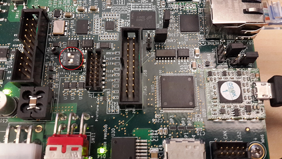
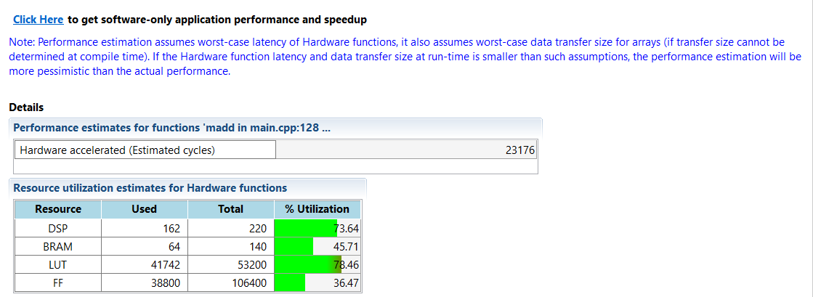

<a href="../../getting-started-tutorial/README.md">English</a> | <a>日本語</a>

<table style="width:100%">
  <tr>
<td align="center" width="100%" colspan="6"><h1>2018.3 SDSoC™ 開発環境チュートリアル</h1>
<a href="https://github.com/Xilinx/SDSoC-Tutorials/branches/all">ほかのバージョンを参照</a>
</td>
  </tr>
  <tr>
    <td colspan="5" align="center"><h2>概要</h2></td>
  <tr>
    <td align="center"><a href="README.md">概要</a></td>
    <td align="center"><a href="lab-1-introduction-to-the-sdsoc-development-environment.md">演習 1: SDSoC 開発環境の概要</a></td>
    <td align="center">演習 2: パフォーマンスの見積もり</td>
    <td align="center"><a href="lab-3-optimize-the-application-code.md">演習 3: アプリケーション コードの最適化</a></td>
    <td align="center"><a href="lab-4-optimize-the-accelerator-using-directives.md">演習 4: 指示子を使用したアクセラレータの最適化</a></td>
  </tr>
  <tr>
    <td align="center"><a href="lab-5-task-level-pipelining.md">演習 5: タスク レベルのパイプライン</a></td>
    <td align="center"><a href="lab-6-debug.md">演習 6: デバッグ</a></td>
    <td align="center"><a href="lab-7-hardware-debug.md">演習 7: ハードウェア デバッグ</a></td>
    <td align="center"><a href="lab-8-emulation.md">演習 8: エミュレーション</a></td>
    <td align="center"><a href="lab-9-installing-applications-from-github.md">演習 9: GitHub からのサンプルのインストール</a></td>
    </tr>
</table>

## 演習 2: パフォーマンスの見積もり  

このチュートリアルでは、ビルド サイクル全体を実行せずに、アプリケーションのパフォーマンスを見積もる方法について説明します。  

>**:pushpin: 注記:**  このチュートリアルは、ZC702 ボードがなくても終了できます。SDSoC プロジェクトを作成する際に、推奨されている [Matrix Multiplication and Addition] テンプレートが見つからない場合は、ボードと使用可能なテンプレートの 1 つを選択してください。たとえば、より小型の Zynq-7000 デバイスを含む MicroZed ボードなどのボードの場合、使用可能なテンプレートに [Matrix Multiplication and Addition (area reduced)] アプリケーションがリストされます。このチュートリアルの学習目標は、アプリケーションが存在していれば、別のアプリケーションを使用しても達成できます。アプリケーションは、ボードで実装済みアプリケーションを実行して、ソフトウェア ランタイム データの収集するために必ず必要です。設定情報の詳細は、ご使用のボードの資料を参照してください。

<strong>手順 1: ボードの設定</strong>

ボードの UART ポートに接続するには mini USB ケーブルが必要です。これにより SDx IDE のシリアル ターミナルに通信できるようになります。この接続は、アプリケーション ソフトウェアからの出力 (情報メッセージを含む) を確認するのに必要です。ボードの Digilent ポートに接続するには Micro USB ケーブルも必要で、これによりビットストリームおよびバイナリをダウンロードできます。この接続は、ターゲット ボードでアプリケーションが起動される際に FPGA をプログラムするために必要です。イーサネット ケーブルも必要です。Linux TCF エージェントには、ターゲット ボードと通信するのにイーサネット リンクが必要です。最後に、SD カードから起動できるように、SD カード スロットのサイドのジャンパーが正しく設定されているかどうか確認します。  

  1. mini USB ケーブルを UART ポートに接続します。  

  2. JTAG モードが Digilent ケーブルを使用するように設定されており、Micro USB ケーブルが接続されていることを確認します。  

         

  3. DIP スイッチ (上の図の赤丸) を SD ブート モードに設定します。SD カードは挿入しないでください。  

  4. ボードに電源を投入します。  

     Windows で USB-UART ドライバーと Digilent ドライバーがインストールされるようにし、SDx IDE がボードと通信できるようにします。  

     >**:warning: 重要:** ボードのジャンパーが SD ブートまたは JTAG ブートに設定されていることを確認します。このようにしておかないと、ボードが QSPI ブートなどのその他のモードでパワーアップし、QSPI デバイスまたはその他のブート デバイスからこの演習に関係のないものが読み込まれてしまいます。

<strong>手順 2: パフォーマンス見積もりおよびプロジェクト ビルド用のプロジェクトのセットアップ</strong>

ビルド コンフィギュレーションにプロジェクトを作成して [Estimate Performance] オプションを作成する手順は、次のとおりです。  

  1. [Matrix Multiplication and Addition] デザイン テンプレートを使用して、プラットフォームに [zc702]、システム コンフィギュレーションに [Standalone] を選択して新しい SDx™ IDE 2018.2 プロジェクト (`lab2`) を作成します。  

  2. [lab] タブをクリックして [SDx Project Settings] を開きます。タブが表示されていない場合は、[Project Explorer] タブの [lab2] プロジェクトの下の project.sdx ファイルをダブルクリックします。  

  3. [HW functions] パネルで `madd` および `mmult` 関数が既にハードウェア用にマークされていることを確認します。SDx 環境のテンプレート プロジェクトには、ハードウェア関数をマークするプロセスを自動化するための情報が含まれています。

  4. [HW functions] パネルに関数がリストされていない場合は、[Add HW Function] アイコン  をクリックして、ハードウェア関数を指定するダイアログ ボックスを起動します。[Matching elements] で Ctrl キーを押しながら `madd` および `mmult` 関数をクリックし、[Qualified name and location] リストの表示されるようにします。  

  5. 使用可能なコンフィギュレーションを選択したり、新しいコンフィギュレーションを作成したりできます。新しいコンフィギュレーションは既存のコンフィギュレーションを基に作成したり、最初から作成したりできます。[Debug] ビルド コンフィギュレーションまたは [Debug] からコピーした別のビルド コンフィギュレーションを使用すると、GCC を使用して -O0 でコードがコンパイルされるので、ソフトウェア パフォーマンスがかなり低下します。この演習では、[Debug] コンフィギュレーション  を選択します。  

     >**:pushpin: 注記:**  パフォーマンス見積もりは、どのビルド コンフィギュレーションを使用しても実行できます。アクティブ コンフィギュレーションに [Debug] または [Release] コンフィギュレーションを選択する代わりに、[Active build configuration] の隣の [Manage build configuration for the project] アイコンをクリックすることもできます。  

       

  6. [SDx Project Settings] の [Options] パネルで [Estimate Performance] をオンにします。これによりパフォーマンス見積もりフローがオンになります。  

  7. [Build] ツールバー ボタンには、ビルド コンフィギュレーションを選択するドロップダウン リストがあります。[Build] アイコンをクリックすると、プロジェクトがビルドされます。[Estimate Performance] オプションをオンにしている場合は、パフォーマンスの見積もりも実行されます。ツールバーの [Build] ボタンをクリックします。  

     SDx IDE でプロジェクトがビルドされます。ビルド プロセスのステータスを示すダイアログ ボックスが表示されます。  

     ビルドが完了したら、初期レポートを表示できます。このレポートには、ハードウェアのみの見積もりサマリが含まれ、リンクをクリックすると、ソフトウェアの実行データを取得できます。これにより、ハードウェア インプリメンテーションとソフトウェアのみの情報が比較されてレポートがアップデートされます。この段階では、ハードウェア関数はハードウェアで実行されていません。  

        

<strong>手順 3: ソフトウェアとハードウェアのパフォーマンス比較</strong>

>**:warning: 重要:**このセクションの手順を実行する前に、ボードのスイッチがオンになっていることを確認してください。  

ソフトウェア実行データを収集してパフォーマンス見積もりレポートを生成するには、次の手順に従います。  

  1. ビルドが終了したら、[SDSoC Report Viewer] タブが開きます。  

  2. [Click Here] リンクをクリックして、ボードのアプリケーションを起動します。   
     [Run application to get its performance] ダイアログ ボックスが表示されます。  

  3. 既存の接続を選択するか、新しい接続を作成してターゲット ボードに接続します。  
       

  4. [OK] をクリックします。  
     デバッガーによりシステムが利せてとされ、FPGA がプログラムされて初期化され、アプリケーションのソフトウェアのみのバージョンが実行されます。この後、パフォーマンス データが収集されて、パフォーマンス見積もりレポートを表示するのに使用されます。  
       

     >**:pushpin: 注記**  *[Summary] セクションには、ハードウェアで関数をアクセラレーションすることによる全体的なスピードアップ見積もりは 2.14 と記述されます。[Details] セクションには、関数自体がソフトウェアではなくハードウェアで実行される場合、56 倍のスピードアップになることが記述されます。  

<strong>手順 4: 全体的なスピードアップ比較のスコープ変更</strong>
  

パフォーマンス、スピードアップ、およびリソース見積もりレポートのサマリには、最上位関数 (perf root) のスピードアップの見積もりが示されます。この関数は、デフォルトで main に設定されますが、たとえばバッファーの割り当て、初期化、設定など、この比較から除外するコードがあることもあります。その他の関数を考慮する際に全体的なスピードアップを確認する場合は、パフォーマンス見積もりフローのルートとして別の関数を指定します。このフローは、ハードウェア アクセラレーションに選択したすべての関数がルートの子である場合に使用できます。  

  1. ルート関数を別の関数に変更する場合は、[SDx Project Settings] ウィンドウで [Root function] フィールドの参照ボタンをクリックし、見積もりフローのルートを **main** ではなく別の関数に変更します。  
     次の図に示すように、その関数のアイコンの左上に小さな R が表示されます。選択した関数は、ハードウェア アクセラレーションに選択された関数の親です。  

       

  2. [Project Explorer] タブでプロジェクトを右クリックして [Clean Project] をクリックし、[Build Project] をクリックします。[SDx Project Settings] で [Estimate performance] をオンにし、見積もりレポートを生成し直して、選択した関数の基づいて全体的なスピードアップの見積もりを取得します。    

<strong>手順 5: その他の演習</strong>

>**:pushpin: 注記:**  このセクションの手順は、オプションです。  

アプリケーションのターゲット OS として Linux を使用する場合に、パフォーマンス見積もりフローを使用する方法について説明します。Linux でパフォーマンス見積もりフローを使用する手順は、次のとおりです。  

  1. [Matrix Multiplication and Addition] デザイン テンプレートを使用して、プラットフォームを [zc702]、システム コンフィギュレーションを [Linux SMP] に指定して、新しい SDx™ IDE プロジェクト (`lab2_linux`) を作成します。  

  2. [lab2_linux] タブをクリックします。タブが表示されていない場合は [Project Explorer] タブで lab2_linux プロジェクトの project.sdx をダブルクリックします。[HW functions] パネルで `madd` および `mmult` 関数が既にハードウェア用にマークされていることを確認します。SDx 環境のテンプレート プロジェクトには、ハードウェア関数をマークするプロセスを自動化するための情報が含まれています。  

  3. [HW functions] パネルに関数がリストされていない場合は、[Add HW Functions] アイコン  をクリックして、ハードウェア関数を指定するダイアログ ボックスを起動します。[Matching items] で Ctrl キーを押しながら `madd` および `mmult` 関数をクリックし、[Qualified name and location] リストの表示されるようにします。   

  4. [SDx Project Settings] の [Options] パネルで [Estimate performance] をオンにします。これにより、現在のビルド コンフィギュレーションでパフォーマンス見積もりフローがオンになります。  

  5. [Build] アイコンには、ビルド コンフィギュレーションを選択するドロップダウン リストがあります。[Build] アイコンをクリックするとプロジェクトがビルドされ、[Estimate performance] がオンになっているとパフォーマンス見積もりフローが実行されます。[Build] をクリックします。  

     SDx IDE でプロジェクトがビルドされます。ビルド プロセスのステータスを示すダイアログ ボックスが表示されます。  

  6. この演習には、ボードに接続されたイーサネット ケーブルも必要です。ボードがイーサネット ケーブルを使用してイーサネット ルーターに接続されているか、コンピューターのイーサネット ポートに直接接続されていることを確認します。まず、ビルド コンフィギュレーションの下の sd_card フォルダーの内容を SD カードにコピーして、ボードを起動します。シリアル ターミナルも接続されていることを確認します。  

     >**:pushpin: 注記:  **シリアル ポートの設定は、115200、8-N-1、ハードウェア フロー制御なしにします。ZC702 の場合、Windows デバイス マネージャーまたは TeraTerm ターミナル エミュレーション プログラムと同じように、これらの設定を Silicon Labs CP210x USB to UART Bridge に接続された Host PC COM ポートに適用します。  

  7. Linux のブート ログがターミナルに表示されます。ボードのイーサネットを設定します。  

     1. ネットワークに接続されているボードがある場合は、「Sending select for 172.19.73.248…Lease of 172.19.73.248 obtained」のような、ボードに割り当てられた IP アドレスがレポートされている行を見つけます。ターミナルで「ifconfig」と入力しても、ターゲット ボードの IP アドレスを入手できます。ifconfig eth0 コマンドを使用する場合、inet addr フィールドの隣に表示される番号がターゲット ボードの Linux IP アドレスです。  
     2. コンピューターにイーサネット ケーブルが直接接続されている場合は、IP アドレスを正しく設定する必要があります。コンピューターは、イーサネット アダプターが ZC702 ボードと同じサブネットワークにあるように設定する必要があります。Windows ホスト システムで [コントロール パネル] → [ネットワークと共有センター] をクリックし、Ethernet リンクをクリックして、イーサネット アダプターの [Ethernet Status] ダイアログ ボックスを開きます。[プロパティ] ボタンをクリックします。[インターネット プロトコル バージョン 4 (TCP/IPv4)] を選択し、[プロパティ] ボタンをクリックします。[全般] タブで [次の IP アドレスを使う] をオンにして `192.168.0.1` と入力します。サブネット マスクに対して 255.255.255.0 と入力します。[OK] をクリックします。すべてのダイアログ ボックスを閉じます。ターゲット ボードで IP アドレスを設定するには、ウィンドウの右下の [Terminal 1] タブをクリックしてターミナルに接続します。緑の接続アイコンをクリックして、ターミナルをターゲット ボードに接続します。シリアル ポートの設定は、適切な COM ポートで、[Baud Rate] を 115200、[Data bits] を 8、[Stop Bits] を 1、[Parity] を None、[Flow Control] を None にします。Linux ブート ログがターミナルに表示されます。ターミナル プロンプトが表示されたら、「ifconfig eth0 192.168.0.2」と入力して IP アドレスを設定します。  

        >**:pushpin: 注記:**  このアドレスは、次の手順で使用します。プロンプトのターミナル ウィンドウでスクロールしてもこの文が見つからない場合は、`ifconfig` コマンドを実行すると、ボードの IP アドレスを取得できます。  

  8. SDx IDE に戻り、[Target Connections] タブで [Linux TCF Agent] を展開表示して [Linux Agent (default)] を右クリックし、[Edit] をクリックします。  

  9. [Target Connection Details] ダイアログ ボックスで IP アドレス (次に示すようなターゲット ボードの IP アドレス、またはターゲット ボードが直接コンピューターに接続されている場合は 192.168.0.2) とポート (1534) を設定して [OK] をクリックします。  

       

     >**:pushpin: 注記:**  [Host] フィールドには、TCF エージェントを実行するターゲット ボードの IP アドレスが含まれます。  

  10. [SDSoC Report Viewer] タブを開きます。  

  11. [Click Here] リンクをクリックして、ボードのアプリケーションを起動します。  
      [Run application to get its performance] ダイアログ ボックスが表示されます。  

  12. [Linux Agent] 接続を選択し、[OK] をクリックします。  
      SDx IDE でアプリケーションのソフトウェアのみのバージョンが実行されます。この後、パフォーマンス データが収集されて、パフォーマンス見積もりレポートを表示するのに使用されます。

### まとめ  

このチュートリアルを終了すると、SDSoC 環境を使用して、ハードウェアにインプリメントされた関数の選択に基づいてスピードアップを見積もることができるようになります。  

Copyright&copy; 2019-2019 Xilinx

この資料は表記のバージョンの英語版を翻訳したもので、内容に相違が生じる場合には原文を優先します。資料によっては英語版の更新に対応していないものがあります。日本語版は参考用としてご使用の上、最新情報につきましては、必ず最新英語版をご参照ください。