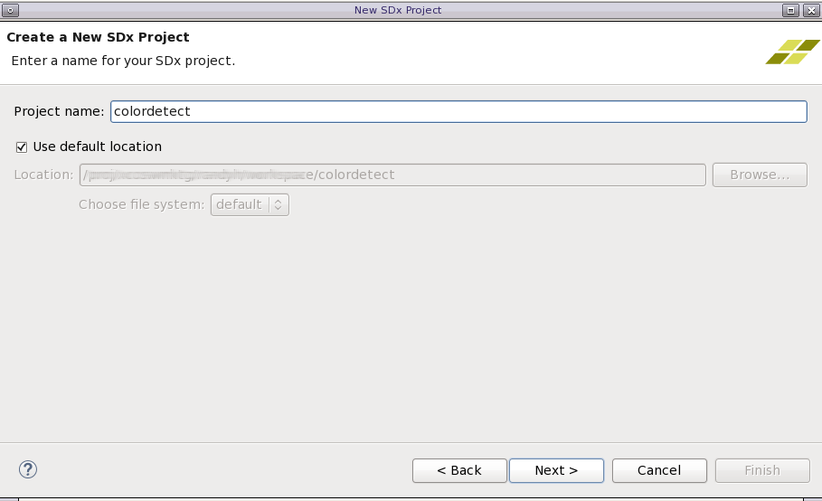
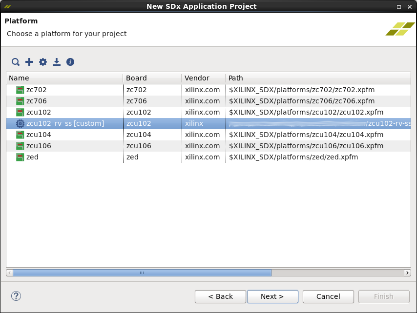
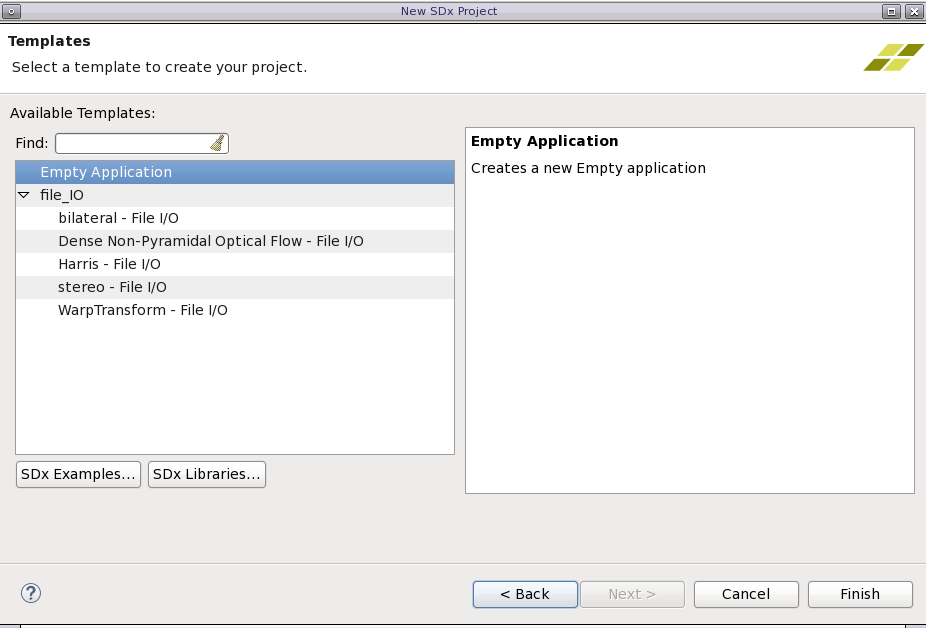
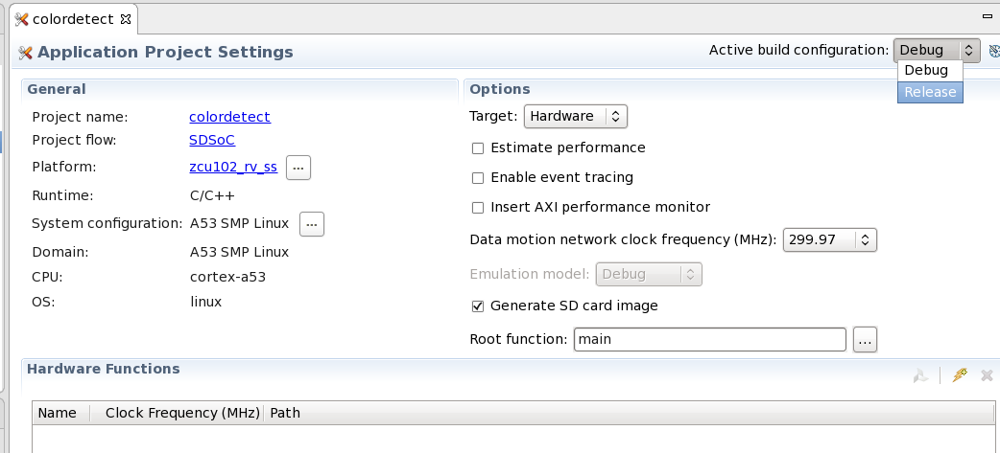
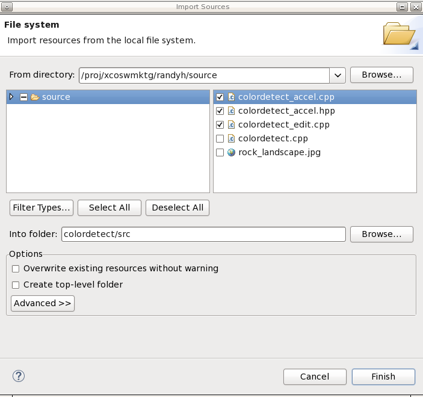
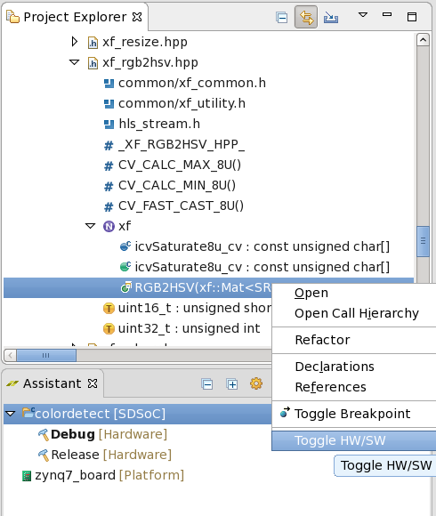
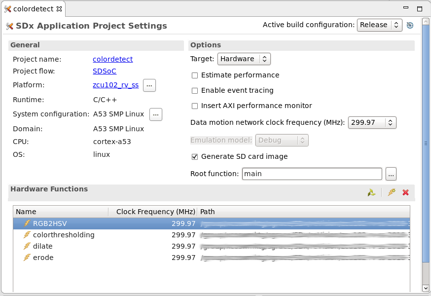
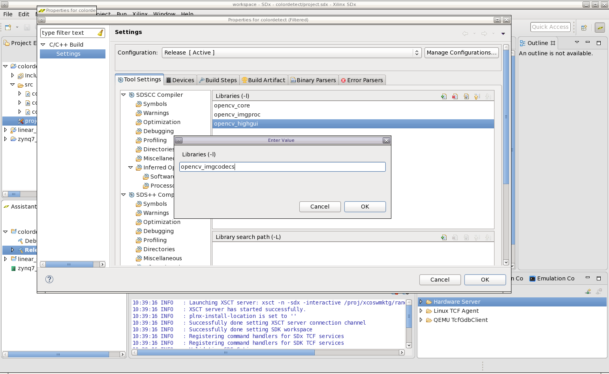

<p align="right">
<a href="../../opencv-to-xfopencv-migration-tutorial/README.md">English</a> | 日本語
</p>

<table style="width:100%">
  <tr>
<td align="center" width="100%" colspan="6"><h1>2018.3 SDSoC™ 開発環境チュートリアル</h1>
<a href="https://github.com/Xilinx/SDSoC-Tutorials/branches/all">ほかのバージョンを参照</a>
</td>

  </tr>
  <tr>
    <td colspan="4" align="center"><h2>OpenCV から xfOpenCV への移行</h2></td>
  </tr>
</table>

## 概要

xfOpenCV は、ザイリンクス SoC および FPGA 用に最適化されたハードウェア アクセラレーション済みの OpenCV 関数です。関数は、高位合成 (HLS) 用に完全に C/C++ で記述されています。  この演習では、SDx 2018.3 および ZCU102 reVISION プラットフォームを使用します。

OpenCV と xfOpenCV の主な違いは、典型的な OpenCV が CPU (x86、Arm など) での実行を目的に記述されているのに対し、xfOpenCV はザイリンクス SoC および FPGA での実行を目的に記述および最適化されている点です。SoC および FPGA 用に最適化することにより、コードはエンベデッド GPU よりも最大で 40 倍、CPU よりも 100 倍高速に実行できます。すべてのコードが C/C++ で記述されるので、独自のコンピューター ビジョン関数に合わせて簡単にカスタマイズできます。

>**:pushpin: 注記:**
>このチュートリアルは、[reVISION 入門ガイド](https://github.com/Xilinx/reVISION-Getting-Started-Guide/blob/master/Docs/software-tools-system-requirements.md)で説明されている OpenCV および reVISION プラットフォームに精通していることを想定して記述されています。チュートリアルを始める前に、このガイドをご確認ください。

## 演習 1 - OpenCV の xfOpenCV への移行

この演習では、CPU 用に記述された OpenCV プログラムを xfOpenCV ライブラリに移行して、reVISION プラットフォームでハードウェア アクセラレーション関数を使用する方法を説明します。 

>**:pushpin: 注記:**
>すべての OpenCV 関数が xfOpenCV ライブラリに複製されているわけではなく、特定の手順を単純化するために記述された関数もあります。

このチュートリアルのソース ファイルとテスト画像は [source.zip](source.zip) ファイルに含まれます。このファイルを任意のディレクトリにダウンロードして解凍します。含まれるファイルおよびフォルダーは次のとおりです。

* `colordetect.cpp` - このチュートリアルで編集する C++ ソース ファイル。 
* `rock_landscape.jpg` - アプリケーションをテストするのに使用するテスト画像。 
* `solution` フォルダー - 変更が完了したソース ファイル (参照用)。

ソース コードは、次に示すテスト画像のような 1920x1080 の入力画像の青、緑、オレンジ色を検出する単純な色検出器です。含まれているコードおよび画像を使用して、ZCU102 reVISION プラットフォームに基づく xfOpenCV 関数を使用して、OpenCV 関数およびアプリケーション フローを移行する方法を示します。このチュートリアルでは、次について学ぶことができます。

* OpenCV 関数およびフローを xfOpenCV 関数およびフローに移行します。
* ハードウェア アクセラレーションする関数を特定します。
* xfOpenCV コードをコンパイルするためのビルド環境を設定します。
* コードを ZCU102 reVISION プラットフォームで使用できるように変更します。

入力画像:


### 手順 1: ソース ファイルの作成と編集

コード エディターでソース コードを開き、ZCU102 ボードで実行できるように変換します。

1. ソース ファイルをダウンロードして解凍し、任意のコード エディターで `colordetect.cpp` ソース ファイルを開きます。 

    `colordetect.cpp` ファイルには先ほど説明した `colordetect()` 関数が含まれ、アプリケーション用に `main()` 関数が含まれます。このチュートリアルでは、colordetect 関数のハードウェア アクセラレーションされたバージョンである `colordetect_accel()` を別のファイルおよびヘッダー ファイルに作成します。 

2. `colordetect.cpp` ファイルの冒頭に xfOpenCV インクルード文を追加し、reVISION プラットフォームがサポートされるようにします。`#include <iostream>` の下に次の 3 行があります。 

    ```c++
    #include <opencv2/opencv.hpp>
    #include <opencv2/highgui.hpp>
    #include <opencv2/imgproc.hpp>
    ```

    これを次のコードに置き換えます。

    ```c++
    #if __SDSCC__
    #undef __ARM_NEON__
    #undef __ARM_NEON
    #include "opencv2/highgui/highgui.hpp"
    #include "opencv2/imgproc/imgproc.hpp"
    #include <opencv2/core/core.hpp>
    #define __ARM_NEON__
    #define __ARM_NEON
    #else
    #include "opencv2/highgui/highgui.hpp"
    #include "opencv2/imgproc/imgproc.hpp"
    #include <opencv2/core/core.hpp>
    #endif
    ```

    `ARM_NEON` に関する最初の部分では、ZCU102 の Arm プロセッサ用に OpenCV インクルード/ライブラリがコンパイルされます。`ARM_NEON` セクションの後に、ツールで使用する xfOpenCV インクルードを定義します。これらのファイルを含めると、コンパイラが必要なすべての関数およびデータ型にアクセスできるようになります。 

    >**:pushpin: 注記:**
    >`__SDSCC__` は sds++ コンパイラで自動的に設定されます。 

3. `colordetect.cpp` を編集するのに使用しているのと同じコード エディターで 2 つのファイル (`colordetect_accel.cpp` および `colordetect_accel.hpp`) を新しく作成します。 

4. `colordetect_accel.cpp` ファイルでは、新しいハードウェア アクセラレーション関数の関数シグネチャを定義します。ファイルの冒頭に次を記述します。 

    ```c++
    void colordetect_accel() {}
    ```

5. `colordetect_accel.hpp` ヘッダー ファイルに次のコードを追加します。

    ```c++
    #include "hls_stream.h"
    #include "ap_int.h"
    #include "common/xf_common.h"
    #include "common/xf_utility.h"
    #include "imgproc/xf_colorthresholding.hpp"
    #include "imgproc/xf_rgb2hsv.hpp"
    #include "imgproc/xf_erosion.hpp"
    #include "imgproc/xf_dilation.hpp"
    ```

    `hls_stream.h` および `ap_int.h` は、xfOpenCV で使用されるデータ型用の Vivado HLS 特定のライブラリです。残りの `xf_*.h` ファイルは、OpenCV ライブラリと同様に、xfOpenCV の関数、マクロ、および固有のデータ型を含みます。

6. コードを読みやすくし、xfOpenCV 関数呼び出しおよびオブジェクト インスタンシエーションの一部をテンプレートにするため、`colordetect_accel.hpp` ファイルの `#include` 文の後に次のマクロを追加します。

    ```c++
    #define MAXCOLORS 3
    #define WIDTH 1920
    #define HEIGHT 1080
    #define FILTER_SIZE 3
    #define KERNEL_SHAPE XF_SHAPE_RECT // Rectangle
    #define ITERATIONS 1
    ```

7. すべてのファイルを保存し、この後さらに編集するため開いたままにしておきます。

### 手順 2: cv:Mat オブジェクトの xf:Mat への変換

1. OpenCV コードをハードウェア アクセラレーションされたプラットフォームに移行する際は、変換コードで使用されるオブジェクトをすべて特定する必要があります。`main()` および `colordetect()` 関数で `cv::Mat` オブジェクト (`in_img`、`out_img`、`mask1`、`mask2`、`mask3`、`_imgrange`、`_imghsv`) を見つけます。

    CPU で実行する場合は、これらのオブジェクトで、必要に応じてメモリを動的に割り当てたり、割り当てを解除したりできます。ハードウェア アクセラレーションをターゲットにする場合は、コンパイル時にメモリ要件を指定する必要があります。このため、xfOpenCV ライブラリには FPGA デバイスでメモリ割り当てを実行する `xf::Mat` オブジェクトが含まれます。ハードウェア アクセラレーション関数で使用される `cv::Mat` オブジェクトは、ユーザーが定義したものか、xfOpenCV ライブラリからのものかにかかわらず、同等の `xf::Mat` オブジェクトに置換する必要があります。  
    
    `main()` 関数のコードは CPU で実行されるので、Linux システムへの入力/出力に引き続き `cv::Mat` を使用できます。アクセラレーション関数では、`cv::Mat` オブジェクトからのデータを `xf::Mat` オブジェクトに変換する必要があります。

2. `main()` 関数で、次の if 文の後にアクセラレーション関数用に入力および出力 `xf::Mat` オブジェクトを作成します。

    ```C++
    if (!in_img.data) {
	    return -1;
	}
    ```

    次のコードを追加します。

    ```c++
    xf::Mat<XF_8UC4, HEIGHT, WIDTH, XF_NPPC1> xfIn(in_img.rows, in_img.cols);
    xf::Mat<XF_8UC1, HEIGHT, WIDTH, XF_NPPC1> xfOut(in_img.rows, in_img.cols);
    ```

   これらの文により、ハードウェア アクセラレーション関数の入力および出力用に `xf::Mat` オブジェクトのテンプレートが作成されます。オブジェクトのテンプレート化に関する一般的な情報は、『ザイリンクス OpenCV ユーザー ガイド』 ([UG1233](https://japan.xilinx.com/cgi-bin/docs/rdoc?v=2018.3;d=ug1233-xilinx-opencv-user-guide.pdf)) を参照してください。  

    作成した `xfIn` および `xfOut` オブジェクトには、次の属性があります。

    `XF_8UC4` - 8 ビットの符号なし char 4 チャネル データ型を定義します。

    `XF_8UC1` - 8 ビットの符号なし char 1 チャネル データ型を定義します。

    入力 `xf:Mat` は、`colorthresholding()` 関数で画像の 3 色要素 (チャネル) に処理を実行できるように、4 チャネル オブジェクトとして宣言されています。出力オブジェクトには 3 つのチャネルは必要ありません。

   `HEIGHT`/`WIDTH` - 入力画像のサイズを定義します。`colordetect_accel.hpp` ヘッダー ファイルで画像の HEIGHT および WIDTH マクロを **1920x1080** と定義しました。最大画像サイズを定義し、関数パラメーターを使用して可変画像サイズを処理することもできます。 

    `XF_NPPC1` - 1 クロック サイクルごとに処理されるピクセル数が 1 であることをコンパイラに通知するテンプレート パラメーター。

<!-- 
    OpenCV では、オブジェクトがダイナミックであり、読み出し/書き込みが必要に応じて処理されるので、このタイプのフローに複数の `cv::Mat` オブジェクトを作成する必要はありません。アクセラレーションでは、ほとんどの C/C++ プログラムのように処理が順次実行されるわけではないので、データがどのように移動するかと、データ サイズを知っておく必要があります。アクセラレーションを使用すると、処理が並列実行されるので、読み出し/書き込みが同時に発生する可能性があります。-->

### 手順 3: アクセラレーション関数の作成

`main()` 関数にアクセラレーション関数の入力および出力に必要な `xf::Mat` オブジェクトを作成したら、アクセラレーション関数を記述します。  ハードウェア アクセラレーションされた `colordetect_accel()` 関数は、`colordetect()` 関数をハードウェアでアクセラレーションされた xfOpenCV 関数を使用して複製します。 

このアクセラレーション関数を使用する場合、すべてを値渡しではなく、参照渡しする必要があります。参照渡しを使用すると、これらのパラメーターが関数へのストリーミング入力または出力のいずれかとして動作するようになり、同時に両方として動作させることはできません。 

`main()` 関数は `colordetect` 関数とアクセラレーションされた `colordetect_accel` 関数の両方を呼び出すので、Arm プロセッシングと FPGA アクセラレーション間のパフォーマンスを比較できます。

1. `colordetect_accel.cpp` ファイルで関数シグネチャを編集して、先ほど作成した `xf::Mat` オブジェクトのパラメーターを追加します。 

    ```c++
    void colordetect_accel( xf::Mat<XF_8UC4, HEIGHT, WIDTH, XF_NPPC1> &_src, xf::Mat<XF_8UC1, HEIGHT, WIDTH, XF_NPPC1> &_dst) {}
    ```

    その他のデータ型と同様、テンプレートの値は関数に渡す値と同じにする必要があります。パラメーター名を間違って入力すると、コンパイラでエラーになります。

2. `colordetect_accel()` 関数は HSV 色空間を使用するので、それに該当するしきい値も渡す必要があります。次に示すように、関数シグネチャに `nLowThreshold`、`nHighThreshold`、および `accel_kernel` を追加します。

    ```c++
    void colordetect_accel(xf::Mat<XF_8UC4, HEIGHT, WIDTH, XF_NPPC1> &_src,
    xf::Mat<XF_8UC1, HEIGHT, WIDTH, XF_NPPC1> &_dst,
    unsigned char nLowThresh[3][3],
    unsigned char nHighThresh[3][3],
    unsigned char accel_kernel[FILTER_SIZE*FILTER_SIZE]) {}
    ```

    プログラマブル ロジックでのアクセラレーションを使用する場合、コードで固定サイズの実際の回路が定義されるので、コンパイル時に配列のサイズを指定する必要があります。たとえば、しきい値データが各次元に 3 要素を含む 2D 配列である場合は、そのように定義します。

3. `xf::Mat` オブジェクトはダイナミックではないので、`xf::Mat` オブジェクトを宣言して、関数を介してデータ ストリームを渡す必要があります。関数の本体に、次のオブジェクトを追加します。

    ```C++
    xf::Mat<XF_8UC4, HEIGHT, WIDTH, XF_NPPC1> _hsv;
    xf::Mat<XF_8UC1, HEIGHT, WIDTH, XF_NPPC1> _range;
    xf::Mat<XF_8UC1, HEIGHT, WIDTH, XF_NPPC1> _erode;
    xf::Mat<XF_8UC1, HEIGHT, WIDTH, XF_NPPC1> _dilate1;
    xf::Mat<XF_8UC1, HEIGHT, WIDTH, XF_NPPC1> _dilate2;
    ```

4. 次に、`colordetect_accel` 関数の演算を定義します。元の `colordetect()` 関数の最初の演算は、入力画像の RGB 色空間を HSV に色変換 (`cv::cvtColor`) します。『ザイリンクス OpenCV ユーザー ガイド』 ([UG1233](https://japan.xilinx.com/support/documentation/sw_manuals_j/xilinx2018_2/ug1233-xilinx-opencv-user-guide.pdf)) には `cvtColor` 関数はありませんが、「色検出」セクションに xfOpenCV ライブラリからの 4 つのハードウェア関数 (`xf::RGB2HSV` など) を使用した色検出アルゴリズムが説明されています。`colordetect_accel` 関数にその関数を使用して、色変換を実行します。 

    `colordetect_accel` のもう一方の `xf::Mat` オブジェクト定義の後に、`xf::RGB2HSV` 関数をパラメーターと共に追加します。

    ```c++
        xf::RGB2HSV<XF_8UC4, HEIGHT, WIDTH, XF_NPPC1>(_src, _hsv);
    ```

    関数およびオブジェクトは、特定の情報を含めてテンプレートにする必要があります。これで、正しいデータ型/サイズが使用されるようになります。この関数テンプレートは `xf::Mat` テンプレートに一致するようにしておかないと、実行時にアサート条件が発生します。

5. `colordetect()` 関数コードの次の部分では、しきい値処理を実行し、出力されるマスクをまとめます。先ほどと同様、xfOpenCV には `cv::inRange` 関数はありませんが、この目的のみに作成された `xf::colorthresholding` があります。『ザイリンクス OpenCV ユーザー ガイド』 ([UG1233](https://japan.xilinx.com/cgi-bin/docs/rdoc?v=2018.3;d=ug1233-xilinx-opencv-user-guide.pdf)) の「色しきい値処理」セクションを見ると、次のように記述されています。

    - テンプレート パラメーター MAXCOLORS
    - `low_thresh` および `high_thresh` は 1 次元配列
    - ソース テンプレートは `XF_8UC4` にする必要あり

    この関数では 3 チャネル データを使用するので、`xf::Mat` 入力オブジェクトは `XF_8UC4` である必要があります。`MAXCOLORS` でしきい値処理する色の数 (このコードの場合は 3) を指定します。最後に `low_thresh` および `high_thresh` は 1D 配列にする必要があります。これにより、使用している `MAXCOLORS` の大きさに基づいて、配列を適切な low および high 値で調整できます。

    2D 配列を 1 次元に変換するには、インストール時に実行する方法と for ループを使用する方法があります。ここでは、for ループを使用する方法を説明します。先ほど追加した `xf::RGB2HSV` 関数の前に次のコードを追加します。

    ```c++
    unsigned char low_thresh[9];
    unsigned char high_thresh[9];

    for(int i = 0; i < 3; ++i)
    for(int j = 0; j < 3; ++j) {
        low_thresh[i*3+j] = nLowThresh[i][j];
        high_thresh[i*3+j] = nHighThresh[i][j];		
    }
    ```

    `colordetect_accel` 関数は、現時点で次のようになっているはずです。

    ```c++
    void colordetect_accel(xf::Mat<XF_8UC4, HEIGHT, WIDTH, XF_NPPC1> &_src,
    xf::Mat<XF_8UC1, HEIGHT, WIDTH, XF_NPPC1> &_dst,
    unsigned char nLowThresh[3][3],
    unsigned char nHighThresh[3][3],
    unsigned char accel_kernel[FILTER_SIZE*FILTER_SIZE]) {

        //Define Matrix objects for operations
        xf::Mat<XF_8UC4, HEIGHT, WIDTH, XF_NPPC1> _hsv;
        xf::Mat<XF_8UC1, HEIGHT, WIDTH, XF_NPPC1> _range;
        xf::Mat<XF_8UC1, HEIGHT, WIDTH, XF_NPPC1> _erode;
        xf::Mat<XF_8UC1, HEIGHT, WIDTH, XF_NPPC1> _dilate1;
        xf::Mat<XF_8UC1, HEIGHT, WIDTH, XF_NPPC1> _dilate2;

        //Convert 2d Array to 1d
        unsigned char low_thresh[9];
        unsigned char high_thresh[9];

        for(int i = 0; i < 3; ++i)
        for(int j = 0; j < 3; ++j) {
            low_thresh[i*3+j] = nLowThresh[i][j];
            high_thresh[i*3+j] = nHighThresh[i][j];		
        }

        //Begin color conversion...
        xf::RGB2HSV<XF_8UC4, HEIGHT, WIDTH, XF_NPPC1>(_src, _hsv);

    }
    ```

    しきい値用に 1 次元配列を追加したので、`xf::colorthresholding` を追加する必要があります。`xf::RGB2HSV` 関数の後に次のコードを追加します。

    ```c++
    xf::colorthresholding<XF_8UC4, XF_8UC1, MAXCOLORS, HEIGHT, WIDTH, XF_NPPC1>(_hsv, _range, low_thresh, high_thresh);
    ```

    この関数は、`XF_8UC4` データ型の入力を `XF_8UC1` (グレースケール) の出力に変換し、`MAXCOLORS` 3 でしきい値処理します。元の `colordetect()` コードと比較すると、基本的には同じ `cv::inRange` およびマスクのビット単位 `OR` 演算の組み合わせを実行していることになります。検出される色の数がこれより多いまたは少ない複雑なコードでも、単に `MAXCOLORS`、`low_thresh`、および `high_thresh` 配列を調整するだけです。

6.  最後の 2 つの色検出関数 `cv::erode` および `cv::dilate` 関数を使用する場合は、どのモルフォロジカル タイプを使用するのか、どのピクセル エリアを考慮するのかを指定する必要があります。この関数では、`xf::erode` および `xf::dilate` は 3x3 および `XF_SHAPE_RECT` のカーネルを使用します。 

    OpenCV バージョンと同じようにこれらの関数を追加するには、`colorthresholding` 関数の後に次の行を挿入します。

    ```c++
	xf::erode<XF_BORDER_REPLICATE, XF_8UC1, HEIGHT, WIDTH, XF_SHAPE_RECT, FILTER_SIZE, FILTER_SIZE, ITERATIONS, XF_NPPC1>(_range, _erode, accel_kernel);
	xf::dilate<XF_BORDER_REPLICATE, XF_8UC1, HEIGHT, WIDTH, XF_SHAPE_RECT, FILTER_SIZE, FILTER_SIZE, ITERATIONS, XF_NPPC1>(_erode, _dilate1, accel_kernel);
	xf::dilate<XF_BORDER_REPLICATE, XF_8UC1, HEIGHT, WIDTH, XF_SHAPE_RECT, FILTER_SIZE, FILTER_SIZE, ITERATIONS, XF_NPPC1>(_dilate1, _dilate2, accel_kernel);
	xf::erode<XF_BORDER_REPLICATE, XF_8UC1, HEIGHT, WIDTH, XF_SHAPE_RECT, FILTER_SIZE, FILTER_SIZE, ITERATIONS, XF_NPPC1>(_dilate2, _dst, accel_kernel);
    ```

    新しいテンプレート パラメーター `XF_BORDER_REPLICATE`、`XF_SHAPE_RECT`、`FILTER_SIZE` (2 回)、`ITERATIONS` が使用されています。`cv::erode` および `cv::dilate` では、このパラメーターで境界型が定義されます。デフォルト値は `BORDER_REPLICATE` で、最端エッジ (行または列) が複製されて境界が追加されます。`XF_SHAPE_RECT` は、収縮または膨張の形を示します。`FILTER_SIZE` は、カーネルの `ITERATIONS` の数を適用するカーネルのサイズを示します。これらの新しいパラメーターを使用するため、コンパイル時に正確なメモリ使用量を定義する必要があります。 
    
    最後に、この関数のテンプレート値すべてがデータ入力および出力に一致していることを確認します。一致していないと、コンパイル エラーまたはランタイム エラーが発生します。

    完成した関数は、次のようになっているはずです。

    ```c++
    void colordetect_accel( xf::Mat<XF_8UC4, HEIGHT, WIDTH, XF_NPPC1> &_src,
    xf::Mat<XF_8UC1, HEIGHT, WIDTH, XF_NPPC1> &_dst,
    unsigned char nLowThresh[3][3],
    unsigned char nHighThresh[3][3],
    unsigned char accel_kernel[FILTER_SIZE*FILTER_SIZE]) {

        //Define Matrix objects for operations
        xf::Mat<XF_8UC4, HEIGHT, WIDTH, XF_NPPC1> _hsv;
        xf::Mat<XF_8UC1, HEIGHT, WIDTH, XF_NPPC1> _range;
        xf::Mat<XF_8UC1, HEIGHT, WIDTH, XF_NPPC1> _erode;
        xf::Mat<XF_8UC1, HEIGHT, WIDTH, XF_NPPC1> _dilate1;
        xf::Mat<XF_8UC1, HEIGHT, WIDTH, XF_NPPC1> _dilate2;

        //Convert 2d Array to 1d
        unsigned char low_thresh[9];
        unsigned char high_thresh[9];

        for(int i = 0; i < 3; ++i)
        for(int j = 0; j < 3; ++j) {
            low_thresh[i*3+j] = nLowThresh[i][j];
            high_thresh[i*3+j] = nHighThresh[i][j];		
        }

        //Begin color conversion...
        xf::RGB2HSV<XF_8UC4, HEIGHT, WIDTH, XF_NPPC1>(_src, _hsv);
        xf::colorthresholding<XF_8UC4, XF_8UC1, MAXCOLORS, HEIGHT, WIDTH, XF_NPPC1>(_hsv, _range, low_thresh, high_thresh);
        xf::erode<XF_BORDER_REPLICATE, XF_8UC1, HEIGHT, WIDTH, XF_SHAPE_RECT, FILTER_SIZE, FILTER_SIZE, ITERATIONS, XF_NPPC1>(_range, _erode, accel_kernel);
        xf::dilate<XF_BORDER_REPLICATE, XF_8UC1, HEIGHT, WIDTH, XF_SHAPE_RECT, FILTER_SIZE, FILTER_SIZE, ITERATIONS, XF_NPPC1>(_erode, _dilate1, accel_kernel);
        xf::dilate<XF_BORDER_REPLICATE, XF_8UC1, HEIGHT, WIDTH, XF_SHAPE_RECT, FILTER_SIZE, FILTER_SIZE, ITERATIONS, XF_NPPC1>(_dilate1, _dilate2, accel_kernel);
        xf::erode<XF_BORDER_REPLICATE, XF_8UC1, HEIGHT, WIDTH, XF_SHAPE_RECT, FILTER_SIZE, FILTER_SIZE, ITERATIONS, XF_NPPC1>(_dilate2, _dst, accel_kernel);
    }
    ```

7. アクセラレータが完成したら、`colordetect_accel.hpp` の `#define` の後に次の行を追加して関数定義を追加します。

    ```c++
    void colordetect_accel( xf::Mat<XF_8UC4, HEIGHT, WIDTH, XF_NPPC1> &_src, xf::Mat<XF_8UC1, HEIGHT, WIDTH, XF_NPPC1> &_dst, unsigned char nLowThresh[3][3], unsigned char nHighThresh[3][3], unsigned char accel_kernel[FILTER_SIZE*FILTER_SIZE]);
    ```

8. `colordetect_accel.cpp` コード ファイルに `colordetect_accel.hpp` ヘッダー ファイルを含めます。ファイルの冒頭に次の行を挿入します。 

    ```c++
    #include "colordetect_accel.hpp"
    ```

これで `colordetect_accel` 関数とヘッダー ファイルの定義が完了しました。 

### 手順 4: `main()` 関数のアップデート

次に、`main` 関数に `colordetect_accel` を追加します。 

1. `colordetect_accel.hpp` を `colordetect.cpp` に含める必要があります。ファイルの冒頭の OpenCV インクルード文の後に次を追加します。

    ```c++
    #include "colordetect_accel.hpp"
    ```

    `colordetect_accel` 関数を呼び出す前に、入力画像 `in_img` を `xfIn` 入力オブジェクトにコピーする必要があります。`cv::Mat` オブジェクトから `xf::Mat` オブジェクトにデータをコピーする `copyTo` と呼ばれる `xf::Mat` メンバー関数を使用します。これは `xfIn` のインスタンシエーションの後に使用します。 

2.  `main()` の `xfIn` オブジェクト作成の後に次の行を追加します。

    ```c++
    xfIn.copyTo(in_img.data);
    ```

3. 次に、`xf::erode` および `xf::dilate` に使用するカーネルを作成する必要があります。`cv::getStructuringElement` のデータのみが必要なので、`nHighThresh[3][3]` の下に次のようなコードを記述します。

    ```c++
    unsigned char accel_kernel[FILTER_SIZE*FILTER_SIZE] = {0};
    cv::Mat element = cv::getStructuringElement(cv::MORPH_ELLIPSE, cv::Size(FILTER_SIZE, FILTER_SIZE), cv::Point(-1,-1));

	for(int i = 0; i < (FILTER_SIZE*FILTER_SIZE); i++)
	    accel_kernel[i] = element.data[i];
    ```

4. これで `colordetect()` 関数の下にハードウェア アクセラレーション関数をインスタンシエートできるようになりました。

    ```c++
    colordetect_accel(xfIn,xfOut,nLowThresh,nHighThresh, accel_kernel);
    ```

5. Arm での処理出力とプログラマブル ロジックでの処理出力を比較するには、`copyFrom` を使用して `xfOut` からデータを別の `cv::Mat` オブジェクトにコピーします。`colordetect_accel` 関数の直後に次の行を追加します。

    ```c++
    cv::Mat accel_out(height, width, CV_8U);
    accel_out.data = xfOut.copyFrom();
    ```

6. `cv::imwrite` 関数を使用して出力画像を保存します。もう 1 つの `cv::imwrite` 関数の直後に次を追加します。

    ```c++
    cv::imwrite("accel_out.png",accel_out);
    ```

    `main()` 関数は次のようになるはずです。

    ```c++
    int main(int argc, char **argv)
    {
        //Create the input/output cv::Mat objects
        cv::Mat in_img, out_img;
        cv::Mat imghsv, imgrange, imgerode, imgdilate1, imgdilate2;

        // Define the low and high thresholds
        // Want to grab 3 colors (Blue, Green, Orange) for the input image
        unsigned char nLowThresh[3][3] = { { 110, 150, 20 }, // Lower boundary for Blue
                                        { 38, 0, 20 }, // Lower boundary for Green
                                        { 10, 150, 20 } }; // Lower boundary for Orange
        unsigned char nHighThresh[3][3] = { { 130, 255, 255 }, // Upper boundary for Blue
                                            { 75, 125, 255 }, // Upper boundary for Green
                                            { 25, 255, 255 } }; // Upper boundary for Orange

        unsigned char accel_kernel[FILTER_SIZE*FILTER_SIZE] = {0};
        cv::Mat element = cv::getStructuringElement(cv::MORPH_ELLIPSE, cv::Size(FILTER_SIZE, FILTER_SIZE), cv::Point(-1,-1));

        for(int i = 0; i < (FILTER_SIZE*FILTER_SIZE); i++)
            accel_kernel[i] = element.data[i];
            
        // Read in the commandline for an image
        in_img = cv::imread(argv[1], 1);
        if (!in_img.data) {
            return -1;
        }

        // Create input output images for the hardware function
        xf::Mat<XF_8UC4, HEIGHT, WIDTH, XF_NPPC1> xfIn(in_img.rows, in_img.cols);
        xfIn.copyTo(in_img.data);
        xf::Mat<XF_8UC1, HEIGHT, WIDTH, XF_NPPC1> xfOut(in_img.rows, in_img.cols);

        // Create the output image to match the input image (CV_8U)
        int height = in_img.rows;
        int width = in_img.cols;
        out_img.create(height, width, CV_8U);

        // Run the input and thresholds into the colordect function
        colordetect(in_img, out_img, nLowThresh, nHighThresh, element);

        // Call the hardware accelerated function
        colordetect_accel(xfIn,xfOut,nLowThresh,nHighThresh, accel_kernel);

        //Copy xfOut image to cv::Mat object
        cv::Mat accel_out(height, width, CV_8U);
        accel_out.data = xfOut.copyFrom();

        // Write out the input image and the output image
        cv::imwrite("output.png", out_img);
        cv::imwrite("input.png", in_img);
        cv::imwrite("accel_out.png",accel_out);

        return 0;
    }
    ```

7. ファイルを保存して閉じます。

### 演習 1 のまとめ

使用される OpenCV オブジェクトを見て、xfOpenCV のテンプレート化方法を理解すると、どのオブジェクトを `cv::Mat` から `xf::Mat` に移行し、`xf::erode` などの一般的な関数と `xf::RGB2HSV` および `xf::colorthresholding` などの複雑な関数をどのように使用して元の OpenCV コードのデザインおよびフローを作成し直すのかが簡単にわかります。

元の `colordetect()` と新しい `colordetect_accel()` を比較すると、フローは同じでも使用される関数が異なります。

この演習では、OpenCV 関数の `colordetect()` を xfOpenCV 関数を使用してハードウェア アクセラレーション関数 `colordetect_accel()` に変換しました。実行した内容は、次のとおりです。

- OpenCV コードを特定して変更し、最適化された xfOpenCV を使用ました。
- ダイナミックな cv::Mat オブジェクトをテンプレート化した xf:Mat オブジェクトに変換しました。
- テンプレート化した xfOpenCV 関数を呼び出しました。 


## 演習 2 - SDSoC アクセラレーション プロジェクトのビルド

この演習では、ZCU102 reVISION プラットフォームで実行されるハードウェア アクセラレーションされた xfOpenCV 関数を使用して SDSoC アプリケーション プロジェクトをビルドする方法を説明します。演習を実行するには、2018.3 SDx をインストールし、ZCU102 reVISION プラットフォームを入手する必要があります。[reVISION プラットフォーム](https://japan.xilinx.com/member/forms/download/design-license-xef.html?akdm=1&filename=zcu102-rv-ss-2018-3.zip)からダウンロードできます。


### 手順 1: ZCU102 reVISION を使用した SDSoC アプリケーション プロジェクトの作成

1. ターミナルを開いて、2018.3 インストール ディレクトリの `/path/to/SDx/2018.3/` から source コマンドを使用して `settings64.csh`/`settings64.sh` スクリプトを読み込みます。

    **:pushpin: 注記:** 2018.2 プラットフォームを使用している場合は、このチュートリアルの 2018.2 バージョンを使用してください。

2. SDx ワークスペースを追加するディレクトリに移動し、次のコマンドを使用して SDx IDE を起動します。

	```bash
	sdx -workspace rv_lab
	```
    >**:pushpin: 注記:**
    >既存の SDx ワークスペースを使用することもできます。 


4. アプリケーション プロジェクトを作成します。

	

5. [Project name] に **colordetect** と入力します。

	

6. [Add Custom Platform] ボタンをクリックして `zcu102_rv_ss` ディレクトリから reVISION プラットフォームを追加し、[OK] をクリックします。リストからプラットフォームを選択し、[Next] をクリックします。プラットフォームがワークスペースに追加され、今後ほかのプロジェクトで使用できるようになります。

	

7. [System configuration] ページで [System Configuration] を **[A53 SMP Linux]** に、[Runtime] を **[C/C++]** に、[Domain] を **[A53 SMP Linux]** に設定します。[Next] をクリックします。

	

8. [Templates] ページでプラットフォームと一緒にインストールするサンプル デザインを選択します。ここでは [Empty Application] を選択し、[Finish] をクリックします。

	

    SDx 環境で選択したプラットフォームと指定したオプションに基づいて SDSoC アプリケーション プロジェクトが作成されます。SDx IDE に [Application Project Settings] ウィンドウが表示されます。このウィンドウでは、プロジェクトのオプションを確認して設定でき、コンパイルされるハードウェア関数や使用されるビルド コンフィギュレーションのタイプなどを指定できます。 

9.  [Active build configuration] を [Debug] から [Release] に変更します。
    - [Debug] を [Release] に変更すると、Arm で実行するコンパイル済みアプリケーションが追加のデバッグ機能なしで最適化されます。

	

### 手順 2: OpenCV コードのインポート

1. プロジェクトの準備ができたので、使用するソース コードをインポートします。[Project Explorer] ビューで src ディレクトリを右クリックし、[Import Sources] を選択します。使用するソース コードを選択できる Import Sources ウィザードが起動されます。

2. **[From directory]** で colordetect.cpp ファイルを保存したディレクトリを指定し、[OK] をクリックします。

	

3. ソース ファイルを選択し、`colordetect/src` ディレクトリにコピーされることを確認します。

4. [Finish] をクリックし、[Project Explorer] ビューの src ディレクトリの下にインポートされたソース ファイルが含まれることを確認します。

### 手順 3: ハードウェア関数の決定と追加

xfOpenCV 関数を追加すると、ZCU102 ボードのプログラマブル ロジックで使用可能なハードウェア最適化された関数およびオブジェクトが含まれるようになります。次に、sds++ コンパイラでこれらの関数がハードウェア関数として認識されるように指定する必要があります。

1. [Application Project Settings] ウィンドウで [Hardware Functions] セクションを見つけます。このセクションに関数を追加します。稲妻マークのボタンをクリックします。プロジェクト コードを解析して、アクセラレーションするのに推奨される関数を示すダイアログ ボックスが表示されます。

	

	ハードウェア関数の候補として `colordetect`、`colordetect_accel`、および `main` 関数が表示されます。演習 1 で作成した `colordetect_accel` 関数を選択することはできますが、関数を定義するためにテンプレートを使用したので、正しく動作しません。代わりに、コードで使用した xfOpenCV 関数を個別に選択する必要があります。

    通常はこのダイアログ ボックスでハードウェア関数を指定しますが、xfOpenCV ライブラリ全体から関数を検索するのは効率的ではないので、別の方法でハードウェア関数を追加します。 

2. [Add Hardware Functions] ダイアログ ボックスで [Cancel] をクリックします。

3. [Project Explorer] ビューで **colordetect** プロジェクトの [Includes] を展開し、`/<path>/<to>/zcu102_rv_ss/sw/a53_linux/a53_linux/inc/xfopencv` のインクルード パスを展開します。 

4. xfOpenCV 関数は imgproc フォルダーに含まれるので、フォルダーを展開します。

5. `xf_rgb2hsv.hpp` ファイルを展開し、xf 名前空間を展開します。`RGB2HSV` 関数はここに含まれます。

6. 関数を右クリックし、[Toggle SW/HW] をクリックします。これで、関数を Arm で実行するかとアクセラレーションするかを切り替えることができます。

	

6. 前の imgproc ディレクトリの手順を繰り返して、次の関数を見つけます。 
    - `imgproc/xf_colorthresholding.hpp` の colorthresholding
    - `imgproc/xf_erosion.hpp` の erode
    - `imgproc/xf_dilation.hpp` の dilate

	

[Hardware Functions] に 4 つのアクセラレーション関数が表示されます。終了したら、[Project Explorer] ビューの Includes ディレクトリの展開を閉じます。

### 手順 4: パフォーマンス モニターの追加

プログラマブル ロジックでアクセラレーションする関数を指定したので、コードを Arm プロセッサで実行した場合とパフォーマンスを比較します。パフォーマンスを測定するには、ソース コードを変更する必要があります。 

1. [Project Explorer] ビューで `colordetect.cpp` ソース ファイルをダブルクリック (または右クリックして [Open] をクリック) し、SDSoC コード エディターで `colordetect` C++ ソース コードを開きます。

2. `sds_lib.h` という新しいインクルードを追加します。 

    このヘッダー ファイルには、実行時間を測定しやすくするための `sds_clock_counter` および `sds_clock_frequency` という 2 つの関数が含まれます。`sds_clock_counter` は Arm のフリーランニング クロックのカウントを返します。戻り値のデータ型は `unsigned long` です。`sds_clock_frequency` は Arm プロセッサの動作周波数を返します。これは 1.2 GHz になります。

    >**:pushpin: 注記:**
    >`sds_lib.h` には、その前に `stdio.h` ヘッダーを含める必要があります。

3. 使用するタイミング コードを簡潔にするには、時間を測定する定義済みマクロを使用します。`colordetect_accel.hpp` 文を含めた箇所の後に次の行を追加します。

	```C++
	#include "sds_lib.h"
	unsigned long clock_start, clock_end;
	#define TIME_STAMP_INIT clock_start = sds_clock_counter();
	#define TIME_STAMP  { clock_end = sds_clock_counter(); printf("elapsed time %lu \nelapsed real-time %f ms \n", clock_end-clock_start, (1000.0/sds_clock_frequency())*(double)(clock_end-clock_start)); clock_start = sds_clock_counter();  }
	```

	コードを見ると、`sds_clock_counter` を使用して開始時間 (`clock_start`) および終了時間 (`clock_end`) を記録していることがわかります。`sds_clock_frequency` 関数は、`clock_end` と `clock_start` の値を実時間 (ミリ秒) に変換しやすくします。

4. これらのマクロを使用するには、`main()` 内の `colordetect()` および `colordetect_accel()` 関数呼び出し両方の近くに追加する必要があります。ソース コード ファイルに次を追加します。

    ```c++
	std::cout << "CPU" << std::endl;
	TIME_STAMP_INIT
	colordetect(in_img, out_img, nLowThresh, nHighThresh, element);
	TIME_STAMP

	std::cout << "Accelerator" << std::endl;
	TIME_STAMP_INIT
	colordetect_accel(xfIn,xfOut,nLowThresh,nHighThresh,accel_kernel);
	TIME_STAMP
	```

	`std::cout` を追加して分離する必要はありませんが、各プロセスの実行にかかる時間を把握しておくと有益です。

	関数のパフォーマンスを測定すると、同じファイルを処理するのに Arm とハードウェア アクセラレータでかかる時間がわかります。

5. ソース コード ファイルを保存します。

### 手順 5: C/C++ ビルド オプションの調整
プロジェクトをビルドする前に、ビルド プロセスが正しく完了するように、残り数個の reVISION ライブラリを参照する必要があります。 

1. これらのビルド設定を調整するには、[Assistant] ビューで [Release] コンフィギュレーションを右クリックし、[Settings] コマンドをクリックします。

2. [Build Configuration Settings] ダイアログ ボックスから [Edit Toolchain Settings] リンクをクリックして [Settings] ダイアログ ボックスを開きます。 

3. [SDSCC Compiler] および [SDS++ Compiler] の下の [Miscellaneous] を選択し、[Other flags] フィールドのテキストの最後に次を追加します。 

    `-hls-target 1`  

    ![[SDSCC Compiler] の [Miscellaneous]](./images/misc_build_settings.png)

    [SDS++ Linker] の下の [Libraries] を変更する必要があります。

4. [SDS++ Linker] 設定の下の [Libraries] をクリックし、[Libraries (-l)] フィールドで [Add] ボタンをクリックして次のライブラリを追加します。	
	- opencv_core
	- opencv_imgproc
	- opencv_highgui
	- opencv_imgcodecs
	
	これらのライブラリは、コードで使用した関数に関連しています。

	

6. [Build Configuration Settings] ダイアログ ボックスを閉じます。 

    すべての変更を加えたら、プロジェクトをビルドできます。 

7. [Assistant] ビューで [Build] コマンド (ハンマー アイコン) をクリックします。

ビルド プロセス中は、ハードウェア用にマークされた関数が、プログラマブル ロジック用にコンパイルおよび処理され、デバイス用のビットストリームが生成されます。この手順では、ビットストリームが生成されるので時間がかかります。

### 手順 6: プラットフォームでのコードの実行

ビルドが終了したら、ビルドしたアプリケーションを実行するボードをプログラムする必要があります。

1. `sd_card` ディレクトリの内容をボードの SD カードにコピーします。リストされるファイルは、次のとおりです。
	- BOOT.BIN
	- colordetect.elf
	- image.ub
2. 提供されている画像ファイル (`rock_landscape.jpg`) を SD カードにコピーします。 

    コピーが終了すると、SD カードには次のファイルが入っているはずです。
	- BOOT.BIN
	- colordetect.elf
	- image.ub
	- rock_landscape.jpg
3. SD カードをマシンから取り出し、ZCU102 に挿入します。

    次に、ボードへのシリアル通信を設定する必要があります。正しいドライバーと Teraterm または PuTTy のようなプログラムがマシンにインストールされていることを確認します。

3. シリアル通信プログラムで、通信速度を 115200 に設定し、8-n-1 形式になるようにします。
	Windows で Silicon Labs Quad CP2108 USB to UART Bridge の Interface 0 に関連付けられた COM ポートが使用されていることを確認します。

5. ZCU102 プラットフォームをオンにすると、使用するターミナルが Linux のブート情報を表示し始めるはずです。

	- データが UART から供給されない場合は、ボードの LED をチェックします。LED が赤色であれば、ブートでエラーが発生しています。SD カードの内容を再確認して、もう一度実行します。

7. コマンド プロンプトが表示されたら、SD カードのマウント ポイント `cd media/sd_card` に移動します。

	- コマンドでエラーが発生したら、`mount` コマンドを実行して SD カード マウントを見つけます (`mmblk0` の可能性あり)。

8. マウント ポイントで `ls` コマンドを実行して、すべてのファイルがあることを確認します。不足しているファイル (入力画像など) がある場合、プロンプトに `halt` と入力してシステムのシャットダウンを待ちます。SD カードをマシンに戻して、不足していたファイルをコピーし、再度処理します。

	>**:pushpin: 注記:**
    >ボードがオフにならない場合、ファイルシステムがアップロードされるのを待ってからボードの電源を切ります。

9. アプリケーションを実行するには、`./colordetect.elf rock_landscape.jpg` コマンドを実行します。

    Arm での実行とプログラマブル ロジックでのアクセラレーション実行では、パフォーマンスが大きく異なるはずです。次のような結果になります。

    ```bash
    $ ./colordetect.elf rock_landscape.jpg
    CPU
    elapsed time 298321668
    elapsed real-time 248.626252 ms
    アクセラレータ
    elapsed time 12168372
    elapsed real-time 10.141324 ms
    ```

    >**:pushpin: 注記:**
    >このコマンドは何度でも実行して、経過時間を複数ポイントで記録できます。

1. コマンド プロンプトにアプリケーションが終了したことが表示されたら、システムを停止できます。正しく停止するには、プロンプトに `halt` と入力します。これにより、シャットダウン手順が開始し、ファイル システムが破損しないようにシャットダウンします。

2. 数秒したら、ターミナル プログラムにランダムなテキストを入力するか、`Enter` を数度押します。何も変わらなければ、ボードをオフにします。

3. オフになったら、SD カードを取り出してコンピューターに挿入し、画像結果を確認します。次のファイルが含まれているはずです。
	- input.png – 元の画像 (PNG 形式)
	- output.png – 色検出の CPU 結果
	- accel_out.png – 色検出のアクセラレーション結果

画像結果は次のようになります。

| CPU                           | アクセラレーションされたもの                        |
| :---------------------------: | :--------------------------------: |
|  |  |

比較すると、プログラマブル ロジックの方が Arm で実行されたコードよりも、ランタイムが約 24 倍改善していることがわかります。また、CPU バージョンの表示の方がわずかに詳細度が高いですが、アクセラレーションされたバージョンもかなり近い結果です。これにより、より高速なランタイムでかなり質の良い結果が得られたことがわかります。

### まとめ

xfOpenCV を使用して OpenCV プログラムをハードウェア アクセラレーションされたプログラムに変換し、ZCU102 で実行して結果を比較しました。この演習では、次の内容について説明しました。

- OpenCV コードを特定して最適化された xfOpenCV を使用するよう変更しました。
- テンプレート化した xfOpenCV 関数を呼び出しました。
- プログラムのビルド設定をアップデートし、reVISION プラットフォームで実行しました。

このチュートリアルを終了したので、しきい値を変更して別の出力を取得したり、OpenCV を reVISION プラットフォームに移行したりできます。

---
<p align="center"><sup>Copyright&copy; 2019-2019 Xilinx</sup></p>

この資料は表記のバージョンの英語版を翻訳したもので、内容に相違が生じる場合には原文を優先します。資料によっては英語版の更新に対応していないものがあります。日本語版は参考用としてご使用の上、最新情報につきましては、必ず最新英語版をご参照ください。
