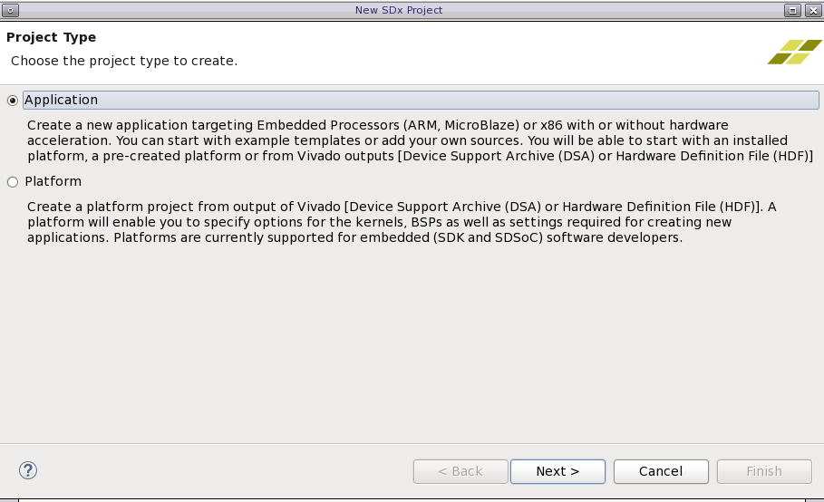
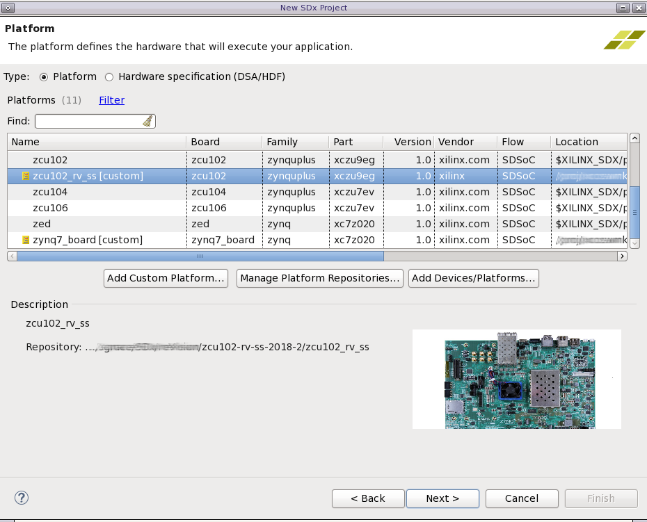
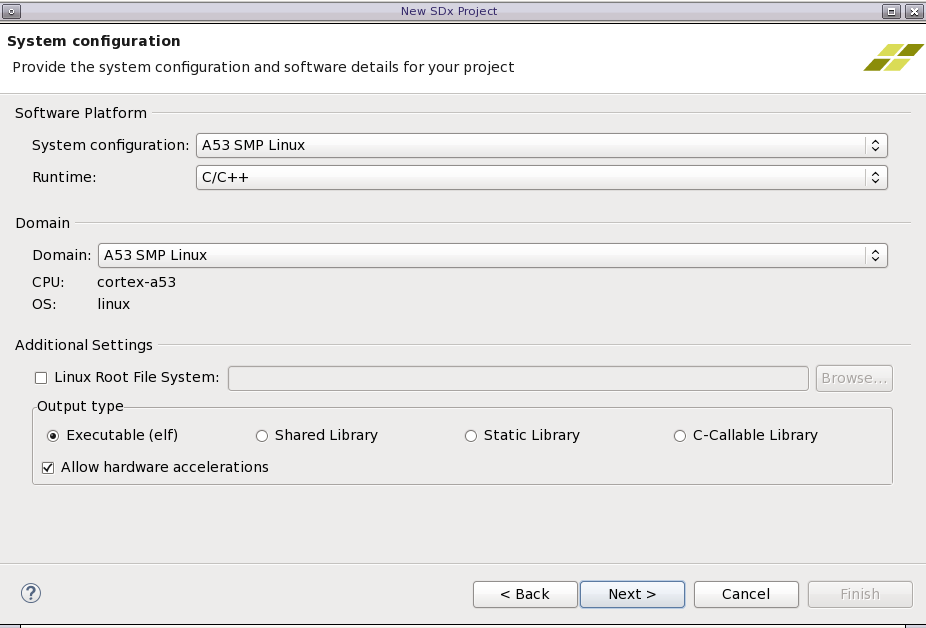
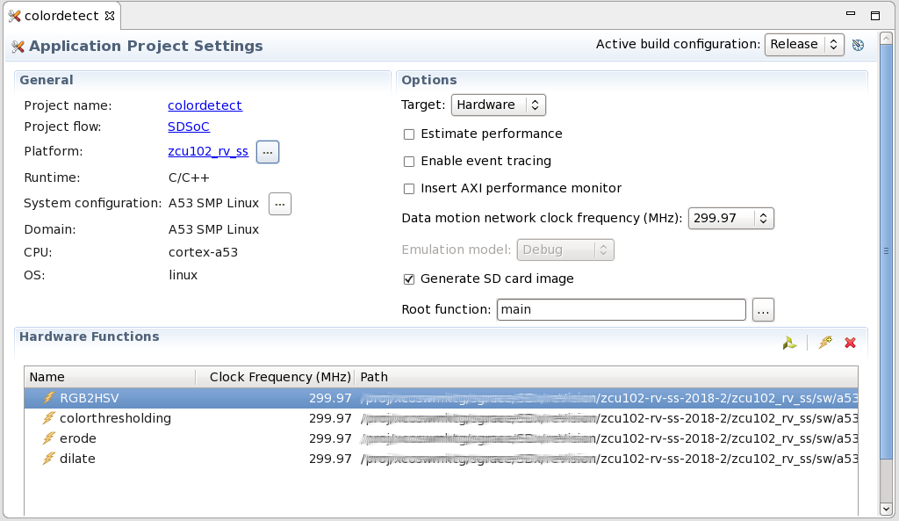

<table style="width:100%">
    <tr>
        <th width="100%" colspan="6"><h1>SDSoC 環境チュートリアル: OpenCV の xfOpenCV への移行</h2>
        </th>
    </tr>
    <tr>
    <td align="center"><a href="README.md">概要</a></td>
    <td align="center"><a href="lab-1-migrate-opencv-to-xfopencv.md">演習 1: OpenCV の xfOpenCV への移行</a></td>
    <td align="center"><a>演習 2: SDSoC アクセラレーション プロジェクトのビルド</a></td>
    </tr>
</table>


## 演習 2 - SDSoC アクセラレーション プロジェクトのビルド

この演習では、ZCU102 reVISION プラットフォームで実行されるハードウェア アクセラレーションされた xfOpenCV 関数を使用して SDSoC アプリケーション プロジェクトをビルドする方法について説明します。演習を実行するには、2018.2 SDx をインストールしていて、ZCU102 reVision プラットフォームを持っている必要があります。これは [reVision プラットフォーム](https://japan.xilinx.com/member/forms/download/design-license-xef.html?akdm=1&filename=zcu102-rv-ss-2018-2.zip) からダウンロードできます。


### 手順 1: ZCU102 reVISION を使用した SDSoC アプリケーション プロジェクトの作成

1. ターミナルを開いて、2018.2 インストール ディレクトリの `/path/to/SDx/2018.2/` から `settings64.csh`/`settings64.sh` スクリプトを読み込みます。

2. Linux ターミナルで `SYSROOT` が ZCU102 reVISION プラットフォームの sysroot ディレクトリを指定するように設定します。`SYSROOT` を適切なディレクトリに設定しておくと、ビルドするアプリケーションが SDx が実行されるマシンではなく、Arm プロセッサ専用のコンパイル済みインクルードおよびライブラリにアクセスできるようになります。

    Bash の場合:

	```bash
	export SYSROOT=/<path>/<to>/zcu102-rv-ss-2018-2/petalinux/sdk/sysroots/aarch64-xilinx-linux
	```

	C シェルの場合:

	```csh
	setenv SYSROOT /<path>/<to>/zcu102-rv-ss-2018-2/petalinux/sdk/sysroots/aarch64-xilinx-linux
	```

3. SDx ワークスペースを追加するディレクトリまで移動し、次のコマンドで SDx IDE を起動します。

	```bash
	sdx -workspace rv_lab
	```
    >**:pushpin: 注記:**
    >既存の SDx ワークスペースを使用することもできます。 


4. アプリケーション プロジェクトを作成します。

	

5. [Project name] に **colordetect** と指定します。

	

6. [Add Custom Platform] ボタンをクリックして `zcu102_rv_ss` ディレクトリから reVISION プラットフォームを追加し、[OK] をクリックします。リストからプラットフォームを選択して、[Next] をクリックします。プラットフォームがワークスペースに追加され、今後ほかのプロジェクトで使用できるようになります。

	

7. [System configuration] ページで [System Configuration] を [A53 SMP Linux] に、[Runtime] を [C/C++] に、[Domain] を [A53 SMP Linux] に、[Output type] を [Executable (elf)] に設定します。[Next] をクリックします。

	

8. [Templates] ページでプラットフォームと一緒にインストールするサンプル デザインを選択します。この場合は、[Empty Application] を選択し、[Finish] をクリックします。

	

    SDx 環境で選択したプラットフォームと指定したさまざまなオプションに基づいて SDSoC アプリケーション プロジェクトが作成されます。SDx IDE に [Application Project Settings] ウィンドウが表示されます。このウィンドウでは、プロジェクトのオプションを確認して設定でき、コンパイルされるハードウェア関数や使用されるビルド コンフィギュレーションのタイプなどを指定できます。 

9.  [Active build configuration] を [Debug] から [Release] に変更します。
    - [Debug] を [Release] に変更すると、Arm で実行するプログラムを最適化できるようになります。

	

### 手順 2: OpenCV コードのインポート

1. プロジェクトの準備ができたので、使用するソース コードをインポートする必要があります。[Project Explorer] ビューで src ディレクトリを右クリックし、[Import Sources] を選択します。使用するソース コードを選択できる Import Sources ウィザードが起動されます。

2. [From directory] に colordetect.cpp ファイルを保存したディレクトリを指定します。

	

3. ソース ファイルを選択し、src ディレクトリにコピーされるようにします。

4. [Finish] をクリックし、[Project Explorer] ビューの src ディレクトリの下にインポートされたソース ファイルが含まれることを確認します。

### 手順 3: ハードウェア関数の決定と追加

xfOpenCV 関数を追加すると、ZCU102 ボードのプログラマブル ロジックで使用可能なハードウェア最適化された関数およびオブジェクトが含まれるようになります。次は、sds++ コンパイラにこれらの関数をハードウェア関数として識別されるようにする必要があります。

1. [Application Project Settings] ウィンドウで [Hardware Functions] セクションを見つけます。このセクションには、関数を追加できます。稲妻マークのボタンをクリックします。プロジェクト コードを解析して、アクセラレーションするのに推奨される関数を示すダイアログ ボックスが表示されます。

	

	ハードウェア関数の候補として `colordetect`、`colordetect_accel`、および `main` 関数が表示されます。演習 1 で作成した `colordetect_accel` 関数を選択することはできますが、関数を定義するためにテンプレートを使用したので、正しく動作しません。代わりに、コードで使用した xfOpenCV 関数を個別に選択する必要があります。

    通常はこのダイアログ ボックスでハードウェア関数を指定しますが、xfOpenCV ライブラリ全体から関数を検索するのは効率的ではないので、別の方法でハードウェア関数を追加します。 

2. [Add Hardware Functions] ダイアログ ボックスで [Cancel] をクリックします。

3. [Project Explorer] ビューで **colordetect** プロジェクトの [Includes] を展開し、`/<path>/<to>/zcu102_rv_ss/sw/a53_linux/inc/xfopencv` のインクルード パスを展開します。 
   
4. xfOpenCV 関数は imgproc フォルダーに含まれるので、フォルダーを展開します。

5. `xf_rgb2hsv.hpp` ファイルを展開し、xf 名前空間を展開します。`RGB2HSV` 関数はここに含まれます。

6. 関数を右クリックし、[Toggle SW/HW] を選択します。これで、関数の Arm での実行とアクセラレーションを切り替えることができます。

	

6. 前の imgproc ディレクトリの手順を繰り返して、次の関数を見つけます。 
    - `imgproc/xf_inrange.hpp` の colorthresholding
    - `imgproc/xf_erosion.hpp` の erode
    - `imgproc/xf_dilation.hpp` の dilate

	

[Hardware Functions] に 4 つのアクセラレーションされた関数が表示されます。終了したら、[Project Explorer] ビューの Includes ディレクトリの展開を閉じます。

### 手順 4: パフォーマンス モニターの追加

これでどの関数をプログラマブル ロジックでアクセラレーションするかが判明したので、Arm プロセッサで実行されるコードのパフォーマンスと比較して、どのようなパフォーマンスにするのかを指定する必要があります。パフォーマンスを測定するには、ソース コードを変更する必要があります。 

1. [Project Explorer] ビューで `colordetect.cpp` ソース ファイルをダブルクリックし (または右クリックで [Open] を選択し)、SDSoC コード エディターで `colordetect` C++ ソース コードを開きます。

2. `sds_lib.h` という新しいインクルードを追加します。 

    このヘッダー ファイルには、実行時間を測定しやすくするための `sds_clock_counter` および `sds_clock_frequency` という 2 つの関数が含まれます。`sds_clock_counter` は Arm のフリーランニング クロック数を戻します。戻し型は `unsigned long` です。`sds_clock_frequency` は Arm プロセッサの動作周波数を戻します。これは 1.2 GHz になります。

    >**:pushpin: 注記:**
    >`sds_lib.h` では `stdio.h` ヘッダーを前に含める必要があります。

3. 使用するタイミング コードを簡素にするには、時間を測定する定義済みマクロを使用します。`colordetect_accel.hpp` 文を含めた箇所の後に次の行を追加します。

	```C++
	#include "sds_lib.h"
	unsigned long clock_start, clock_end;
	#define TIME_STAMP_INIT clock_start = sds_clock_counter();
	#define TIME_STAMP  { clock_end = sds_clock_counter(); printf("elapsed time %lu \nelapsed real-time %f ms \n", clock_end-clock_start, (1000.0/sds_clock_frequency())*(double)(clock_end-clock_start)); clock_start = sds_clock_counter();  }
	```

	コードからは、`sds_clock_counter` を使用して開始時間 (`clock_start`) および終了時間 (`clock_end`) を記録していることがわかります。`sds_clock_frequency` 関数は、`clock_end` および `clock_start` の値を実時間 (ミリ秒) に変換しやすくします。

4. これらのマクロを使用するには、`colordetect()` および `colordetect_accel()` 関数の両方の近くに追加する必要があります。ソース コード ファイルに次を追加します。

	```c++
	std::cout << "CPU" << std::endl;
	TIME_STAMP_INIT
	colordetect(in_img, out_img, nLowThresh, nHighThresh);
	TIME_STAMP

	std::cout << "Accelerator" << std::endl;
	TIME_STAMP_INIT
	colordetect_accel(xfIn,xfOut,nLowThresh,nHighThresh);
	TIME_STAMP
	```

	分割するのに `std::cout` を追加する必要はありませんが、追加して各プロセスが実行されるのにどれくらいかかるのかを知っておくことをお勧めします。

	関数のパフォーマンスを測定すると、同じファイルを処理するのに Arm およびハードウェア アクセラレータでどれくらいかかるのかがわかります。

5. ソース コード ファイルを保存します。

### 手順 5: C/C++ ビルド オプションの調整
プロジェクトをビルドする前に、残り数個の reVISION ライブラリを追加しておかないと、ビルド プロセスを問題なく終了できなくなります。 

1. これらのビルド設定を調整するには、[Assistant] ビューで [Release] コンフィギュレーションを右クリックして、[Settings] コマンドを選択します。

2. [Build Configuration Settings] ダイアログ ボックスから [Edit Toolchain Settings] リンクをクリックして [Settings] ダイアログ ボックスを開きます。 

3. [SDSCC Compiler] および [SDS++ Compiler] 設定の下の [Directories] ページで [Add] コマンドをクリックして次のパスを追加します。 
   
   [Directories] ページで `${SYSROOT}/usr/include` を指定。 

    ![[SDSCC Compiler] の [Directories]](./images/sysroot_usr_include.png)

4. [SDSCC Compiler] および [SDS++ Compiler] 設定の下の [Miscellaneous] ページの [Other flags] フィールドのテキストの終わりに次を追加します。 
   
   `-hls-target 1`  

    ![[SDSCC Compiler] の [Miscellaneous]](./images/misc_build_settings.png)

    [SDS++ Linker] 設定の下の [Libraries] および [Miscellaneous] ページを変更する必要があります。これでどの OpenCV ライブラリを使用するのか定義し、`SYSROOT` が正しくリンクされるようにします。

5. [SDS++ Linker] 設定の下の [Libraries] をクリックし、[Libraries (-l)] フィールドで [Add] ボタンをクリックして次のライブラリを追加します。	
	- opencv_core
	- opencv_imgproc
	- opencv_highgui
	- opencv_imgcodecs
	
	これらのライブラリは、コードで使用した関数に関連しています。

	


6. [SDS++ Linker] 設定の下の [Miscellaneous] をクリックし、[Linker Flags] フィールドに次を追加します。 
	
	`--sysroot=${SYSROOT} -Wl,-rpath-link=${SYSROOT}/lib,-rpath-link=${SYSROOT}/usr/lib`

	これは、reVISION プラットフォームからコンパイル済みライブラリおよびインクルードが必ず呼び出されるようにするために必要です。 

7. [Build Configuration Settings] ダイアログ ボックスを閉じます。 

    すべての変更をしたら、プロジェクトをビルドできます。 

8. [Assistant] ビューで [Build] コマンド (ハンマー アイコン) をクリックします。

ビルド プロセス中は、ハードウェア用にマークされた関数がプログラマブル ロジック、およびデバイスのビットストリームをビルドするプロセスのためにコンパイルされ処理されます。この手順では、ビットストリームがビルドされるので時間が長めにかかります。

### 手順 6: プラットフォームでのコードの実行

ビルドが終了したら、そのビルドしたアプリケーションを実行するボードをプログラムする必要があります。

1. `sd_card` ディレクトリの内容をボードの SD カードにコピーします。リストされるファイルは、次のとおりです。
	- BOOT.BIN
	- colordetect.elf
	- image.ub
2. 提供された画像ファイル (`rock_landscape.jpg`) を SD カードにコピーします。 

    終了したら、SD カードには次のファイルが入っているはずです。
	- BOOT.BIN
	- colordetect.elf
	- image.ub
	- rock_landscape.jpg
3. SD カードをマシンから取り出して、ZCU102 に挿入します。

    次に、ボードへのシリアル通信を設定する必要があります。正しいドライバーと Teraterm または PuTTy のようなプログラムがマシンにインストールされていることを確認してください。

3. シリアル通信プログラムで、通信速度を 115200 に設定し、8-n-1 形式になるようにします。
	Windows で Silicon Labs Quad CP2108 USB to UART Bridge の Interface 0 に関連付けられた COM ポートが使用されていることを確認してください。

5. ZCU102 プラットフォームをオンにすると、使用するターミナルが Linux のブート情報を表示し始めるはずです。

	- データが UART から来ていない場合は、ボードの LED をチェックします。LED が赤色であれば、ブートがエラーになっています。SD カードの内容を再確認して、もう 一度実行します。

7. コマンド プロンプトが表示されたら、SD カードのマウント ポイント `cd media/sd_card` に移動します。

	コマンドがエラーになったら、`mount` コマンドを実行して、SD カード マウントを見つけます (`mmblk0` の可能性あり)。

8. マウント ポイントで `ls` コマンドを実行して、すべてのファイルがそこにあることを確認します。不足しているファイル (入力画像など) がある場合、プロンプトに `halt` と入力してシステムのシャットダウンを待ちます。SD カードをマシンに戻して、不足していたファイルをコピーし、再度処理します。

	>**:pushpin: 注記:**
    >ボードがオフにならない場合、ファイルシステムがアップロードされるのを待って、ボードの電源を落とします。

9. アプリケーションを実行するには、`./colordetect.elf rock_landscape.jpg` コマンドを実行します。

    Arm での実行とプログラマブル ロジックでのアクセラレーションの実行のパフォーマンスはかなり異なるはずです。次のような結果になります。

    ```bash
    $ ./colordetect.elf rock_landscape.jpg
    CPU
    elapsed time 298321668
    elapsed real-time 248.626252 ms
    Accelerator
    elapsed time 12168372
    elapsed real-time 10.141324 ms
    ```

    >**:pushpin: 注記:**
    >このコマンドは何度でも実行して、経過時間を複数ポイントで記録できます。

1. コマンド プロンプトにアプリケーションが終了したことが表示されたら、システムを停止できます。正しく停止するには、プロンプトに `halt` と入力します。これにより、シャットダウン手順が開始され、ファイル システムが破損しないようになります。
   
2. 数秒したら、ターミナル プログラムにランダムなテキストを入力するか、`Enter` を数度押します。何も変更しなければ、ボードをオフにします。
   
3. オフになったら、SD カードを取り出してコンピューターに挿入して、画像結果を確認します。次のファイルが含まれているはずです。
	- input.png – 元の画像 (PNG 形式)
	- output.png – 色検出の CPU 結果
	- accel_out.png – 色検出のアクセラレーション結果

画像結果は次のようになります。

| CPU                           | アクセラレーションされたもの                        |
| :---------------------------: | :--------------------------------: |
|  |  |

比較すると、プログラマブル ロジックの方が Arm で実行されたコードよりも、約 4 倍ランタイムが改善していることがわかります。また、CPU バージョンの方がわずかに詳細に表示はされていますが、アクセラレーションされたバージョンとかなり類似しています。これにより、より高速なランタイムで質がかなり良い結果になったことがわかります。

### まとめ

xfOpenCV を使用して OpenCV プログラムをハードウェア アクセラレーションされたプログラムに変換し、ZCU102 で実行して結果を比較しました。この演習では、次の内容について説明しました。

- 最適化された xfOpenCV を使用するため OpenCV コードを見つけて変更しました。
- テンプレート化した xfOpenCV 関数を呼び出しました。
- プログラムのビルド設定をアップデートし、reVISION プラットフォームで実行しました。

このチュートリアルを終了したので、しきい値を変更して別の出力を取得したり、OpenCV を reVISION プラットフォームに移行できるようになりました。

<hr/>

:arrow_backward:**前のトピック:**  [演習 1 - OpenCV の xfOpenCV への移行](lab-1-migrate-opencv-to-xfopencv.md)


---
<p align="center"><sup>Copyright&copy; 2018 Xilinx</sup></p>

この資料は表記のバージョンの英語版を翻訳したもので、内容に相違が生じる場合には原文を優先します。資料によっては英語版の更新に対応していないものがあります。日本語版は参考用としてご使用の上、最新情報につきましては、必ず最新英語版をご参照ください。