<p align="right">
<a href="../../platform-creation-tutorial/README.md">English</a> | <a>日本語</a>
</p>

<table style="width:100%">
  <tr>
<td align="center" width="100%" colspan="6"><h1>2018.3 SDSoC™ 開発環境チュートリアル</h1>
<a href="https://github.com/Xilinx/SDSoC-Tutorials/branches/all">ほかのバージョンを参照</a>
</td>

  </tr>
  <tr>
    <td colspan="4" align="center"><h2>演習: プラットフォームの作成</h2></td>
  </tr>
  <tr>
     <td align="center"><a href="Lab1-Creating-DSA-for-Zynq-MPSoC-Processor-Design.md">概要</a></td>
     <td align="center">演習 1: Zynq UltraScale+ MPSoC プロセッサ デザイン用の DSA の作成</td>
     <td align="center"><a href="Lab2-Creating-Software-Components.md">演習 2: SDSoC プラットフォームの作成</a></td>
     <td align="center"><a href="Lab3-Creating-Custom-Platform-Using-the-SDx-IDE.md">演習 3: カスタム プラットフォームの使用</a></td>
   </tr>
</table>

## 演習 1: Zynq UltraScale+ MPSoC プロセッサ デザイン用の DSA の作成  

**注記:** この演習を実行するには、Vivado Design Suite および IP インテグレーターの機能に精通している必要があります。Vivado Design Suite IDE の基本的な情報は、『Vivado Design Suite ユーザー ガイド: 概要』 ([UG910](https://japan.xilinx.com/support/documentation/sw_manuals_j/xilinx2018_3/ug910-vivado-getting-started.pdf)) を参照してください。

この演習では、Vivado&reg; を使用して Arm&reg; デュアルコア Cortex&trade;-A53 およびデュアルコア Cortex-R5 リアルタイム プロセッシング システム (PS) およびプログラマブル ロジック (PL) 領域の IP ブロックを含んだ Zynq&reg; UltraScale+ MPSoC プロセッサ デザインを作成します。Clocking Wizard IP を使用し、アクセラレーションしたハードウェア関数で使用可能な複数のクロックを生成します。  Processor System Reset IP ブロックを追加して、さまざまなクロック ソースのリセットを同期します。プログラミング ロジックの IP ブロックからの割り込みすべてのソースをまとめる Concat IP も含めます。sds++ システム コンパイラで使用するハードウェア インターフェイスを宣言し、ハードウェア アクセラレータを接続できるようにします。これでハードウェア デザインおよびそのインターフェイス メタデータがデバイス サポート アーカイブ (DSA) ファイルに含まれ、後でカスタム SDSoC プラットフォームを作成する際に使用できるようになります (<a href="Lab3-Creating-Custom-Platform-Using-the-SDx-IDE.md">演習 2: SDSoC プラットフォームの作成</a>を参照)。

<details>
<summary><big><strong>手順 1: Vivado IDE の起動とプロジェクトの作成</strong></big></summary>

#### Linux ホスト マシン

シェル プロンプトに次のコマンドを入力します。

   1. `source <Xilinx_Install_Directory>/SDx/<Version>/settings64.{sh,csh}`
   2. `vivado`

1 つ目のコマンドでは、Vivado を起動修正前に環境変数を設定しており、2 つ目のコマンドでは Vivado を起動しています。

#### Windows ホスト マシン

Windows ホスト マシンの場合は、次のいずれかの方法で Vivado を起動します。

   - Vivado デスクトップ アイコンをクリックします。

   - [スタート] メニューから [Xilinx Design Tools] → [Vivado 2018.3] → [Vivado 2018.3] をクリックします。

   - コマンド プロンプト ウィンドウで次のコマンドを入力します。

      1. `<Xilinx_Install_Directory>/SDx/<Version>/settings64.bat`
      2. `vivado`

     1 つ目のコマンドでは、Vivado を起動修正前に環境変数を設定しており、2 つ目のコマンドでは Vivado を起動しています。

#### Vivado プロジェクトの作成

Vivado プロジェクトを作成する手順は、次のとおりです。

1. 次の図に示す Getting Started ページの **[Quick Start]** セクションで **[Create Project]** をクリックします。

    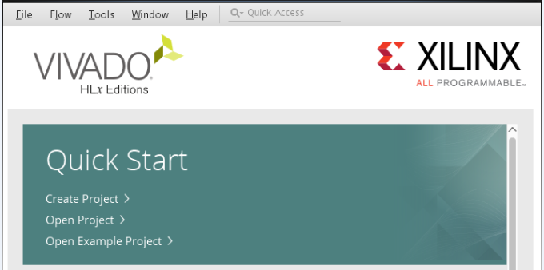

2. New Project ウィザードが開きます。**[Next]** をクリックします。

    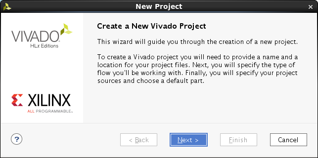

   **[Project Name]** ページが開きます。

3. プロジェクト名を **zcu102_board** に指定します。

4. [Project Location] にダイアログ ボックスに **/tmp** と入力します。

5. **[Create project subdirectory]** をオンにします。

   

6. **[Next]** をクリックします。**[Project Type]** ページが開きます。

7. **[RTL Project]** をオンにします。

    

8. **[Next]** をクリックします。**[Add Sources]** ページが開きます。

7. [Target language] ドロップダウン リストから **[Verilog]** を選択します。
8. [Simulator language] ドロップダウン リストから **[Mixed]** を選択します。

    

9. **[Next]** をクリックします。**[Add Constraints]** ページが開きます。

    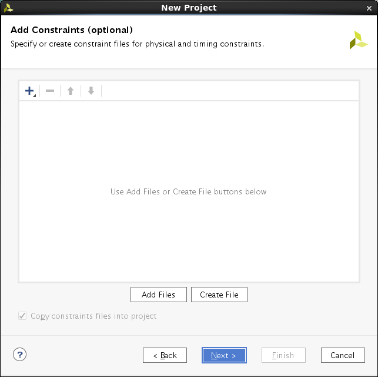

10. **[Next]** をクリックします。**[Default Part]** ページが開きます。

11. ダイアログ ボックス一番上の **[Boards]** タブをクリックします。

    このチュートリアルの場合、ZCU102 評価ボードを作成するプラットフォームのテンプレートとして使用します。既存のボードを選択すると、カスタム プラットフォームを作成する際に使用するさまざまパーツおよびインターフェイスが表示されます。

11. 使用可能なボードのリストから **[Zynq UltraScale+ ZCU102 Evaluation Board]** を選択します。

    >**:information_source: ヒント:**
    >検索機能を使用すると、ZCU102 をフィルターできます。

     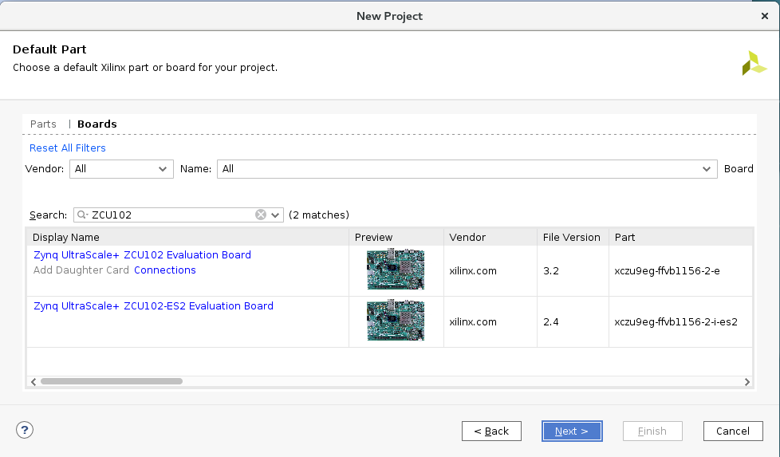

12. **[Next]** をクリックします。

    >**:warning: 警告:**
    > Vivado では、ボードごとに複数のバージョンがサポートされます。正しいボードをターゲットにしていることを確認してください。

13. **[New Project Summary]** ページでプロジェクトのサマリを確認し、**[Finish]** をクリックしてプロジェクトを作成します。

    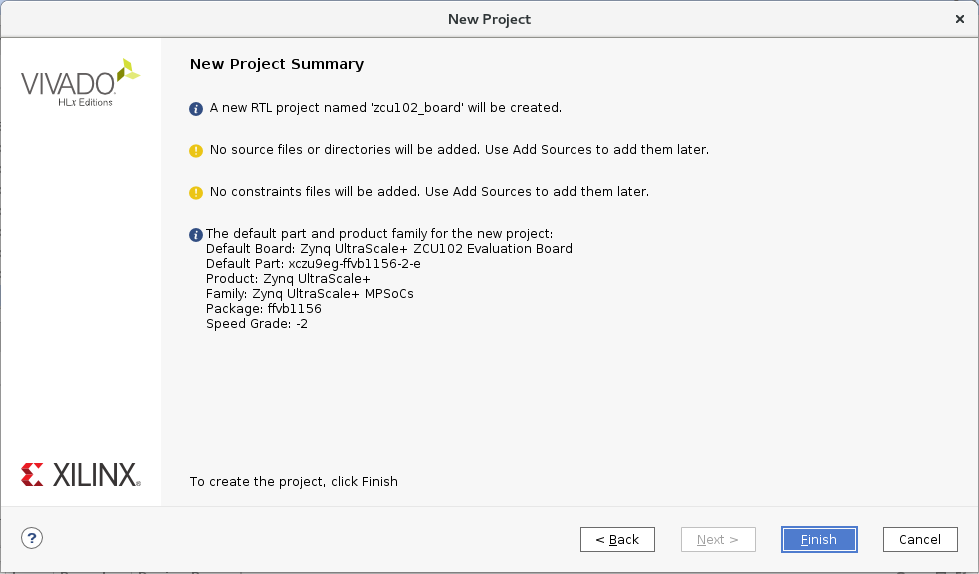

</details>

<details>
<summary><big><strong>手順 2: IP インテグレーター デザインの作成</strong></big></summary>

1. Flow Navigator で **[IP INTEGRATOR]** を展開表示し、**[Create Block Design]** をクリックします。
   **[Create Block Design]** ダイアログ ボックスが開きます。

   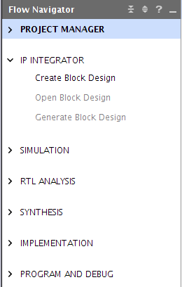

2. IP サブシステム デザインの名前を指定します。この例の場合は、**zcu102_board** と指定します。

   >:pushpin: **注記:**
   >**[Directory]** および **[Specify source set]** ドロップダウン リストのデフォルト値は変更しないでください。

    

    >**:information_source: ヒント:**
    > Vivado プロジェクトに複数のブロック デザインが含まれている場合、SDSoC プラットフォームを含む IP インテグレーター ブロック デザインの名前は SDSoC プラットフォームと同じ名前にする必要があります。

3.  **[OK]** をクリックします。

#### ブロック デザインへの IP の追加

これで複数の IP ブロックを IP インテグレーター デザインに追加できるようになりました。次の表では、追加する IP ブロックと、それらの SDSoC での役割についてまとめています。
<table style="width:100%; border: 1px solid black;" class="w3-table-all w3-small">
<tr>
<th></th><th>IP ブロックの役割</th>
</tr>
<tr>
<td>Zynq UltraScale+ MPSoC Processor System (PS)</td>
<td>
<ul>
<li>キャッシュ階層を含むデュアル コア Arm プロセッサ</li>
<li>統合 I/O ペリフェラル</li>
<li>外部メモリ インターフェイスを使用した DDR メモリ コントローラー</li>
<li>PS からプログラマブル ロジック (PL) へのインターコネクト</li>
<li>PL から PS へのインターコネクト</li>
</ul>
</td>
</tr>
<tr>
<td>
Processor System Reset ブロック (PL)
</td>
<td>
<ul>
<li>PL ロジックのリセット シーケンスおよび同期ブロック</li>
</ul>
</td>
</tr>
<tr>
<td>
Clocking Wizard (PL)
</td>
<td>
<ul>
<li> PL ロジックを駆動する複数の出力クロック ジェネレーター</li>
</ul>
</td>
</tr>
<tr>
<td>
Concat ブロック (PL)
</td>
<td>
<ul>
<li>Zynq UltraScale+ MPSoC PS 割り込みリクエスト入力に使用される PL 割り込み構造</li>
</ul>
</td>
</tr>
</table>
<!-- end list -->

1. ブロック デザイン キャンバスで右クリックし、**[Add IP]** をクリックします。

    または、IP インテグレーター キャンバスの **[Add IP]** ボタン (**+**) をクリックします。

    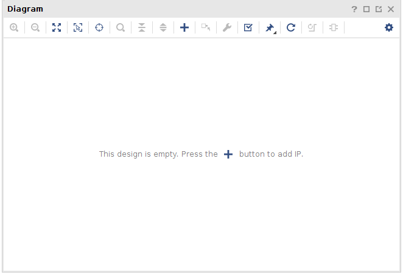

2. IP カタログの **[Search]** ダイアログ ボックスが表示されます。[Search] フィールドに「**zynq**」と入力して Zynq UltraScale+ MPSoC IP を検索します。

   

3. **[Zynq UltraScale+ MPSoC]** を選択し、<kbd>Enter</kbd> キーを押してデザインに IP を追加します。

   IP ブロックをダブルクリックしても IP インテグレーター キャンバスに追加できます。

   

   Zynq UltraScale+ MPSoC が IP インテグレーター キャンバスに追加され、[Tcl Console] ウィンドウにも IP を追加するのに使用したコマンドが表示されます。

   `create_bd_cell -type ip -vlnv xilinx.com:ip:zynq_ultra_ps_e:3.2 zynq_ultra_ps_e_0`

   >**:pushpin: 注記:**
   >ブロック デザインで実行するほとんどの操作に、対応する Tcl コマンドがあります。
   Tcl コマンドの詳細は、『Vivado Design Suite: Tcl コマンド リファレンス ガイド』 ([UG835](https://japan.xilinx.com/support/documentation/sw_manuals_j/xilinx2018_3/ug835-vivado-tcl-commands.pdf)) を参照してください。


4.  IP インテグレーターで **[Run Block Automation]** リンクをクリックします。

    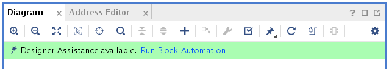

    次の図のように **[Run Block Automation]** ダイアログ ボックスが開きます。**[Apply Board Preset]** がデフォルトでオンになっているでの、定義済みのボードの利点を生かして PS がコンフィギュレーションされます。

   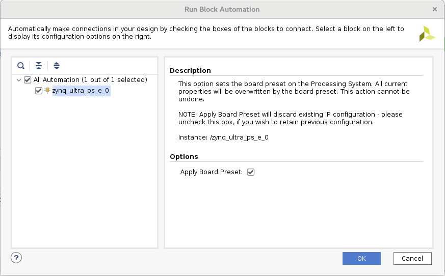

5.  **[OK]** をクリックして ZCU102 ボードのデフォルト設定を使用します。

    IP インテグレーターの図は、Zynq UltraScale+ MPSoC IP ブロックでブロック オートメーションを実行するとアップデートされます。

    

6.  IP インテグレーターの図を右クリックし **[Add IP]** をクリックして PL にペリフェラルを追加します。

7.  **[Search]** フィールドに「**proc sys res**」と入力して Processor System Reset を検索し、<kbd>Enter</kbd> キーを押してデザインに追加します。
    Processor System Reset IP ブロックにより、宣言したプラットフォーム クロックごとに同期リセット信号が作成されます。各リセットは、Clocking Wizard で生成されたクロックに関連付けられます。

    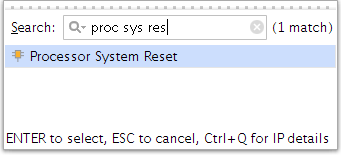

9.  **Clocking Wizard** IP ブロックを追加して、プラットフォームに PL クロックを提供します。クロック設定は、この後の手順でカスタマイズします。

    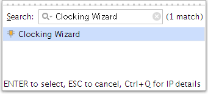

10. **Concat** IP を追加して、PL で生成された割り込みを PS ブロックに接続します。これにより、必要であればプロセッサ割り込みをするハードウェア アクセラレータのパスが提供されます。

    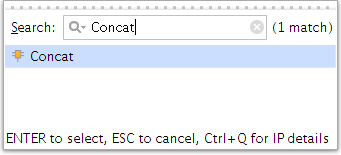

    ブロック図は、次のようになるはずです。IP の相対的な位置は異なる場合があります。

    >**:information_source: ヒント:**
    >IP インテグレーターの図は **[Zoom In]** および **[Zoom Out]** ボタンを使用するか、該当するキーボード ショートカット (拡大は **Ctrl**+**=**、縮小は **Ctrl**+**-**) を使用すると拡大および縮小できます。

    


#### ZYNQ MPSoC の設定

1.  ZYNQ UltraScale+ MPSoC IP ブロックをダブルクリックして [Re-Customize IP] ダイアログ ボックスを開きます。 

2.  Arm 設定をカスタマイズし直して、存在する PL-PS 割り込みのパスをイネーブルにします。

    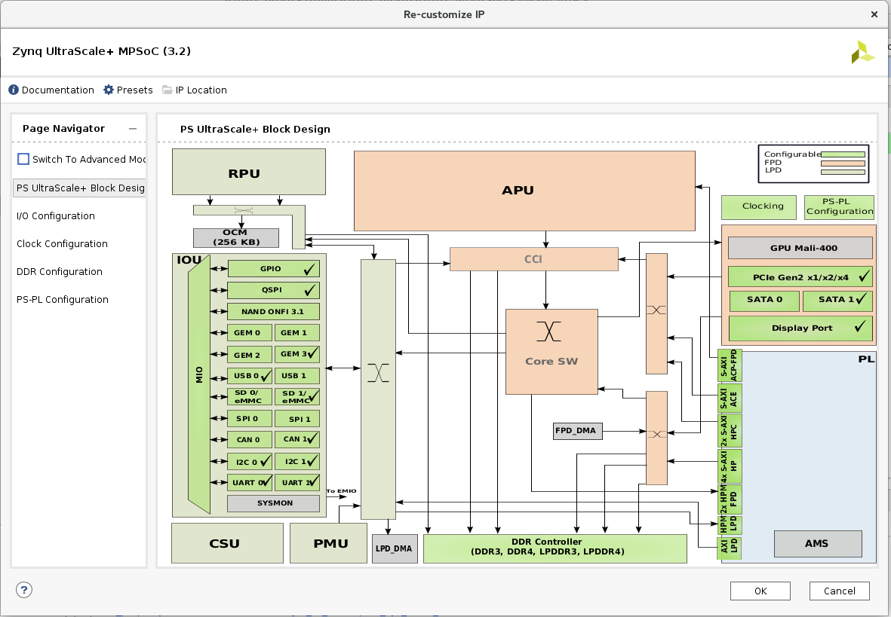

2.  [Re-customize IP] ダイアログ ボックスの左側の Page Navigator で [PS-PL Configuration] ページをクリックし、[General Settings]、[Interrupts]、および [PL to PS] セクションを展開します。次の図のように、**[IRQ0[0-7]]** および **[IRQ1[0-7]]** ドロップダウン リストが「**1**」なっていることを確認します。これで、最大 8 個の PS 割り込みの入力ポートが PS 割り込みの各入力ポートで処理できるようになります。

    また、PS-PL 割り込みインターフェイスがイネーブルになり、PL Concat IP ブロックに接続されます。Concat IP ブロックの入力側は sds++ システム コンパイラで使用できるように未使用のままになり、ハードウェア アクセラレータから PS への PL 割り込みが必要に応じて配線されます。

    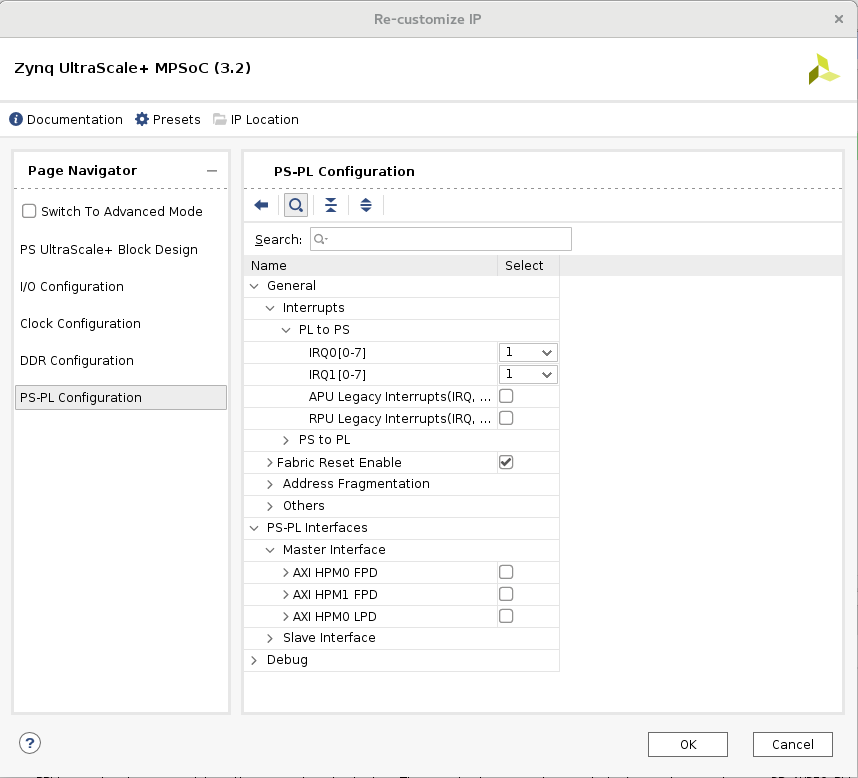

3.  同じ [PS-PL Configuration] ページで **[PS-PL Interfaces]** → **[Master Interface]** セクションを展開します。前の図のように、**[AXI HPM0 FPD]** および **[AXI HPM1 FPD]** をオフにします。

    これらのチェック ボックスをオフにすると、sds++ システム コンパイラでアクセラレータとの接続に AXI HPM インターフェイスが使用できるように保持されます。デフォルト設定では、M_AXI_HPM インターフェイスは PS で使用するために予約されるので、これらのチェック ボックスをオフにすることで、インターフェイスが空いて、SDx ツールで使用できるようになります。     

4.  **[OK]** をクリックします。


#### Clocking Wizard IP の設定

1.  Clocking Wizard IP をダブルクリックして再カスタマイズします。

2.  [Re-customize IP] ダイアログ ボックスの **[Clocking Options]** タブで、**[Primary Input Clock]** の **[Input Frequency]** チェック ボックスを確認します。PS 用の ZCU102 プリセットには 100 MHz クロック (pl_clk0) が含まれており、これが Clocking Wizard IP への入力として接続されます。  [Input Frequency] が [AUTO] に設定される場合、入力クロック周波数は接続された入力クロック ソースから自動的に指定されます。

3.  **[Output Clocks]** タブをクリックし、clk_out1 の出力周波数が 100 MHz に設定されていることを確認します。

4.  **[Output Clocks]** タブでスクロール ダウンし、次の図に示すように **[Reset Type]** の **[Active Low]** をオンにします。

    

5.  **[OK]** をクリックすると、Clocking Wizard IP が設定されます。


#### Concat ブロックの設定

1. **Concat** IP ブロックをダブルクリックして [Re-Customize IP] ダイアログ ボックスを開きます。sds++ システム コンパイラは PL 割り込みを Concat IP ブロックを介して PS ブロックに配線します。

2. **[Number of Ports]** フィールドを 1 に変更して、<kbd>Enter</kbd> キーを押します。

    sds++ システム コンパイラがその PS 用に生成する可能性のある PL 側からの割り込みがイネーブルになります。

    

3. **[OK]** をクリックすると、Concat IP が設定されます。

#### 設計アシスタンスの使用

設計アシスタンスを使用すると、Clocking Wizard と Processor System Reset ブロックを自動的に Zynq UltraScale+ MPSoC プロセッシング システムに接続できます。

1.  **[Run Connection Automation]** をクリックします。[Run Connection Automation] ダイアログ ボックスが開きます。

    

2.  次の図に示すように IP のクロック オプションを設定します。コネクション オートメーションを実行する各インターフェイスを選択すると、右側に選択したインターフェイスの説明とオプションが表示されます。

    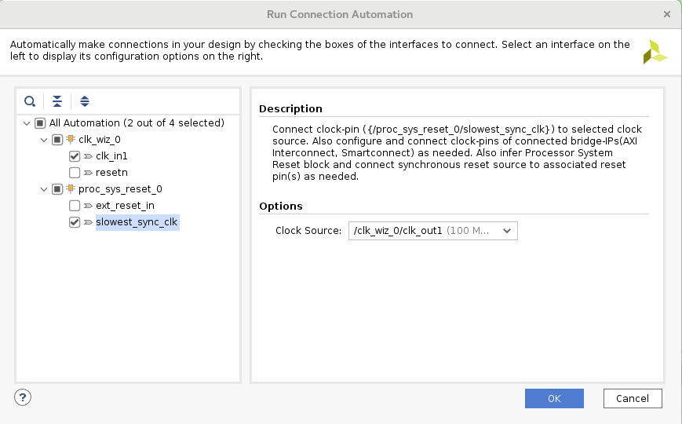

    図に示すように、**slowest_sync_clk** 設定を **\/clk_wiz_0/clk_out1** に変更します。   

4.  **[OK]** をクリックすると、設定が保存されてダイアログ ボックスが閉じます。

    Vivado IP インテグレーターでは、**[Run Connection Automation]** コマンドの設定に基づいてブロックへ接続が追加されます。


#### デザインの残りの部分の手動接続

複数のデザイン依存ソースを持つ可能性のある接続を手動でして、デザインを終了します。このプラットフォーム例の場合、PS ブロックで生成されたリセット出力を使用して PL 側のロジックのリセット入力を制御します。特に、Processor System Reset IP ブロックおよび Clocking Wizard のクロック ソースをこの方法で接続します。また、PL Processor System Reset ブロックはクロック ソースがリクエストされた周波数にロックされるまでリセット ステートのままにします。さらに、PL で生成された割り込みは PS ブロックの割り込みリクエスト入力に接続します。

1.  Zynq UltraScale+ MPSoC IP の **pl_resetn0** 出力ピンを Clocking Wizard の **resetn** 入力ピンに接続します。

2.  Zynq UltraScale+ MPSoC IP の **pl_resetn0** 出力ピンを Processor System Reset IP ブロックの **ext_reset_in** ピンに接続します。

3.  Clocking Wizard IP の **locked** 出力ピンの Processor System Reset IP ブロックの **dcm_locked** 入力ピンに接続します。

4.  xclconcat_0 ブロックの **dout[0:0]** 出力ピンを Zynq UltraScale+ MPSoC IP ブロックの **pl_ps_irq0[0:0]** 入力ピンに接続します。

5.  **[Regenerate Layout]** コマンドをクリックし、ブロック デザインを描画し直します。この段階でブロック図は次のようになります。

    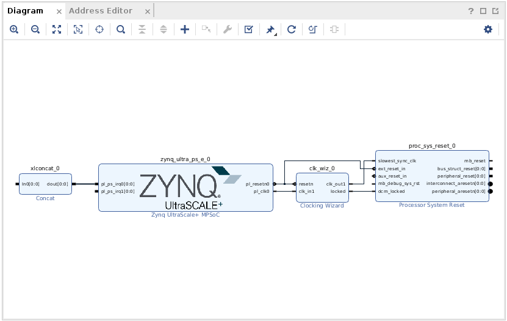

7.  **[Validate]** ボタンをクリックしてデザインが正しいかどうかを検証します。

    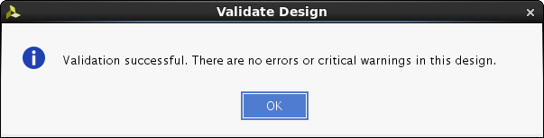

8.  **[OK]** をクリックして [Validate Design] ダイアログ ボックスを閉じます。

9.  ツールバーのフロッピー ディスク アイコンをクリックするか **Ctrl**+**S** キーを押して、ブロック デザインを保存します。


#### クロック、リセット、および割り込みの追加

この段階では、ブロック デザインにはプラットフォームのフレームワーク (Zynq UltraScale+ MPSoC、Clocking Wizard および Processor System Reset、および Concat ブロックから管理される割り込み) が含まれます。プラットフォームにはクロック 1 つとリセット 1 つのみと、8 つの割り込みに使用可能なスペースのみが含まれます。この場合のプラットフォーム要件には十分な数なので、次の手順に進むことはできます。

ただし、このチュートリアルでは、クロック、リセット、および割り込みをいくつか追加してみます。PL 領域にさまざまな周波数を追加しておくと、ベース プラットフォームの柔軟性が増します。複数のクロック ソースがプラットフォームから使用できると、ベース プラットフォームを定義し直さなくても SDx ハードウェア アクセラレータで入力クロック ソースが変更できるようになります。

1.  Clocking Wizard IP をダブルクリックして再カスタマイズします。

2.  **[Output Clocks]** タブをクリックし、**clk_out1** ～ **clk_out7** の出力クロックすべてのチェック ボックスをオンにして追加します。**[Output Freq (MHz)]** の **[Requested]** 列の下の出力周波数を次のように設定します。

    - clk_out1 -\> 75
    - clk_out2 -\> 100
    - clk_out3 -\> 150
    - clk_out4 -\> 200.000
    - clk_out5 -\> 300.000
    - clk_out6 -\> 400.000
    - clk_out7 -\> 600.000

3.  **[OK]** をクリックして Clocking Wizard のダイアログ ボックスを閉じます。

4.  **proc_sys_reset_0** ブロックを選択してコピーし、合計 7 つのリセット IP ブロックに貼り付けます。

    **注記:** キーボード ショートカットの Ctrl + C および Ctrl + V を使用して、デザイン キャンバスでコピーしたり、貼り付けたりできます。

5. **xlconcat_0** ブロックを選択して、コピーして貼り付けて、2 つ目のインスタンスを作成します。

6. **[Run Connection Automation]** をクリックします。次のようなダイアログ ボックスが表示されます。

    

    オートメーション オプションが次のように設定されていることを確認します。

    **注記:** 表のエレメントの中には前に接続済みのものもあり、表に表示されないことがあります。すべてを含む表も参照用に含まれます。

<div style="page-break-after: always;"></div>

<table style="width:100%; border: 1px solid black;" class="w3-table-all w3-small">
<thead>
<tr class="header">
<th><strong>接続</strong></th>
<th><strong>説明</strong></th>
<th><strong>設定</strong></th>
</tr>
</thead>
<tbody>
<tr class="odd">
<td><strong>clk_wiz_0</strong><br />
- clk_in1</td>
<td>Clocking Wizard の入力クロック。</td>
<td><em><strong></em>/zynq_ultra_ps_e_0/pl_clk0 (99 MHz)</strong> が [Clock Source] オプションのデフォルトとして選択されます。デフォルト値のままにします。</td>
</tr>
<tr class="even">
<td><strong>proc_sys_reset_0<br />
</strong>- slowest_sync_clk</td>
<td>このリセットが同期されるクロック ソース。</td>
<td>[Clock Source] オプションのドロップダウン リストから <strong>/clk_wiz_0/clk_out1 (75 MHz)</strong> を選択します。</td>
</tr>
<tr class="odd">
<td><strong>proc_sys_reset_1<br />
</strong>- slowest_sync_clk</td>
<td>このリセットが同期されるクロック ソース。</td>
<td>[Clock Source] オプションのドロップダウン リストから <strong>/clk_wiz_0/clk_out2 (100 MHz)</strong> を選択します。</td>
</tr>
<tr class="even">
<td><strong>proc_sys_reset_2<br />
</strong>- slowest_sync_clk</td>
<td>このリセットが同期されるクロック ソース。</td>
<td>[Clock Source] オプションのドロップダウン リストから <strong>/clk_wiz_0/clk_out3 (150 MHz)</strong> を選択します。</td>
</tr>
<tr class="odd">
<td><strong>proc_sys_reset_3<br />
</strong>- slowest_sync_clk</td>
<td>このリセットが同期されるクロック ソース。</td>
<td>[Clock Source] オプションのドロップダウン リストから <strong>/clk_wiz_0/clk_out4 (200 MHz)</strong> を選択します。</td>
</tr>
<tr class="even">
<td><strong>proc_sys_reset_4<br />
</strong>- slowest_sync_clk</td>
<td>このリセットが同期されるクロック ソース。</td>
<td>[Clock Source] オプションのドロップダウン リストから <strong>/clk_wiz_0/clk_out5 (300 MHz)</strong> を選択します。</td>
</tr>
<tr class="even">
<td><strong>proc_sys_reset_5<br />
</strong>- slowest_sync_clk</td>
<td>このリセットが同期されるクロック ソース。</td>
<td>[Clock Source] オプションのドロップダウン リストから <strong>/clk_wiz_0/clk_out6 (400 MHz)</strong> を選択します。</td>
</tr>
<tr class="even">
<td><strong>proc_sys_reset_6<br />
</strong>- slowest_sync_clk</td>
<td>このリセットが同期されるクロック ソース。</td>
<td>[Clock Source] オプションのドロップダウン リストから <strong>/clk_wiz_0/clk_out7 (600 MHz)</strong> を選択します。</td>
</tr>
</tbody>
</table>

1.  Zynq UltraScale+ MPSoC IP の **pl_resetn0** 出力ピンをすべての Processor System Reset IP ブロックの **ext_reset_in** ピンに手動で接続します。

2.  Clocking Wizard IP の **locked** 出力ピンをすべての Processor System Reset IP ブロックの **dcm_locked** 入力ピンに接続します。

3.  xclconcat_1 ブロックの **dout[0:0]** 出力ピンを Zynq UltraScale+ MPSoC IP ブロックの **pl_ps_irq1[0:0]** 入力ピンに手動で接続します。

4.  ブロック デザインを確認して再び保存します。作成したブロック デザインはリリースされている ZCU102 プラットフォームと同じになり、次の図のようになるはずです。

    

</details>

<details>
<summary><big><strong>手順 3: プラットフォーム ハードウェア インターフェイスの宣言</strong></big></summary>

IP インテグレーターのハードウェア プラットフォーム デザインを終了したら、SDSoC アクセラレータの接続ポイントとして使用可能なハードウェア インターフェイスおよびそれらと通信するデータ ムーバーを宣言する必要があります。これらの宣言は、プラットフォーム名を定義して、sds++ システム コンパイラで使用可能な特定のクロック、割り込み、およびバス インターフェイスを指定するプラットフォーム (PFM) プロパティを設定すると、デザインに追加され、ハードウェア アクセラレーションを生成するのに使用されます。これらのプロパティはプロジェクトに保存されます。

PFM プロパティはブロック デザイン (BD) 内に含まれるので、既存プラットフォーム プロジェクトから新しいプラットフォームを開始すると、既存プロパティがそのプラットフォーム用のものにはならず、ハードウェア プラットフォームが無効になることがあります。このような場合は、競合のある PFM プロパティの設定を解除する必要があります。

この演習では、Vivado IP インテグレーターの [Platform Interfaces] ウィンドウを使用してハードウェア インターフェイスを宣言します。  これらの PFM はブロック デザインに追加されます。  Vivado の [Block Properties] タブまたは [Tcl Console] ウィンドウを使用しても、ハードウェア インターフェイスを宣言する PFM プロパティを設定できます。  このセクションの最後には、PFM プロパティを定義するのに使用可能な Tcl コマンドが含まれます。

このブロック デザインには、Clocking Wizard を使用して生成された異なるクロックが 7 つ含まれます。この演習では、このクロックの 1 つのみをイネーブルにし、それ以外は SDx IDE で使用できるようにします。SDx IDE を使用すると、ハードウェアでアクセラレーションする関数を選択し、ハードウェア アクセラレータのクロック ソースを指定できます。同様に、プロセッサ (PS) とハードウェア関数 (PL) 間のデータ転送に使用可能な AXI ポートも宣言します。これらの AXI ポートはブロック デザインには直接表示されないこともありますが、PFM プロパティ設定で SDx 環境で使用できるように定義できます。

#### [Platform Interfaces] タブでのイネーブル

1.  Vivado のメイン メニューで **[Window]** → **[Platform Interfaces]** をクリックします。

2.  **[Enable platform interfaces]** リンクをクリックして [Platform Interfaces] タブを開きます。

  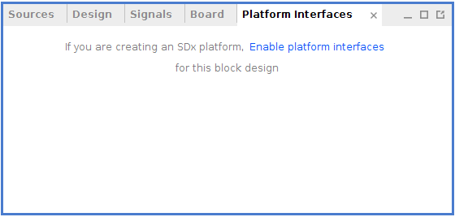
    
[Platform Interfaces] ウィンドウにはプラットフォーム名が表示されるほか、ブロック デザイン内で使用可能なインターフェイスすべてが表示され、オン/オフにすることで、SDx 環境でハードウェア アクセラレータを作成する際に使用するかどうかを指定できます。インターフェイスまたは選択したインターフェイスのグループを右クリックし、[Enable] をクリックすると、インターフェイス名の前の淡色表示のアイコンが色付きのアイコンに変わります。インターフェイスをイネーブルにすると、SDx ツールで使用できるようになります。

  

#### プラットフォーム名
次の図に示すように、[Platform Interface] ウィンドウで最上位プラットフォームを選択し、[Platform Properties] ウィンドウを開きます。[Platform Interfaces] タブをイネーブルにすると、[Platform Properties] ウィンドウのブロック デザインのプラットフォーム名のプロパティが自動的に設定されます。プラットフォームの名前、ベンダー、ボード、バージョンは [Properties] ウィンドウから変更できます。このチュートリアルでは、既に設定済みのデフォルトをそのまま使用します。

  

#### プラットフォーム クロック

Clocking Wizard で生成された 7 つの出力クロックは、次の図のように **clk_wiz_0** クロックを [Platform Interfaces] タブでイネーブルにすると、sds++ システム コンパイラで使用できるように宣言されます。

宣言されたクロックには、Processor System Reset IP ブロックを使用して同期済みリセット信号が関連付けられている必要があります。宣言されたクロックは、それぞれ [Platform Interface Properties] ダイアログ ボックスの **proc_sys_reset** プロパティで関連付けることができます。複数のプラットフォーム クロック周波数を指定すると、Vivado インプリメンテーション ツールが起動されたときに、配線されてタイミング制約を満たす可能性の高いアクセラレータ クロックを選択できるようになります。特定のクロック周波数を選択してタイミングが満たされなかった場合は、より周波数の小さなクロック ソースで問題が回避できることがあります。

   >**:pushpin: 注記:**
   >範囲を選択するには、ラインをクリックして、<kbd>Shift</kbd> キーを押しながら別のラインをクリックすると、その間にあるラインを選択できます。


1. **clk_wiz_0** の各クロックを右クリックし、**clk_out1** ～ **clk_out7** の **[Enable]** をオンにします。

2. [Platform Interfaces] ウィンドウで **[clk_out2]** を選択します。

3.  [Platform Interfaces Properties] ウィンドウの **[Options]** タブで **[is_default]** チェック ボックスをオンにし、これをアクセラレータのデフォルト クロックとしてマークします。

    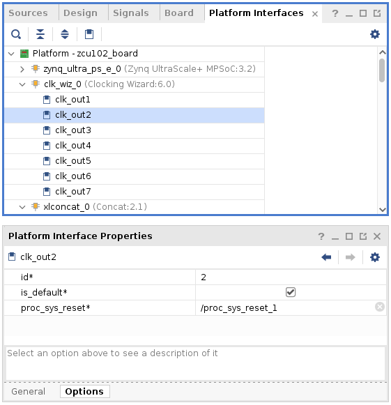

#### プラットフォーム AXI ポート

このカスタム プラットフォームの場合、sds++ システム コンパイラで使用できるように、すべての Zynq UltraScale+ MPSoC の PS 側の AXI ポート (マスターおよびスレーブ) が宣言されます。この場合、次の図でイネーブルになっている ps_e インターフェイスです。pl_clk0 インターフェイスは既に Clocking Wizard IP に 100.000 MHz 入力クロックを提供するためにハードウェアで使用されているので、SDx アクセラレータでの使用目的にはイネーブルになりません。

1. pl_clk0、S_AXI_ACP_FPD、および S_AXI_LPD 以外の **ps_e** インターフェイスすべてを選択します。右クリックして **[Enable]** をクリックします。

    **注記:** <kbd>Shift</kbd> または <kbd>Ctrl</kbd> を押して選択すると、複数のインターフェイスを選択できます。


#### プラットフォーム割り込み

PL ロジックのハードウェア アクセラレータからの割り込みソースは、**Concat** IP ブロックを介して Zynq UltraScale+ MPSoC IRQ 入力ポート (**pl_ps_irq0** および **pl_ps_irq1**) に接続されます。次の図は、sds++ システム コンパイラで使用できるように各 Concat ブロックで 8 個の割り込みソースがイネーブルになっています。

1. **xlconcat_0** 入力の **In0** から **In7** を右クリックし、[Enable] を選択します。

2. **xlconcat_1** 入力の **In0** から **In7** を右クリックし、[Enable] を選択します。


**xclconcat_0** オブジェクトなどの [Platform Interfaces] ウィンドウでオブジェクトをクリックすると、次の図のように、オブジェクトの PFM プロパティが [Block Properties] ウィンドウに表示されます。

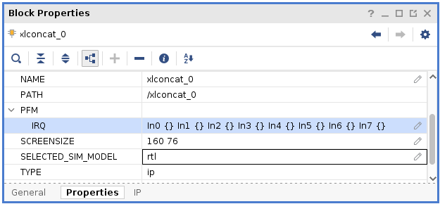

#### Tcl コンソール コマンド (参照用)

次に示すコマンドは参照用であり、前のセクションで説明したように **[Platform Interfaces]** タブでイネーブル/ディスエーブルにしてプラットフォーム プロパティを設定した場合は必要ありません。Vivado ジャーナルまたはログ ファイルからは、**[Platform Interfaces]** タブで実行された動作で生成された Tcl コマンドの履歴を確認できます。

1.  PFM NAME
    ```
    set_property PFM_NAME “vendor:lib:zcu102_board:1.0”\  
    [get_files [get_property FILE_NAME [get_bd_designs]]]
    ```
2.  PFM CLOCK
    ```
        set_property PFM.CLOCK {\  
        clk_out1 {id “1” is_default “false”\  
        proc_sys_reset “proc_sys_reset_0”}\  
        clk_out2 {id “2” is_default “true”\
        proc_sys_reset “proc_sys_reset_1”}\  
        clk_out3 {id “3” is_default “false”\  
        proc_sys_reset “proc_sys_reset_2”}\  
        clk_out4 {id “4” is_default “false”\  
        proc_sys_reset “proc_sys_reset_3”}\  
        clk_out5 {id “5” is_default “false”\  
        proc_sys_reset “proc_sys_reset_4”}\  
        clk_out6 {id “6” is_default “false”\  
        proc_sys_reset “proc_sys_reset_5”}\  
        clk_out7 {id “7” is_default “false”\  
        proc_sys_reset “proc_sys_reset_6”}\  
        } [get_bd_cells /clk_wiz_0]
    ```
3.  PFM AXI ポート
    ```
        set_property PFM.AXI_PORT {\  
        M_AXI_HPM0_FPD {memport “M_AXI_GP” sptag “” memory “”}\  
        M_AXI_HPM1_FPD {memport “M_AXI_GP” sptag “” memory “”}\  
        M_AXI_HPM0_LPD {memport “M_AXI_GP” sptag “” memory “”}\  
        S_AXI_HPC0_FPD {memport “S_AXI_HPC” sptag “” memory “”}\  
        S_AXI_HPC1_FPD {memport “S_AXI_HPC” sptag “” memory “”}\  
        S_AXI_HP0_FPD {memport “S_AXI_HP” sptag “” memory “”}\  
        S_AXI_HP1_FPD {memport “S_AXI_HP” sptag “” memory “”}\  
        S_AXI_HP2_FPD {memport “S_AXI_HP” sptag “” memory “”}\  
        S_AXI_HP3_FPD {memport “S_AXI_HP” sptag “” memory “”}\  
        } [get_bd_cells /zynq_ultra_ps_e_0]
    ```
4.  PFM 割り込み
    ```
        set_property PFM.IRQ {\  
        In0 {} In1 {} In2 {} In3 {} In4 {} In5 {} In6 {} In7 {}\
        } [get_bd_cells {/xlconcat_0 /xclconcat_1}]
    ```
</details>

<details>
<summary><big><strong>手順 4: HDL デザイン ファイルの生成</strong></big></summary>

デザインの HDL ファイルを生成します。

1. [Sources] ウィンドウで **zcu102_board.bd** ブロック デザインを右クリックし、**[Generate Output Products]** をクリックします。

    

2. **[Generate]** をクリックします。

    

3. [Design Runs] ビューのステータス列に「**Submodule Runs Complete**」と表示されると、zcu102_board 出力が生成されています。出力ファイルの生成をバックグラウンドで実行し、必要な場合に [Design Runs] ビューから確認できるように設定できます。

    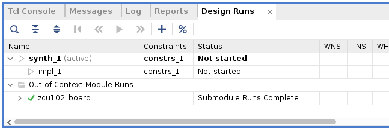

5. [Sources] ウィンドウで **zcu102_board.bd** を右クリックし、**[Create HDL Wrapper]** をクリックし、そのプラットフォーム デザイン用の最上位 HDL ラッパーを作成します。

   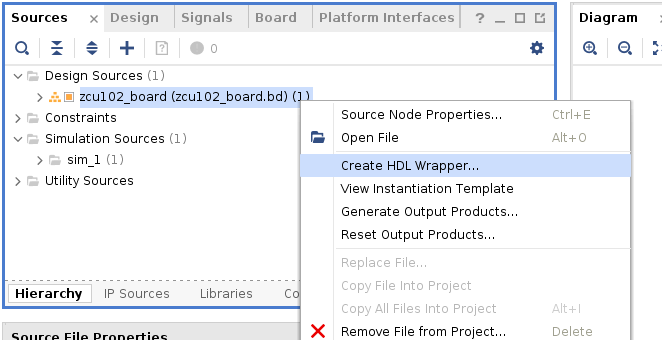

6. **[OK]** をクリックします。

    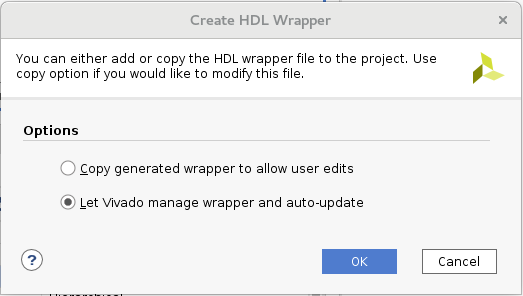

7. Flow Navigator で **[Generate Bitstream]** をクリックします。

8. Vivado ツールで、使用可能なインプリメンテーション結果がないことが示され、それらを生成するかどうかを尋ねるメッセージが表示されます。**[Yes]** をクリックして続行します。  

9. [Launch Runs] ダイアログ ボックスはデフォルトの設定のままにして **[OK]** をクリックします。

    合成およびインプリメンテーション run が、プラットフォーム デザイン用のネットリストの合成、ロジックの配置配線、必要なビットストリームの生成を順番に開始します。

10. [Bitstream Generated] ダイアログ ボックスが表示されたら、**[Cancel]** をクリックして閉じて、メイン メニューから **[File]** → **[Export]** → **[Export Hardware]** をクリックします。

11. 次に示すように **[Include bitstream]** チェック ボックスをオンにします。

    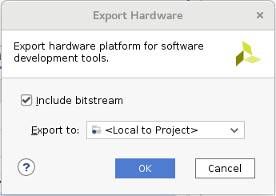

    これで SDSoC アクセラレータのないハードウェア デザインを含む Zynq UltraScale+ MPSoC ビットストリームが生成されました。このビットストリームは、ハードウェア アクセラレータを生成するために SDx IDE でデザインを実行修正前に、ハードウェア機能をチェックするために使用できます。
</details>

<details>
<summary><big><strong>手順 5: DSA の出力</strong></big></summary>

ここまでで、IP インテグレーター ハードウェア デザインを PFM プロパティ デザイン メタデータと一緒aデバイス サポート アーカイブ (DSA) (SDSoC プラットフォームの定義の一部になった) に含めることができるようになりました。

1.  [Tcl Console] ウィンドウに次のように入力し、<kbd>Enter</kbd> キーを押します。

    `write_dsa -force -include_bit /tmp/zcu102_board/zcu102_board.dsa`

    **注記:** プロジェクトに別の名前を付けた場合は、それに合わせてコマンドを変更する必要があります。

2.  [Tcl Console] ウィンドウに次のように入力し、DSA を確認します。

    `validate_dsa /tmp/zcu102_board/zcu102_board.dsa`

3.  DSA を確認したら、Vivado GUI を閉じます。

</details>

### まとめ

演習 1 では、Vivado Design Suite の Vivado IP インテグレーターを使用して ZCU102 ボードをターゲットにした Zynq UltraScale+ MPSoC ハードウェア デザインを作成しました。PS Zynq UltraScale+ MPSoC IP のほか、クロック、リセット、および割り込み用に主な PL IP ブロックも追加して、ベース ハードウェア プラットフォームを定義しました。sds++ システム コンパイラで使用できるようにハードウェア インターフェイス選択を宣言した後、DSA を作成して SDSoC プラットフォームのハードウェア コンポーネントを定義しました。

## 関連情報
 - <a href="Lab2-Creating-Software-Components.md">演習 2: SDSoC プラットフォームの作成</a>
 - <a href="Lab3-Creating-Custom-Platform-Using-the-SDx-IDE.md">演習 3: カスタム プラットフォームの使用</a>

<hr/>
<p align="center"><sup>Copyright&copy; 2019 Xilinx</sup></p>

この資料は表記のバージョンの英語版を翻訳したもので、内容に相違が生じる場合には原文を優先します。資料によっては英語版の更新に対応していないものがあります。日本語版は参考用としてご使用の上、最新情報につきましては、必ず最新英語版をご参照ください。