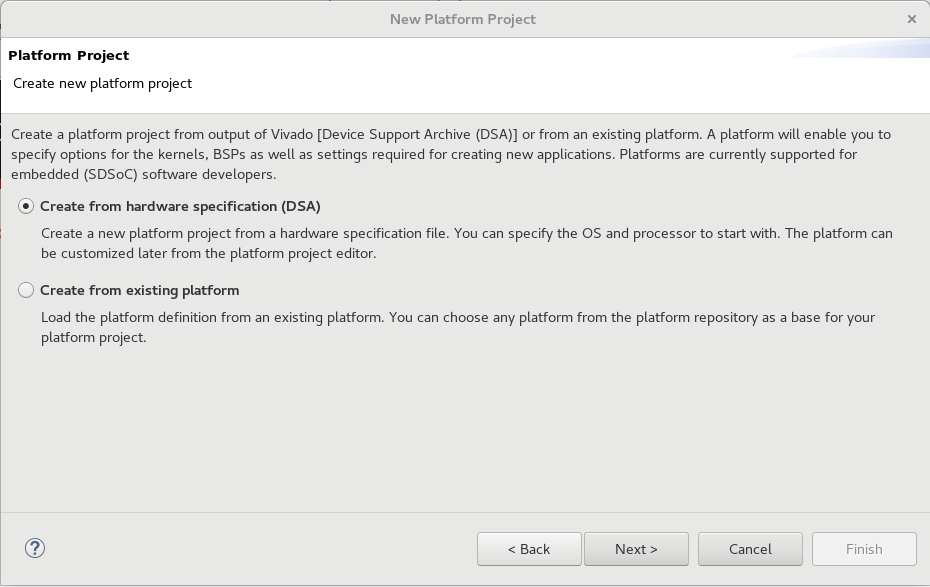
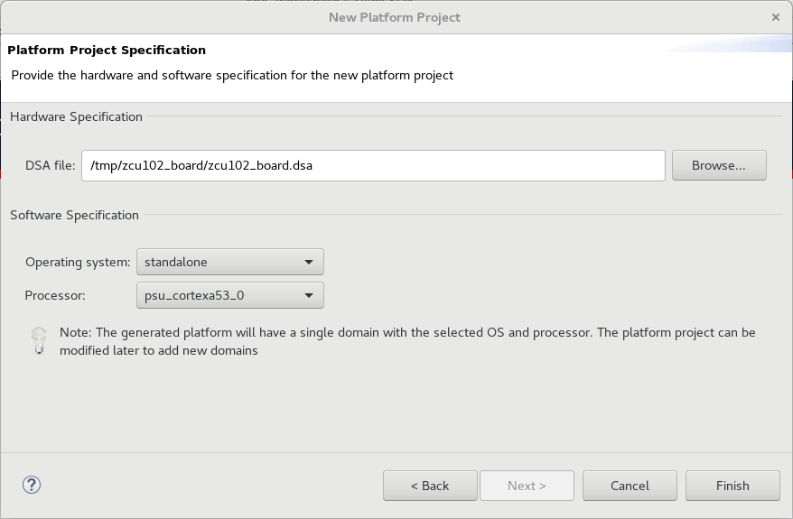
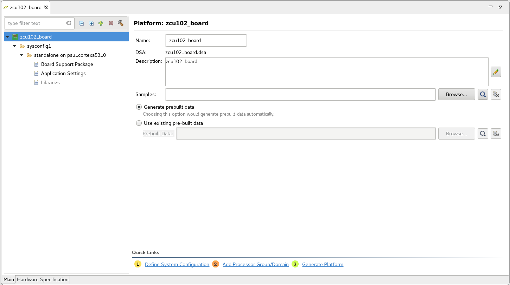
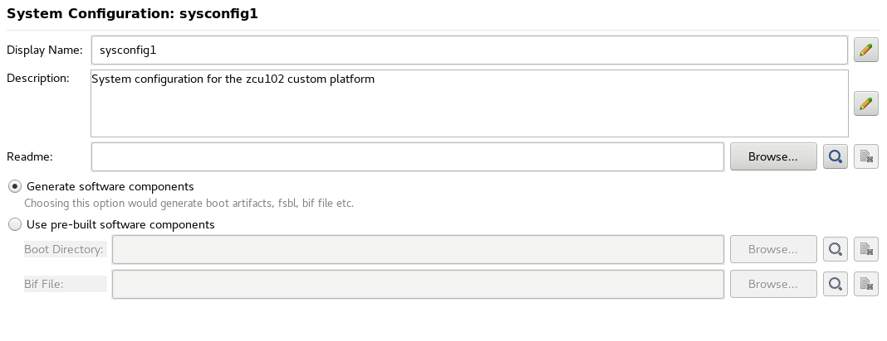
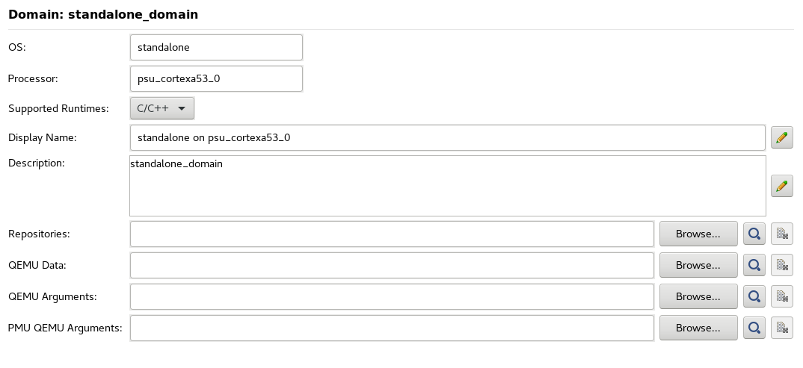
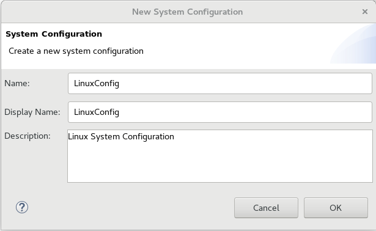
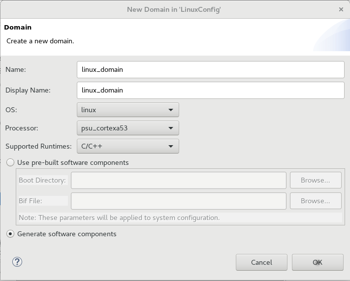
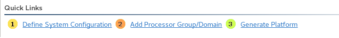



<a href="../../platform-creation-tutorial/README.md">English</a> | <a>日本語</a>

<table style="width:100%">
  <tr>
<td align="center" width="100%" colspan="6"><h1>2018.3 SDSoC™ 開発環境チュートリアル</h1>
<a href="https://github.com/Xilinx/SDSoC-Tutorials/branches/all">ほかのバージョンを参照</a>
</td>

  </tr>
  <tr>
    <td colspan="4" align="center"><h2>演習: プラットフォームの作成</h2></td>
  </tr>
  <tr>
     <td align="center"><a href="Lab1-Creating-DSA-for-Zynq-MPSoC-Processor-Design.md">概要</a></td>
     <td align="center"><a href="Lab1-Creating-DSA-for-Zynq-MPSoC-Processor-Design.md">演習 1: Zynq UltraScale+ MPSoC プロセッサ デザイン用の DSA の作成</a></td>
     <td align="center">演習 2: SDSoC プラットフォームの作成</td>
     <td align="center"><a href="Lab3-Creating-Custom-Platform-Using-the-SDx-IDE.md">演習 3: カスタム プラットフォームの使用</a></td>
   </tr>
</table>

## 演習 2: SDSoC プラットフォームの作成  
演習 1 では、SDSoC プラットフォームのハードウェア コンポーネント (ハードウェア デザインのフレームワークを含む DSA ファイル) を作成しました。この演習では、**zcu102_board** プラットフォームを定義する SDSoC プラットフォーム プロジェクトを作成するほか、スタンドアロン (またはベアメタル) オペレーティング システム用のソフトウェアのエレメントも生成します。必要なソフトウェア コンポーネントは、次のとおりです。

- **FSBL (第 1 段階ブートローダー)**: FSBL は プロセッサ (PS) ブロックを初期化し、必要であればビットストリームを使用してプログラマブル ロジック (PL) をコンフィギュレーションし、第 2 段階ブーブートローダーブート ファイルを読み込むか、ブート ファイルで指定されたとおりにアプリケーションを読み込みます。

- **リンカー スクリプト**: リンカー スクリプトは実行可能なソフトウェア アプリケーション ファイル内のコードおよびデータ領域に使用するメモリ アドレス空間を指定します。実行可能ファイルは、ELF (Executable and Linkable Format) にフォーマットされます。スタックおよびヒープ サイズもリンカー スクリプト内で指定します。

- **ブート イメージ フォーマット (BIF) ファイル**: BIF ファイルは、Zynq&reg; UltraScale MPSoC ブート ファイル (BOOT.BIN) の構築方法を指定します。ブート ファイルには、FSBL と実行可能アプリケーション ELF ファイルが含まれます。また、ビットストリームだけでなく、追加プログラムおよびデータ ファイルも含まれます。

>:pushpin: **注記:**
>ブート イメージの作成に関する詳細は、『ZynqUltraScale+ MPSoC ソフトウェア開発者向けガイド』 ([UG1137](https://japan.xilinx.com/support/documentation/user_guides/j_ug1137-zynq-ultrascale-mpsoc-swdev.pdf)) を参照してください。

<big><strong>手順 1: SDx&trade; IDE の起動</strong></big>

#### Linux ホスト マシン

シェル プロンプトに次のコマンドを入力します。
   
   1. `source <Xilinx_Install_Directory>/SDx/<Version>/settings64.{sh,csh}`
   2. `sdx`
    
1 つ目のコマンドで SDx IDE を起動する前に環境変数を設定し、2 つ目のコマンドでツールを起動しています。 

#### Windows ホスト マシン

Windows ホスト マシンの場合は、次のいずれかの方法で Vivado&reg; を起動します。

- Vivado デスクトップ アイコンをクリックします。

- **[スタート]** メニューから **[Xilinx Design Tools]** → **[Vivado 2018.3]** → **[Vivado 2018.3]** をクリックします。

- コマンド プロンプト ウィンドウで次のコマンドを入力します。
   
1. `<Xilinx_Install_Directory>/SDx/<Version>/settings64.bat`
2. `sdx`
    
    1 つ目のコマンドで SDx IDE を起動する前に環境変数を設定し、2 つ目のコマンドでツールを起動しています。 

SDx IDE が開いたら、SDx ワークスペースを指定する画面が表示されます。SDx ワークスペースには、SDx ツールで開発するプラットフォームとアプリケーション プロジェクトが含まれます。ワークスペースは、新しいプラットフォームまたはアプリケーション プロジェクトを作成する際に変更できます。 

1. この演習では、次のようにワークスペースを「**/tmp/sdx_workspace_workspace**」と指定します。

   

1. **[OK]** をクリックします。

1. SDx IDE の [Welcome] 画面で **[Create Platform Project]** をクリックします。

   または、SDx IDE メニュー から **[File]** → **[New]** → **[SDx Platform Project]** をクリックします。

   

   この演習では、SDSoC プラットフォームに必要なソフトウェア コンポーネントを作成し、次の演習でハードウェアとソフトウェア コンポーネントをプラットフォーム プロジェクト内でまとめて、SDSoC プラットフォームを定義します。

<big><strong>手順 2: 新規プラットフォーム プロジェクトの作成</strong></big>

1. [New Platform Project] ダイアログ ボックスで [Project name] に「**zcu102_board**」と入力します。

    

2. **[Next]** をクリックします。

3. [Platform] ページで **[Create from hardware specification (DSA)]** をオンにします。

    

4. **[Next]** をクリックします。

5. **[Browse]** ボタンをクリックして DSA ファイルを追加します。

6. 演習 1 で生成した **zcu102_board.dsa** ファイルを指定します。 

    **注記:** これは /tmp/zcu102_board/zcu102_board.dsa にあります。

    SDx ツールでは選択した DSA ファイルを読み込んで、次の図のように使用可能なソフトウェア仕様を含めて [Platform Project] ダイアログ ボックスを表示します。  

    

7. [Software Specification] で次を選択します。

    - \[Operating system]: **standalone**
    - \[Processor]: **psu_cortex53_0**

     

8. **[Finish]** をクリックします。

<big><strong>手順 3: システム コンフィギュレーションの定義とプラットフォームの生成</strong></big>

プラットフォーム プロジェクトが作成され、次の図のように SDx IDE の編集エリアにプラットフォーム コンフィギュレーション設定が開きます。SDx ツールでは **sysconfig1** というシステム コンフィギュレーションと、選択したオペレーティング システムとプロセッサに基づいた名前のプロセッサ ドメインが自動的に作成されます。 

   

次に、プラットフォーム プロジェクトを編集して、新しいコンフィギュレーションとドメインを追加します。

1. [Platform Configuration Settings] ツリー ビューで最上位プラットフォーム プロジェクト (**zcu102_board**) を選択します。プラットフォームの記述は変更できます。プラットフォーム プロジェクトのフィールドは、**[Edit]** コマンド (鉛筆アイコン) をクリックすると変更できます。 

2. サンプル アプリケーション ファイルを参照して、プラットフォームの ./samples フォルダーに追加します。これらのファイルはオプションです。このフォルダーは指定しない限り作成されません。 

3. **[Generate prebuilt data]** をオンにして、プラットフォーム用のプリビルド フォルダーを生成します。**[Use existing prebuilt data]** をオンにして、別のプラットフォームからのプリビルド データを指定することもできます。 

    ソフトウェア ファイル、ポート インターフェイス仕様およびビットストリームを含むプリビルド データを使用したプラットフォームを使用すると、ソフトウェア アプリケーションがハードウェア アクセラレーションされた関数を開始しないので、すばやくコンパイルおよび実行できます。

   

1. 上の図に示すツリー ビューで **[sysconfig1]** をクリックします。システム コンフィギュレーションの詳細は、**[Edit]** コマンド (鉛筆アイコン) をクリックすると変更できます。 

2. システム コンフィギュレーションに **Readme** ファイルがある場合は追加します。 

3. この演習では、**[Generate software components]** をオンにして、SDx IDE で現在のプラットフォームのシステム コンフィギュレーションに必要なファイルが自動的に生成されるようにします。  または、**[Use pre-built software components]** をオンにして必要なファイルを指定します。

   

4. 上の図に示すツリー ビューで **[standalone on psu_cortexa53_0]** ドメインをクリックします。このビューでは、
ボード サポート パッケージ、アプリケーション リンカー スクリプト、および含まれるライブラリを指定します。このページは変更しません。フィールドを確認だけしてください。詳細は、『SDSoC 環境プラットフォーム開発ガイド』 ([UG1146](https://japan.xilinx.com/support/documentation/sw_manuals_j/xilinx2018_3/ug1146-sdsoc-platform-development.pdf)) を参照してください。 

これで、SDSoC プラットフォーム プロジェクトを設定したときの選択肢に基づいて自動的に定義された最初のシステム コンフィギュレーションが作成できましたが、このチュートリアルでは Linux オペレーティング システム用に 2 つ目のシステム コンフィギュレーションも定義します。こうしておくと、カスタム プラットフォームをスタンドアロン アプリケーションや Linux ベースのアプリケーションで使用できます。 

1. プロジェクト エディターで **[Add]** コマンド (緑の **+** アイコン) をクリックして、新しいシステム コンフィギュレーションを追加します。 

   

    上記のような **[New System Configuration]** ダイアログ ボックスが開くので、コンフィギュレーションの [Name]、[Display Name]、[Description] を記述します。 
    
    **注記:** Linux オペレーティング システムのソフトウェア コンポーネントを生成するには、PetaLinux ツールをインストールして、SDSoC 開発環境にアクセスできるようにしておく必要があります。PetaLinux には、ザイリンクス デバイス用に統合およびテスト済みの完全なリファレンス Linux ディストリビューションが提供されています。詳細は、『PetaLinux ツール資料: リファレンス ガイド』 ([UG1144](https://japan.xilinx.com/support/documentation/sw_manuals_j/xilinx2018_3/ug1144-petalinux-tools-reference-guide.pdf)) を参照してください。システムに PetaLinux をインストールしたら、**[Windows]** → **[Preferences]** をクリックし、[Preferences] ダイアログ ボックスで **[Xilinx SDx]** → **[Platform Project]** をクリックして SDSoC 環境で **[PetaLinux Install Location]** を設定する必要もあります。
    
2. 次のように入力します。

- \[Name]: LinuxConfig
- \[Display Name]: Linux Config
- \[Description]: 説明を追加してください。 

3. **[OK]** をクリックして、新しいシステム コンフィギュレーションをプラットフォーム プロジェクトに追加します。 

4. プロジェクト エディターで **[Add]** コマンド (緑の *+* アイコン) をクリックして、新しいドメインを追加します。

   

    上記のような **[New Domain]** ダイアログ ボックスが開くので、コンフィギュレーションの \[Name]、\[Display Name]、\[Description] を記述します。 
    
5. 次のように入力します。

- \[Name]: **linux_domain**
- \[Display Name]: **linux_domain**
- \[OS]: ドロップダウン リストから **[linux]** を選択します。 
- \[Processor]: **psu_cortexta53**
- \[Supported Runtimes]: **[C/C++]** を選択します。
- **[Generate software components]** をオンにします。

6. **[OK]** をクリックして、新しいドメインをプラットフォーム プロジェクトに追加します。 

7. ページの一番下のクイック リンクから **[3: Generate Platform]** をクリックし、現在のプロジェクトからプラットフォーム ファイルを生成します。

   

    SDx ツールは ./sw フォルダーをコンパイルして、FSBL に必要なファイル、リンカー スクリプト (lscript.ld)、および BIF ファイルをシステム コンフィギュレーションごとに生成します。また、指定した場合は、プラットフォームをテストするためのプリビルド アプリケーション ファイルも生成されます。最後に、演習 1 からのハードウェア プラットフォーム DSA ファイルをプラットフォームの ./hw フォルダーにコピーします。エクスポートしたプラットフォームの内容は、次の図のようになります。 

   

### まとめ

演習 2 では、演習 1 の Vivado Design Suite で作成した DSA ファイルを SDx 環境のプラットフォーム プロジェクトに読み込みました。SDx IDE を使用し、プラットフォームの Standalone システム コンフィギュレーションと Linux システム コンフィギュレーションを指定しました。SDSoC アプリケーション プロジェクトで使用するために、指定したプラットフォームの詳細で実際のプラットフォームを生成しました。演習 3 では、作成したプラットフォームを使用します。 
## 関連情報
 - <a href="Lab1-Creating-DSA-for-Zynq-MPSoC-Processor-Design.md">演習 1: Zynq UltraScale+ MPSoC プロセッサ デザイン用の DSA の作成</a>
 - <a href="Lab3-Creating-Custom-Platform-Using-the-SDx-IDE.md">演習 3: カスタム プラットフォームの使用</a>

Copyright&copy; 2019 Xilinx

この資料は表記のバージョンの英語版を翻訳したもので、内容に相違が生じる場合には原文を優先します。資料によっては英語版の更新に対応していないものがあります。日本語版は参考用としてご使用の上、最新情報につきましては、必ず最新英語版をご参照ください。
