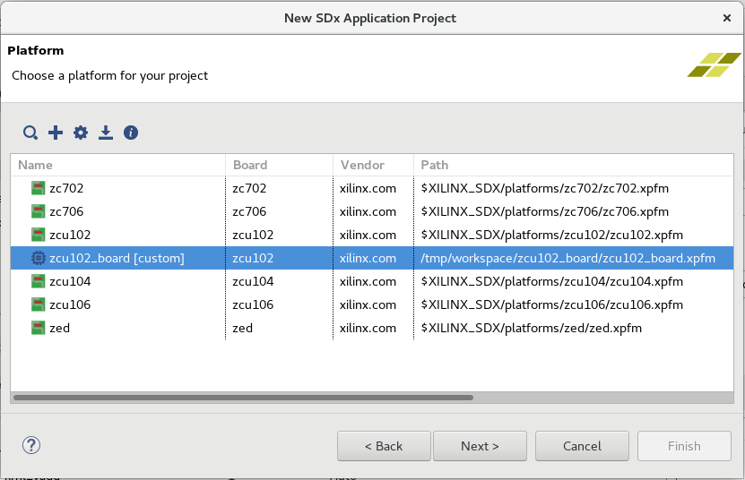
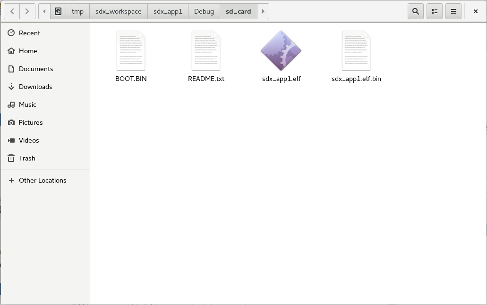



<table style="width:100%">
  <tr>

<th width="100%" colspan="6"><h1>演習: SDSoC プラットフォームの作成</h2>
</th>

</tr>
  <tr>
    <td width="17%" align="center"><a href="README.md">概要</a></td>
    <td width="16%" align="center"><a href="Lab1-Creating-DSA-for-Zynq-MPSoC-Processor-Design.md">演習 1: Zynq UltraScale+ MPSoC プロセッサ デザイン用の DSA の作成</a></td>
    <td width="17%" align="center"><a href="Lab2-Creating-Software-Components.md">演習 2: SDSoC プラットフォームの作成</a></td>
    <td width="17%" align="center">演習 3: カスタム プラットフォームの使用</td>
  </tr>
</table>

## 演習 3: カスタム プラットフォームの使用

1.  SDx IDE メニュー 、から **[File]** → **[New]** → **[SDx Application Project]** をクリックして新しいアプリケーション プロジェクトの作成を開始します。

1.  [Create a New SDx Application Project] ダイアログ ボックスでプロジェクトの名前に **sdx\_app1** と入力します。

1.  **[Next]** をクリックします。

    

1.  [Platform] ダイアログ ボックスで **[Add Custom Platform]** (**+** アイコン) をクリックします。

    [Specify Custom Platform Location] ダイアログ ボックスが開くので、プラットフォームのフォルダーを選択します。このチュートリアルの手順に従ってきた場合、プラットフォームは /tmp/sdx_workspace/zcu102_board/export/zcu102_board に含まれます。

    

1. **[zcu102_board]** プラットフォームを [Platform] ダイアログ ボックスで選択したら、**[Next]** をクリックします。 

1.  [System Configuration] ページは、デフォルト設定のままにします。

    - \[System configuration]: **sysconfig1**
    - \[Runtime]: **C/C++**
    - \[Domain]: **standalone on psu_cortexa53**
    - \[CPU]: **psu_cortexa53_0**
    - \[OS]: **standalone**

    
    Linux アプリケーションを生成する場合は、[LinuxConfig] システムを選択します。
1. **[Next]** をクリックします。

1.  [Templates] ページで **[Array Partitioning]** を選択して **[Finish]** をクリックします。

    

    **注記:** サンプル アプリケーションを取得またはアップデートするには、**[SDx Examples]** ボタンをクリックします。詳細は、『SDSoC 開発環境ユーザー ガイド』 ([UG1027](https://japan.xilinx.com/support/documentation/sw_manuals_j/xilinx2018_3/ug1027-sdsoc-user-guide.pdf)) を参照してください。 

   新しく作成した SDSoC アプリケーション `sdx_app1` が [Project Explorer] ビューおよび [Assistant] ビューに表示されます。

   >:pushpin: **注記:**
   >[Assistant] ビューには、[Array Partitioning] 例の一部である `matmul_partition_accel` という名前のハードウェア アクセラレーション関数が表示されます。

1. [Application Project Settings] ウィンドウには `sdx_app1` の設定が表示されます。

    

1. [Assistant] ビューで **[sdx_app1 [SDSoC]]** の下の **[Debug[Hardware]]** を右クリックし、**[Build]** をクリックします。

1. [Assistant] ビューには、次のリンクを使用したビルド結果が表示されます。

   - コンパイル ログ

   - アクセラレータのデータ モーション レポート

   - 生成された SD カード イメージの内容

   

1. [Console] ビューをスクロールすると、**sds.log** に含まれるのログのビルド プロセスの記録を確認することもできます。

    

1. [Assistant] ビューで **[SD Card Image]** を右クリックし、**[Open]** → **[Open in File Browser]** をクリックして、ディスクの SD カードの内容を表示します。`sd_card` ディレクトリは `/tmp/sdx_workspace/sdx_app1/Debug/sd_card` の SDx ワークスペース内に含まれます。

   

    SD カードの内容を FAT32 フォーマットの SD カードにコピーして、この SD カードを使用して ZCU102 プラットフォームを起動して、ターミナル プログラムで sdx\_app1 UART 出力を確認します。

### まとめ

演習 3 では、スタンドアロン ソフトウェア ランタイム環境を使用して Zynq UltraScale+ MPSoC をターゲットにしたカスタム SDSoC プラットフォームを作成しました。また、カスタム SDSoC プラットフォーム (zcu102_board) 上に SDSoC の配列パーティションの例をビルドしました。  

### チュートリアル終了

## 関連情報
 - <a href="Lab1-Creating-DSA-for-Zynq-MPSoC-Processor-Design.md">演習 1: Zynq UltraScale+ MPSoC プロセッサ デザイン用の DSA の作成</a>
 - <a href="Lab2-Creating-Software-Components.md">演習 2: SDSoC プラットフォームの作成</a>

Copyright&copy; 2019 Xilinx

この資料は表記のバージョンの英語版を翻訳したもので、内容に相違が生じる場合には原文を優先します。資料によっては英語版の更新に対応していないものがあります。日本語版は参考用としてご使用の上、最新情報につきましては、必ず最新英語版をご参照ください。
