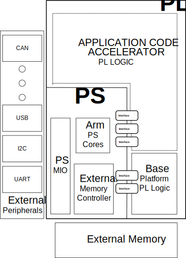

<a href="../../platform-creation-tutorial/README.md">English</a> | <a>日本語</a>

<table style="width:100%">
  <tr>
<td align="center" width="100%" colspan="6"><h1>2018.3 SDSoC™ 開発環境チュートリアル</h1>
<a href="https://github.com/Xilinx/SDSoC-Tutorials/branches/all">ほかのバージョンを参照</a>
</td>

  </tr>
  <tr>
    <td colspan="4" align="center"><h2>プラットフォームの作成</h2></td>
  </tr>
  <tr>
     <td align="center">概要</td>
     <td align="center"><a href="Lab1-Creating-DSA-for-Zynq-MPSoC-Processor-Design.md">演習 1: Zynq UltraScale+ MPSoC プロセッサ デザイン用の DSA の作成</a></td>
     <td align="center"><a href="Lab2-Creating-Software-Components.md">演習 2: SDSoC プラットフォームの作成</a></td>
     <td align="center"><a href="Lab3-Creating-Custom-Platform-Using-the-SDx-IDE.md">演習 3: カスタム プラットフォームの使用</a></td>
   </tr>
</table>

## 概要

SDSoC&trade; 開発環境は、Zynq&reg;-7000 SoC または Zynq UltraScale+&trade; MPSoC デバイスを使用してヘテロジニアス エンベデッド システムをインプリメントするのに必要なツールです。 

このチュートリアルでは、SDSoC プラットフォームの作成方法を説明し、そのプラットフォーム上で SDSoC アプリケーション例を作成して実行します。ハードウェア プラットフォームの作成には Vivado&reg; Design Suite を、SDSoC アプリケーションを含むソフトウェア プラットフォームの作成には SDx&trade; 統合環境 (IDE) を使用します。

プラットフォームのコンセプトは SDSoC 環境には不可欠で、SDSoC アプリケーションをビルドするハードウェア、ソフトウェア、メタデータ コンポーネントを定義します。SDSoC プラットフォームでは、ベース ハードウェアおよびソフトウェア アーキテクチャおよびアプリケーション コンテキストが定義されます。これには、プロセッシング システム、外部メモリ インターフェイス、カスタム入力/出力、ソフトウェア ランタイムが含まれます。ソフトウェア ランタイムには、オペレーティング システム (ベアメタルの場合もあり)、ブートローダー、プラットフォーム ペリフェラルやルート ファイル システムのドライバーが含まれます。SDx 環境内で作成したプロジェクトは、すべて特定のハードウェア プラットフォームをターゲットとし、sds++/sdscc システム コンパイラ (sds++ と呼ぶ) などのツールを使用して、そのプラットフォームのアプリケーション特有のハードウェア アクセラレータおよびデータ モーション ネットワークをカスタマイズします。

  

このチュートリアルには、スタンドアロンまたはベアメタル ソフトウェア ランタイム環境で動作する Zynq UltraScale+ MPSoC ベースの ZCU102 ボードをターゲットにした 3 つの演習が含まれます。プラットフォームを構成するハードウェアおよびソフトウェア コンポーネントをビルドする方法を手順ごとに説明します。

1.  プラットフォームのデバイス サポート アーカイブ (DSA) と呼ばれるハードウェア コンポーネントを作成します。

      1. DSA には、IP インテグレーター ハードウェア デザインとデザインのメタデータ プロパティが含まれます。

2.  ソフトウェア コンポーネントを定義して、それらをハードウェア DSA とマッチングさせて SDSoC プラットフォームを作成します。

    1. SDx IDE とその 4 つの段階プロセスを使用してカスタム プラットフォームを作成します。

3. SDSoC ハードウェア アクセラレーション アプリケーションを新しいプラットフォームに作成して実行します。

Zynq ファミリでサポートされるプラットフォームでは、ハードウェアおよびソフトウェアのシステム デザインをパーティションして最適化可能な製品を開発できるように、Arm ベースのプロセッサ システム (PS) と高パフォーマンスのユーザー プログラマブル ロジック (PL) がまとめられます。次の図は、プラットフォームが作成される Zynq デバイスの機能を示しています。

  

Zynq ベースのプラットフォームでは、PS Arm プロセッサ コア、統合 PS I/O (MIO) ペリフェラル ブロック、PS 外部 DDR メモリ コントローラー、多数のコンフィギュレーション可能な PS to PL および PL to PS インターフェイスのほか、PL 用にデザインされたロジック ブロックも使用できます。

SDSoC 環境の詳細は、『SDSoC 環境ガイド』 ([UG1027](https://japan.xilinx.com/support/documentation/sw_manuals_j/xilinx2018_3/ug1027-sdsoc-user-guide.pdf)) および『SDSoC 環境プラットフォーム開発ガイド』 ([UG1146](https://japan.xilinx.com/support/documentation/sw_manuals_j/xilinx2018_3/ug1146-sdsoc-platform-development.pdf)) を参照してください。

## ハードウェアおよびソフトウェア要件

このチュートリアルを実行するには、2018.3 SDx をインストールしておく必要があります。インストール手順、リリース ノート、インストールおよびライセンスの詳細は、『SDSoC 環境リリース ノート、インストール、およびライセンス ガイド』 ([UG1294](https://japan.xilinx.com/support/documentation/sw_manuals_j/xilinx2018_3/ug1294-sdsoc-rnil.pdf)) を参照してください。すべて SDx 環境に、ターゲット デバイスのプラグラムおよびカスタム ハードウェア プラットフォームの開発のために Vivado Design Suite が含まれます。ターゲット ボードがなくてもビルド手順はすべて終了できますが、ハードウェアでのテストには ZCU102 が必要です。

このプラットフォーム作成のチュートリアルの手順に従うと、スタンドアロン ターゲット アプリケーション用の ZCU102 SDSoC プラットフォームが生成できます。Linux オペレーティング システム ターゲット環境内で実行できるアプリケーションの作成については、『SDSoC 環境プラットフォーム開発ガイド』 ([UG1146](https://japan.xilinx.com/support/documentation/sw_manuals_j/xilinx2018_2/ug1146-sdsoc-platform-development.pdf)) を参照してください。Linux ターゲット アプリケーションは Linux ホスト マシンでビルドする必要がありますが、スタンドアロン ターゲット アプリケーションは Windows または Linux ホスト マシンのいずれかでビルドできます。

次は、このチュートリアルに最低限必要なソフトウェアおよびハードウェア要件です。  

  - [SDSoC 2018.3 開発環境] (https://japan.xilinx.com/support/download.html)

      - [UG1294](https://japan.xilinx.com/support/documentation/sw_manuals_j/xilinx2018_3/ug1294-sdsoc-rnil.pdf): リリース ノート、インストール、およびライセンス ガイド

  - [ZCU102 評価ボード](https://japan.xilinx.com/products/boards-and-kits/ek-u1-zcu102-g.html)

      - FAT32 フォーマットの SD カード

      - ZCU102 USB to UART インターフェイス用 USB Host Type-A to mini-USB ケーブル

      - Silicon Labs CP210x の Host PC USB to UART ドライバー

          - [XTP426](https://japan.xilinx.com/support/documentation/boards_and_kits/install/ug1033-cp210x-usb-uart-install.pdf): Silicon Labs CP210x USB-to-UART インストール ガイド

## 関連情報
 - <a href="Lab1-Creating-DSA-for-Zynq-MPSoC-Processor-Design.md">演習 1: Zynq UltraScale+ MPSoC プロセッサ デザイン用の DSA の作成</a>
 - <a href="Lab2-Creating-Software-Components.md">演習 2: SDSoC プラットフォームの作成</a>
 - <a href="Lab3-Creating-Custom-Platform-Using-the-SDx-IDE.md">演習 3: カスタム プラットフォームの使用</a>

Copyright&copy; 2019-2019 Xilinx

この資料は表記のバージョンの英語版を翻訳したもので、内容に相違が生じる場合には原文を優先します。資料によっては英語版の更新に対応していないものがあります。日本語版は参考用としてご使用の上、最新情報につきましては、必ず最新英語版をご参照ください。