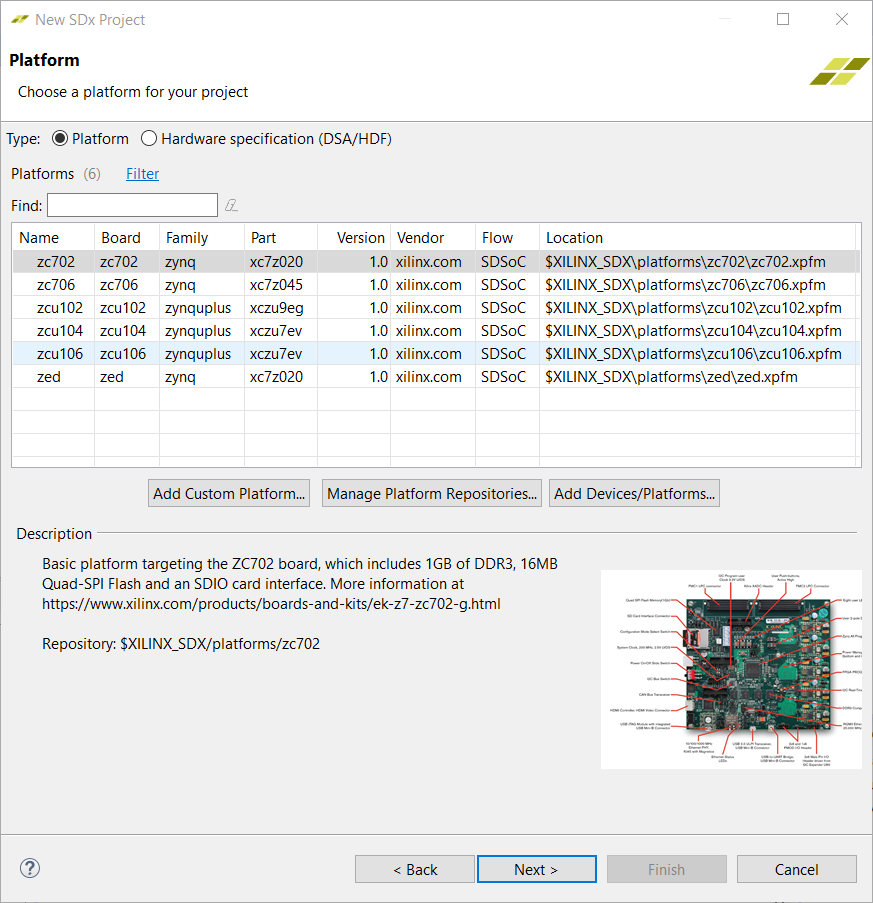
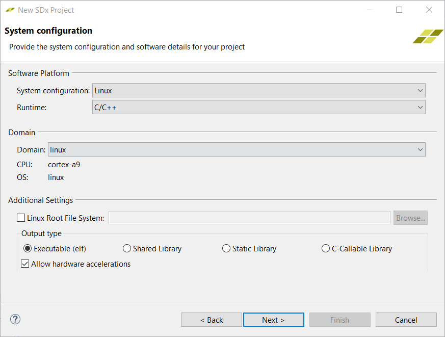
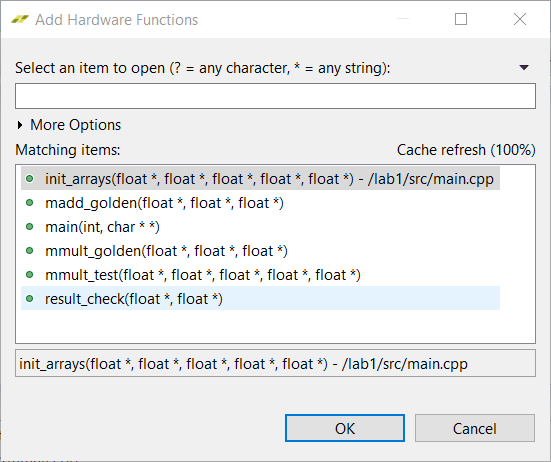
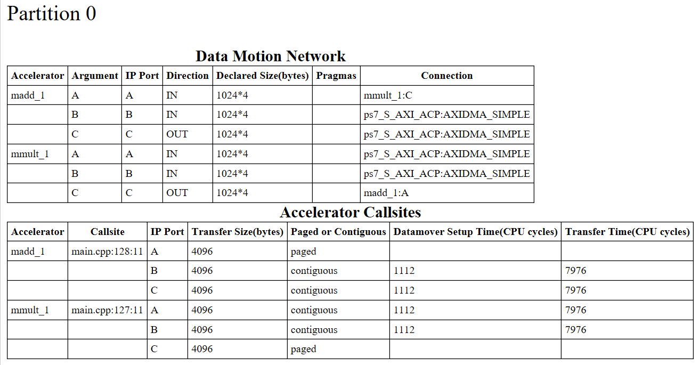
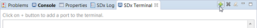
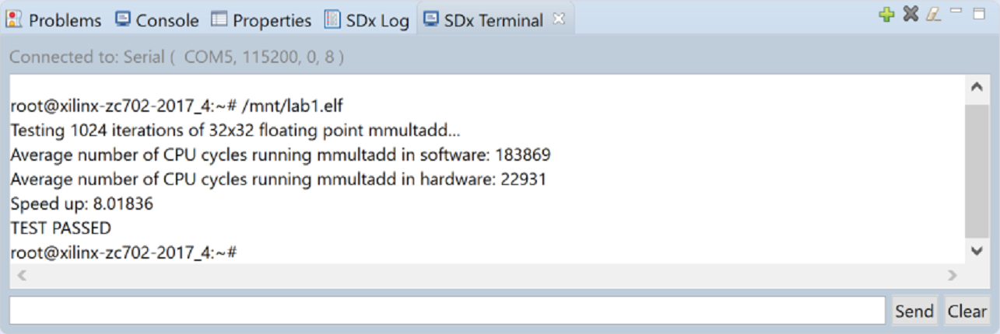

<table style="width:100%">
  <tr>
    <th width="100%" colspan="6"><h1>SDSoC Environment Tutorial: Introduction</h1>
</th>
  </tr>
  <tr>
    <td align="center"><a href="README.md">Introduction</a></td>
    <td align="center">Lab 1: Introduction to the SDSoC Development Environment</td>
    <td align="center"><a href="lab-2-performance-estimation.md">Lab 2: Performance Estimation</a></td>
    <td align="center"><a href="lab-3-optimize-the-application-code.md">Lab 3: Optimize the Application Code</a></td>
    <td align="center"><a href="lab-4-optimize-the-accelerator-using-directives.md">Lab 4: Optimize the Accelerator Using Directives</a></td>
  </tr>
  <tr>
    <td align="center"><a href="lab-5-task-level-pipelining.md">Lab 5: Task-Level Pipelining</a></td>
    <td align="center"><a href="lab-6-debug.md">Lab 6: Debug</a></td>
    <td align="center"><a href="lab-7-hardware-debug.md">Lab 7: Hardware Debug</a></td>
    <td align="center"><a href="lab-8-emulation.md">Lab 8: Emulation</a></td>
    <td align="center"><a href="lab-9-installing-applications-from-github.md">Lab 9: Installing Examples from GitHub</a></td>
</table>

## Lab 1: Introduction to the SDSoC Development Environment  

This lab demonstrates how you can use the SDSoC environment to create a new project using available templates, mark a function for hardware implementation, build a hardware implemented design, and run the project on a ZC702 board.  

>**:pushpin: NOTE:**  You can complete this tutorial even if you do not have a ZC702 board. When creating the SDSoC environment project, select your board and one of the available templates, if the suggested template **Matrix Multiplication and Addition** is not found. For example, boards such as the MicroZed with smaller Zynq-7000 devices offer the **Matrix Multiplication and Addition (area reduced)** application as an available template. A different application can be used to learn the objectives of this tutorial, as long as the application exits (this is a requirement to run the instrumented application on the board to collect software runtime data). Consult your board documentation for setup information.

<strong>Step 1: Creating a New Project</strong>

  1. Launch the SDx IDE 2018.2 using the desktop icon or the Start menu.

  2. When you launch the SDx IDE, the Workspace Launcher dialog appears. Click **Browse** to enter a workspace folder used to store your projects (you can use workspace folders to organize your work), then click OK to dismiss the Workspace Launcher dialog.  

  3. The SDx IDE window opens with the Welcome tab visible when you create a new workspace. The tab includes links for Create SDx Project, Add Custom Platform, Import Project, Tutorials, and Web Resources. Clicking any of these links takes you to further options available under each link. For example, to access documentation and tutorials, clicking on Tutorials takes you to the Tutorials page which has links for SDSoC and SDAccel related documents. The Welcome tab can be dismissed by clicking the X icon or minimized if you do not wish to use it.  

  4. From the SDx IDE menu bar select **File > New > SDx Project**. The New SDx Project dialog box opens.  

       

  5. Application Project is selected by default. Click **Next**.  

  6. In the Create a New SDx Project page, specify the name of the project, `lab1`.  

  7. Click **Next**.  

  8. From the Platform page, select the zc702 platform.  

       

     >**:pushpin: NOTE:**  If a custom platform is being used that is not in the list of supported platforms, click **Add Custom Platform** to add the custom platform.  

  9. Click **Next**.  

  10. From the System configuration drop-down list for the selected platform, select **Linux**. Leave all other fields at their default values.  

        

  11. Click **Next**.  
      The Templates page appears, containing source code examples for the selected platform.  

  12. From the list of application templates, select **Matrix Multiplication and Addition** and click **Finish**.  

        

  13. The standard build configurations are **Debug** and **Release**, and you can create additional build configurations. To get the best runtime performance, switch to use the Release configuration using one of the three methods illustrated below. The Release build configuration uses a higher compiler optimization setting than the Debug build configuration. The SDx Project Settings window also allows you to select the active configuration or create a build configuration.  
      The Build icon provides a drop-down menu for selecting the build configuration and building the project. Clicking on the Build icon builds the project.  
        
      In the Project Explorer you can right-click on the project to select the build configuration.  
        
      The SDx Project Settings window includes a Build Configurations drop-down, where you can select the active configuration or create a build configuration.
        
      The SDx Project Settings window provides a summary of the project settings.  

      When you build an SDx application, you use a build configuration (a collection of tool settings, folders and files). Each build configuration has a different purpose. Debug builds the application with extra information in the ELF (compiled and linked program) that you need to run the debugger. The debug information in an ELF increases the size of the file and makes your application information visible. The Release configuration provides the same ELF file as the Debug configuration with the exception that it has no debug information. The Estimate Performance option can be selected in any build configuration and is used to run the SDSoC environment in a mode used to estimate the performance of the application (how fast it runs), which requires different settings and steps (see [Lab 2: Performance Estimation](lab-2-performance-estimation.md)).

<strong>Step 2: Marking Functions for Hardware Implementation</strong>

This application has two hardware functions. One hardware function, `mmult`, multiplies two matrices to produce a matrix product, and the second hardware function, `madd`, adds two matrices to produce a matrix sum. These hardware functions are combined to compute a matrix multiply-add function. Both functions `mmult` and `madd` are specified to be implemented in hardware.  

When the SDSoC environment creates the project from a template, it specifies the hardware functions for you. In cases where hardware functions have been removed or have not been specified, follow the steps below to add hardware functions.  

>**:pushpin: NOTE:**  For this lab, you do not need to mark functions for hardware - the template code for matrix multiplication and addition has already marked them. If you don't have the `madd` and `mmult` functions marked as HW Functions, you could do the following to mark them as HW Functions.

  1. The SDx Project Settings window provides a central location for setting project values. Click on the tab labeled lab1 (if the tab is not visible, double-click on the 1 file in the Project Explorer tab) and in the HW functions panel, click on the **Add HW Functions**  to invoke a dialog to specify hardware functions.  

  2. Ctrl-click (press the Ctrl key and left click) on the `mmult` and `madd` functions to select them in the "Matching elements" list. Click **OK**, and observe that both functions have been added to the hardware functions list.  

       

     Alternatively, you can expand `mmult.cpp` and `madd.cpp` in the Project Explorer, right-click on `mmult` and `madd` functions, and select **Toggle HW/SW** (when the function is already marked for hardware, you will see the function `mmult(float[], float[], float[]): void [H]` in the Project Explorer tab). When you have a source file open in the editor, you can also select hardware functions in the Outline window.  

       

<strong>Step 3: Building a Design with Hardware Accelerators</strong>
  

  To build a project and generate an executable, bitstream, and SD Card boot png:  

  1. Right-click **lab1** in the Project Explorer and select Build Project from the context menu that appears.   

     The SDSoC system compiler standard output (stdout) is directed to the Console tab. The functions selected for hardware are compiled using Vivado® HLS into IP blocks and integrated into a generated Vivado tools hardware system based on the selected base platform. The system compiler then invokes Vivado synthesis, place and route tools to build a bitstream, and invokes the ARM GNU compiler and linker to generate an application ELF executable file.   

  2. In the Assistant window, below the Project Explorer tab, double-click to open the Data Motion Network Report.  
     This report shows the connections created by the SDx system compiler and the types of data transfers for each function implemented in hardware. For details, see [Lab 3: Optimize the Application Code](lab-3-optimize-the-application-code.md).  
       

  3. Open the `lab1/Release/_sds/swstubs/mmult.cpp` file, to see how the SDx system compiler replaced the original `mmult` function with one named `_p0_mmult_1_noasync` that performs transfers to and from the FPGA using `cf_send_i` and `cf_wait` functions. The SDx system compiler also replaces calls to `mmult` with `_p0_mmult_1_noasync` in `lab1/Release/_sds/swstubs/main.cpp`. The SDx system compiler uses these rewritten source files to build the ELF that accesses the hardware functions.   

  

  

  
<strong>Step 4: Running the Project</strong>

  To run your project on a ZC702 board:  

  1. From Project Explorer, select the `lab1/Release` directory and copy all files inside the `sd_card` directory to the root of an SD card.  

  2. Insert the SD card into the ZC702 and power on the board.  

  3. Connect to the board from a serial terminal in the SDx Terminal tab (or connect via Putty/Teraterm with Baud Rate: 115200, Data bits: 8, Stop bits: 1, Parity: None and Flow Control: None). Click the  icon to open the settings.   

       

  4. Keep the default settings in the Connect to serial port window and click **OK**.  

  5. After the board boots up, you can execute the application at the Linux prompt. Type `/mnt/lab1.elf`.  

       

  >**:pushpin: NOTE:**  The speedup is 8 times faster, when the function is accelerated in hardware. The application running on the processor takes about 184K cycles while the application running on both the processor and the FPGA takes about 22K cycles.  

  

<strong>Step 5: Additional Exercises</strong>

* Examine the contents of the `Release/_sds` folder. Notice the reports folder. This folder contains multiple log files and report (.rpt) files with detailed logs and reports from all the tools invoked by the build.  
* If you are familiar with Vivado&reg; IP integrator, in the Project Explorer, double-click on `Release/_sds/p0/vivado/prj/prj.xpr`. This is the hardware design generated from the application source code. Open the block diagram and inspect the generated IP blocks.

### Summary  
After completing this tutorial, you should be able to do the following:

  * Create a new SDSoC environment project for your application from a number of available platforms and project templates.  
  * Mark a function for hardware implementation.  
  * Build your project to generate a bitstream containing the hardware implemented function and an executable file that invokes this hardware implemented function.  

Copyright&copy; 2018 Xilinx

