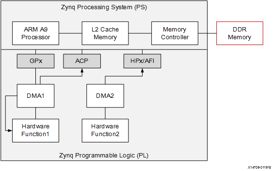
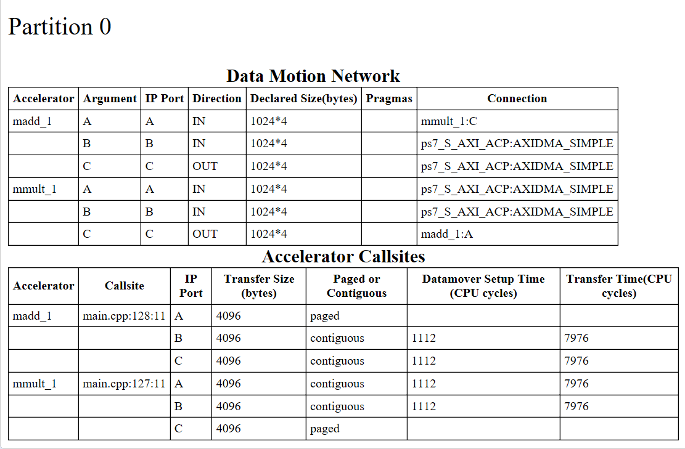
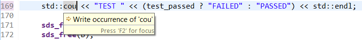
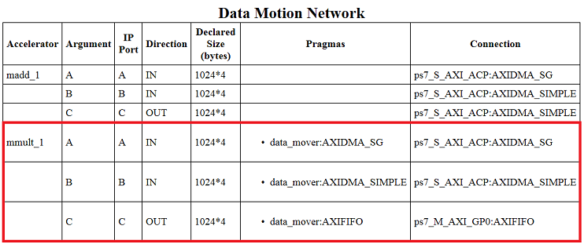
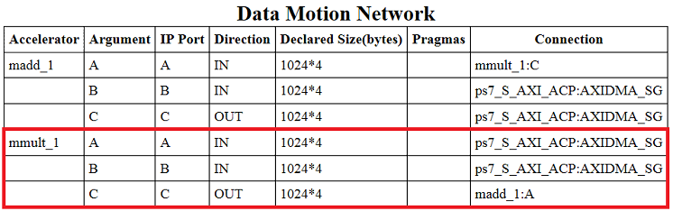

<p align="right">
<a>English</a> | <a href="/docs-jp/README.md">日本語</a>
</p>

<table style="width:100%">
  <tr>
<td align="center" width="100%" colspan="6"><h1>2018.3 SDSoC™ Development Environment Tutorials</h1>
<a href="https://github.com/Xilinx/SDSoC-Tutorials/branches/all">See other versions</a>
</td>
  </tr>
  <tr>
    <td colspan="5" align="center"><h2>Introduction</h2></td>
  <tr>
    <td align="center"><a href="README.md">Introduction</a></td>
    <td align="center"><a href="lab-1-introduction-to-the-sdsoc-development-environment.md">Lab 1: Introduction to the SDSoC Development Environment</a></td>
    <td align="center"><a href="lab-2-performance-estimation.md">Lab 2: Performance Estimation</a></td>
    <td align="center">Lab 3: Optimize the Application Code</td>
    <td align="center"><a href="lab-4-optimize-the-accelerator-using-directives.md">Lab 4: Optimize the Accelerator Using Directives</a></td>
  </tr>
  <tr>
    <td align="center"><a href="lab-5-task-level-pipelining.md">Lab 5: Task-Level Pipelining</a></td>
    <td align="center"><a href="lab-6-debug.md">Lab 6: Debug</a></td>
    <td align="center"><a href="lab-7-hardware-debug.md">Lab 7: Hardware Debug</a></td>
    <td align="center"><a href="lab-8-emulation.md">Lab 8: Emulation</a></td>
    <td align="center"><a href="lab-9-installing-applications-from-github.md">Lab 9: Installing Examples from GitHub</a></td>
    </tr>
</table>

## Lab 3: Optimize the Application Code  

This tutorial demonstrates how you can modify your code to optimize the hardware-software system generated by the SDx environment. You will also learn how to find more information about build errors so that you can correct your code.  

>**:pushpin: NOTE**  You can complete this lab even if you do not have a ZC702 board. When creating the SDSoC environment project, select your board and one of the available applications if the suggested template **Matrix Multiplication and Addition** is not found. For example, boards such as the MicroZed with smaller Zynq-7000 devices offer the **Matrix Multiplication and Addition (area reduced)** application as an available template. In this tutorial you are not asked to run the application on the board, and you can complete the tutorial following the steps for the ZC702 to satisfy the learning objectives.  

<details>
<summary><strong>Introduction to System Ports and DMA</strong></summary>

In Zynq®-7000 SoC device systems, the memory seen by the ARM A9 processors has two levels of on-chip cache followed by a large off-chip DDR memory. From the programmable logic side, the SDx IDE creates a hardware design that might contain a Direct Memory Access (DMA) block to allow a hardware function to  
directly read and/or write to the processor system memory via the system interface ports.  

As shown in the simplified diagram below, the processing system (PS) block in Zynq devices has three kinds of system ports that are used to transfer data from processor memory to the Zynq device programmable logic (PL) and back. They are Accelerator Coherence Port (ACP) which allows the hardware to directly access the L2 Cache of the processor in a coherent fashion, High Performance ports 0-3 (HP0-3), which provide direct buffered access to the DDR memory or the on-chip memory from the hardware bypassing the processor cache using Asynchronous FIFO Interface (AFI), and General-Purpose IO ports (GP0/GP1) which allow the processor to read/write hardware registers.  

    

When the software running on the ARM A9 processor "calls" a hardware function, it actually invokes an `sds++` generated stub function that in turn calls underlying drivers to send data from the processor memory to the hardware function and to get data back from the hardware function to the processor memories over the three types of system ports shown: GPx, ACP, and AFI.  

The table below shows the different system ports and their properties. The `sds++` compiler automatically chooses the best possible system port to use for any data transfer, but allows you to override this selection by using pragmas.  

| System Port Properties        | Properties  |
| ----------------------------- |-------------|
| ACP  | Hardware functions have cache coherent access to DDR via the PS L2 cache. |
| AFI (HP) | Hardware functions have fast non-cache coherent access to DDR via the PS memory controller. |
| GP | Processor directly writes/reads data to/from hardware function. Inefficient for large data transfers. |
|MIG | Hardware functions access DDR from PL via a MIG IP memory controller. |


>**:pushpin: NOTE**  For more information on Optimization refer toSDSoC Environment Profiling and Optimization Guide ([UG1235](https://www.xilinx.com/cgi-bin/docs/rdoc?v=2018.2;d=ug1235-sdsoc-optimization-guide.pdf)).  

</details>

<details>
<summary><strong>Step 1: Creating a New Project</strong></summary>

  1. Create a new project in the SDx™ IDE (`lab3`) for the ZC702 platform and Linux System configuration using the design template for Matrix Multiplication and Addition.   

  2. Click on the tab labeled lab3 to view the SDx Project Settings. If the tab is not visible, in the Project Explorer double click on the project.sdx file under the lab3 project.   

  3. In the HW Functions panel, observe that the `madd` and `mmult` functions already appear in the list of functions marked for hardware acceleration.   

  4. To get the best runtime performance, switch to use the Release configuration by clicking on the Active Build Configuration option and then selecting Release. You could also select Release from the Build icon, or by right-clicking the project and selecting **Build Configurations > Set Active > Release**. The Release build configuration uses a higher compiler optimization setting than the Debug build configurations.

</details>

<details>
<summary><strong>Step 2: Specifying System Ports</strong></summary>

The sys_port pragma allows you to override the SDSoC system compiler port selection to choose the ACP or one of the AFI ports on the Zynq-7000 SoC Processing System (PS) to access the processor memory.  

  1. You do not need to generate an SD card boot image to inspect the structure of the system generated by the SDx system compiler, so set project linker options to prevent generating the bit stream, boot image and build.  
     1. Click on the lab3 tab to select the SDx Project Settings.  
     2. Deselect the Generate SD card image check box.  

  2. Right-click on the top level folder for the project in Project Explorer and select Build Project.  

  3. When the build completes, in the Assistant panel, double-click Data Motion Network Report to view the Data Motion Network report for the project lab3. The report contains a table describing the hardware/software connectivity for each hardware function.  

     The right-most column (Connection) shows the type of DMA assigned to each input array of the matrix multiplier (AXIDMA_SIMPLE= simple DMA), and the Processing System 7 IP port used. The table below displays a partial view of the data_motion.md file, before adding the sys_port pragma.

       

  4. Add sys_port pragma.  
     1. Double-click `mmultadd.h` file in the Project Explorer view, under the src folder, to open the file in the source editor.  
     2. Immediately preceding the declaration for the `mmult` function, insert the following to specify a different system port for each of the input arrays.  
        `#pragma SDS data sys_port(A:ACP, B:AFI)`  

          

    3. Save the file.

  5. Right-click the top-level folder for the project and click on Build Project in the menu.  

  6. When the build completes, click on the tab showing the Data Motion Network Report (`data_motion.md` file).  

  7. Click anywhere in the Data Motion Network Report pane and select Refresh from the context menu.  

       

     The connection column shows the system port assigned to each input/output array of the matrix multiplier.  

  8. Delete the pragma `#pragma SDS data sys_port(A:ACP, B:AFI)` and save the file.

</details>

<details>
<summary><strong>Step 3: Specifying System Ports</strong></summary>

  The sys_port pragma allows you to override the SDSoC system compiler port selection to choose the ACP or one of the AFI ports on the Zynq-7000 SoC Processing System (PS) to access the processor memory.  

  1. You do not need to generate an SD card boot image to inspect the structure of the system generated by the SDx system compiler, so set project linker options to prevent generating the bit stream, boot image and build.  
     1. Click on the lab3 tab to select the SDx Project Settings.  
     2. Deselect the Generate bitstream and Generate SD card image check boxes.  

  2. Right-click on the top level folder for the project in Project Explorer and select Build Project.  

  3. When the build completes, in the Reports panel, double-click Data Motion Network Report to view the Data Motion Network report. The report contains a table describing the hardware/software connectivity for each hardware function.  

     The right-most column (Connection) shows the type of DMA assigned to each input array of the matrix multiplier (AXIDMA_SIMPLE= simple DMA), and the Processing System 7 IP port used. The table below displays a partial view of the `data_motion.md` file, before adding the sys_port pragma.  

       

  4. Add sys_port pragma.  
     1. Double-click mmultadd.h file in the Project Explorer view, under the src folder, to open the file in the source editor.  
     2. Immediately preceding the declaration for the `mmult` function, insert the following to specify a different system port for each of the input arrays.
        `#pragma SDS data sys_port(A:ACP, B:AFI)`  

        

    3. Save the file.


  5. Right-click the top-level folder for the project and click on Build Project in the menu.  
  6. When the build completes, click on the tab showing the Data Motion Network Report (data_motion.md file).  
  7. Click anywhere in the Data Motion Network Report pane and select Refresh from the context menu.  

       

     The connection column shows the system port assigned to each input/output array of the matrix multiplier.  

  8. Delete the pragma `#pragma SDS data sys_port(A:ACP, B:AFI)` and save the file.  

</details>

<details>
<summary><strong>Step 4: Error Reporting</strong></summary>

  You can introduce errors as described in each of the following steps and note the response from the SDx IDE.  

  1. Open the source file main.cpp from the src folder and remove the semicolon at the end of the `std::cout` statement near the bottom of the file.  
     Notice that a yellow box shows up on the left edge of the line.  

       

  2. Move your cursor over the yellow box and notice that it tells you that you have a missing semicolon.      
  3. Insert the semicolon at the right place and notice how the yellow box disappears.  
  4. Now change `std::cout` to `std::cou` and notice how a pink box shows up on the left edge of the line.  

       
  5. Move the cursor over the pink box to see a popup displaying the "corrected" version of the line with `std::cout` instead of `std::cou`.  

       

  6. Correct the previous error by changing `std::cou` to `std::cout`.  
  7. Introduce a new error by commenting out the line that declares all the variables used in `main()`.  

       

  8. Save and build the project. Do not wait for the build to complete.  
  9. You can see the error messages scrolling by on the console. Open the `Release/_sds/reports/sds_main.log and Release/_sds/reports/sds_mmult.log` files to see the detailed error reports.  

       

  10. Uncomment the line where the variables are declared.  

</details>

<details>
<summary><strong>Step 5: Additional Exercises</strong></summary>

  >**:pushpin: NOTE**  Instructions provided in this section are optional.  

  When Linux is used as the target OS for your application, memory allocation  for your application is handled by Linux and the supporting libraries. If you declare an array on stack within a scope (`int a[10000];`) or allocate it dynamically using the standard `malloc()` function, what you get is a section of memory that is contiguous in the Virtual Address Space provided by the processor and Linux. This buffer is typically split over multiple non-contiguous pages in the Physical Address Space, and Linux automatically does the Virtual-Physical address translation whenever the software accesses the  
  array. However, the hardware functions and DMAs can only access the physical address space, and so the software drivers have to explicitly translate from the Virtual Address to the Physical Address for each array, and provide this physical address to the DMA or hardware function. As each array may be spread across multiple non-contiguous pages in Physical Address Space, the driver has to provide a list of physical page addresses to the DMA. DMA that can handle a list of pages for a single array is known as Scatter-Gather DMA. A DMA that can handle only single physical addresses is called Simple DMA. Simple DMA is cheaper than Scatter-Gather DMA in terms of the area and performance  
  overheads, but it requires the use of a special allocator called `sds_alloc()` to obtain physically contiguous memory for each array.  

  [Lab 1](lab-1-introduction-to-the-sdsoc-development-environment.md) used the `mult_add` template to allow the use of Simple DMA. In the following exercises you force the use of other data movers such as Scatter-Gather DMA or AXIFIFO using pragmas, modify the source code to use `malloc()` instead of `sds_alloc()` and observe how Scatter-Gather DMA is automatically selected.  


  <details>
  <summary><strong>Controlling Data Mover Selection</strong></summary>  

  In this exercise you add data mover pragmas to the source code from lab3 to specify the type of data mover used to transfer each array between hardware and software. Then you build the project and view the generated report `(data_motion.md`) to see the effect of these pragmas. Remember to prevent generation of bit stream and boot files, so that your build does not synthesize the hardware.  

  To add data mover pragmas to specify the type of data mover used for each  
  array:  

  1. Double-click mmultadd.h in the folder view under lab3/src to bring up the source editor panel.  
  2. Just above the `mmult` function declaration, insert the following line to specify a different data mover for each of the arrays and save the file.  
     `#pragma SDS data data_mover(A:AXIDMA_SG, B:AXIDMA_SIMPLE, C:AXIFIFO)`  

  3. Right-click the top-level folder for the project and click Build Project in the menu.  

     >**:information_source: IMPORTANT!** The build process can take approximately 5 to 10 minutes to  
  complete.  

  4. When the build completes, in the Project Explorer view, double-click to open Data Motion Report from the Reports tab.  
     The right-most column (Connection) shows the data mover assigned to each input/output array of the matrix multiplier.  

     >**:pushpin: NOTE:**  The Pragmas column lists the pragmas that were used. Also, the `AXIFIFO` data mover has been assigned the `M_AXI_GP0` port, while the other two data movers are associated with `S_AXI_ACP`.  

       

  5. Remove the pragma #pragma SDS data data_mover(A:AXIDMA_SG, B:AXIDMA_SIMPLE, C:AXIFIFO) that you entered in step 2 and save the file.

  </details>

  <details>
  <summary><strong>Using malloc() instead of sds_alloc()</strong></summary>  

  For this exercise you start with the source used in lab3, modify the source to use `malloc()` instead of `sds_alloc()`, and observe how the data mover changes from Simple DMA to Scatter-Gather DMA.  

  1. Double-click the `main.cpp` in the Project Explorer view, under src folder, to bring up the source editor view.  
  2. Find all the lines to where buffers are allocated with `sds_alloc()`, and replace `sds_alloc()` with `malloc()` everywhere. Also remember to replace all calls to `sds_free()` with `free()`.  
  3. Save your file.  
  4. Right-click the top-level folder for the project and click Build Project in the menu.  

     >**:information_source: IMPORTANT!** The build process can take approximately 5 to 10 minutes to complete.  

  5. When the build completes, in the Project Explorer view, double-click to open `Release/_sds/reports/data_motion.md`.  
  6. The right-most column (Connection) shows the type of DMA assigned to each input/output array of the matrix multiplier (`AXIDMA_SG` = scatter gather DMA), and which Processing System 7 IP port is used (`S_AXI_ACP`). You can also see on the Accelerator Call sites table whether the allocation of the memory that is used on each transfer is contiguous or paged.  

       

  7. Undo all the changes made in step 2 and save the file.

  </details>
  <details>
  <summary><strong>Adding Pragmas to Control the Amount of Data Transferred</strong></summary>

  For this step, you use a different design template to show the use of the copy pragma. In this template an extra parameter called M is passed to the matrix multiply function. This parameter allows the matrix multiplier function to multiply two square matrices of any size M*M up to a maximum of 32*32. The top level allocation for the matrices creates matrices of the maximum size 32x32. The M parameter tells the matrix multiplier function the size of the matrices to multiply, and the data copy pragma tells the SDSoC™ environment that it is sufficient to transfer a smaller amount of data corresponding to the actual matrix size instead of the maximum matrix size.  

  1. Launch the SDx environment and create a new project for the zc702, Linux platform using the matrix multiplication with variable data size design template:  
     1. Select File > New > SDx Project  
     2. In the new project dialog box, type in a name for the project (for example `lab3a`)  
     3. Select zc702 and Linux.  
     4. Click **Next**.  
     5. Select Matrix Multiplication Data Size as the application and click Finish.  
     6. Note that the `mmult_accel` function has been marked for hardware acceleration.  

  2. Set up the project to prevent building the bitstream and boot files by deselecting the Generate bitstream and Generate SD Card image checkboxes in the Options panel.  

  3. Note that data copy pragmas are present in the code. They can be viewed by double-clicking mmult_accel.h in the Project Explorer view (under the src folder) to bring up the source editor view.  

     Note the pragmas that specify a different data copy size for each of the arrays. In the pragmas, you can use any of the scalar arguments of the function to specify the data copy size. In this case, M is used to specify the size.  

     ```
      #pragma SDS data copy(A[0:M*M], B[0:M*M], C[0:M*M])  
      #pragma SDS data access_pattern(A:SEQUENTIAL, B:SEQUENTIAL, C:SEQUENTIAL)   
      void mmult_accel (float A[N*N],  
                        float B[N*N],  
                        float C[N*N],  
                        int M);  
     ```
  4. Right-click the top-level folder for the project and click Build Project in the menu.

  5. When the build completes, in the Project Explorer view, double-click to open Data Motion Network Report in the Reports tab.  
  6. Observe the second column from the right, titled Pragmas, to view the length of the data transfer for each array. The second table shows the transfer size for each hardware function call site.  

       

  </details>   
  </details>

### Summary

After completing this tutorial, you should be able to do the following:

  * Use pragmas to select ACP or AFI ports for data transfer.
  * Observe the error detection and reporting capabilities of the SDSoC environment.  

If you go through the additional exercises, you can also learn to:  

  * Use pragmas to select different data movers for your hardware function arguments  
  * Understand the use of `sds_alloc()`  
  * Use pragmas to control the number of data elements that are transferred to/from the hardware function.  
<hr/>
<p align="center"><sup>Copyright&copy; 2019 Xilinx</sup></p>
