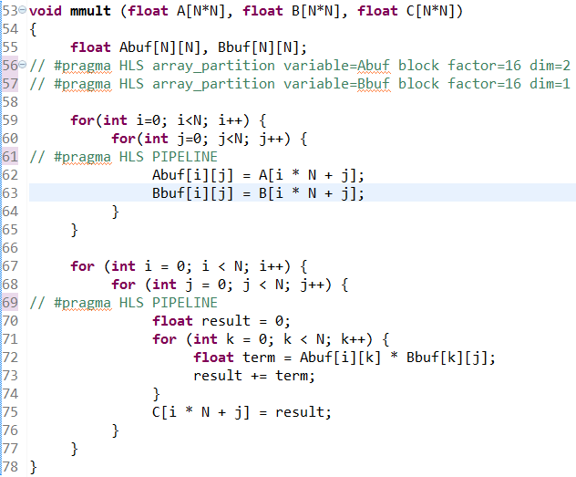
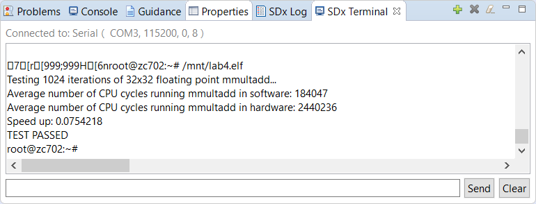

<table style="width:100%">
  <tr>
    <th width="100%" colspan="6"><h1>SDSoC Environment Tutorial: Introduction</h1>
</th>
  </tr>
  <tr>
    <td align="center"><a href="README.md">Introduction</a></td>
    <td align="center"><a href="lab-1-introduction-to-the-sdsoc-development-environment.md">Lab 1: Introduction to the SDSoC Development Environment</a></td>
    <td align="center"><a href="lab-2-performance-estimation.md">Lab 2: Performance Estimation</a></td>
    <td align="center"><a href="lab-3-optimize-the-application-code.md">Lab 3: Optimize the Application Code</a></td>
    <td align="center">Lab 4: Optimize the Accelerator Using Directives</td>
  </tr>
  <tr>
    <td align="center"><a href="lab-5-task-level-pipelining.md">Lab 5: Task-Level Pipelining</a></td>
    <td align="center"><a href="lab-6-debug.md">Lab 6: Debug</a></td>
    <td align="center"><a href="lab-7-hardware-debug.md">Lab 7: Hardware Debug</a></td>
    <td align="center"><a href="lab-8-emulation.md">Lab 8: Emulation</a></td>
    <td align="center"><a href="lab-9-installing-applications-from-github.md">Lab 9: Installing Examples from GitHub</a></td>
</table>

## Lab 4: Optimize the Accelerator Using Directives  

In this exercise, you modify the source file in the project to observe the effects of Vivado HLS pragmas on the performance of generated hardware. See the SDSoC Environment Profiling and Optimization Guide ([UG1235](https://www.xilinx.com/cgi-bin/docs/rdoc?v=2018.2;d=ug1235-sdsoc-optimization-guide.pdf)) for more information on this topic.  

  1. Create a new project in the SDx™ environment (lab4) for the ZC702 Platform and Linux System Configuration using the design template for Matrix Multiplication and Addition.  

  2. Click on the tab labeled **lab4** to view the SDx Project Settings. If the tab is not visible, in the Project Explorer double click on the `project.sdx` file under the lab4 project.  

  3. In the HW Functions panel, observe that the `madd` and `mmult` functions already appear in the list of functions marked for hardware acceleration.

  4. To get the best runtime performance, switch to use the Release configuration by clicking on the Active Build Configuration option and then selecting **Release**. You could also select Release from the Build icon, or by right-clicking the project and selecting **Build Configuration > Set Active > Release**. The Release build configuration uses a higher compiler optimization setting than the Debug build configurations.  

  5. Double click the `mmult.cp`p under the `src` folder in the Project Explorer view to bring up the source editor view.  

  6. Find the lines where the pragmas `HLS pipeline` and `HLS array_partition` are located.

  7. Remove these pragmas by commenting out the lines.  

       

  8. Save the file.  

  9. Right click the top-level folder for the project and click Build Project in the menu.

  10. After the build completes, copy the contents of `lab4/Release/sd_card` to an SD card.  

  11. Insert the SD card into the ZC702 board and power on the board.  

  12. Connect to the board from a serial terminal in the SDx Terminal tab of the SDx IDE. Click the **+** icon to open the settings.  

  13. After the board boots up, you can execute the application at the Linux prompt. Type `/mnt/lab4.elf`.  

Observe the performance and compare it with the performance achieved with the commented out pragmas present (compare it with the results of lab1). Note that the `array_partition` pragmas increase the memory bandwidth for the inner loop by allowing array elements to be read in parallel. The pipeline pragma on the other hand performs pipelining of the loop and allows multiple iterations of a loop to run in parallel.  

Copyright&copy; 2018 Xilinx

