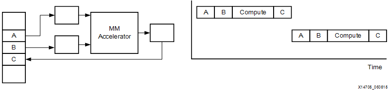
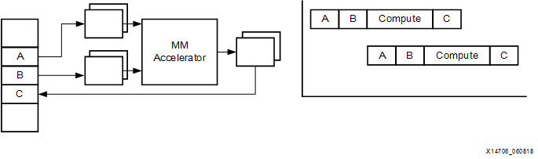
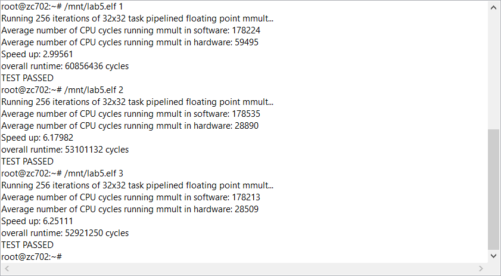

<table style="width:100%">
  <tr>
    <th width="100%" colspan="6"><h1>SDSoC Environment Tutorial: Introduction</h1>
</th>
  </tr>
  <tr>
    <td align="center"><a href="README.md">Introduction</a></td>
    <td align="center"><a href="lab-1-introduction-to-the-sdsoc-development-environment.md">Lab 1: Introduction to the SDSoC Development Environment</a></td>
    <td align="center"><a href="lab-2-performance-estimation.md">Lab 2: Performance Estimation</a></td>
    <td align="center"><a href="lab-3-optimize-the-application-code.md">Lab 3: Optimize the Application Code</a></td>
    <td align="center"><a href="lab-4-optimize-the-accelerator-using-directives.md">Lab 4: Optimize the Accelerator Using Directives</a></td>
  </tr>
  <tr>
    <td align="center">Lab 5: Task-Level Pipelining</td>
    <td align="center"><a href="lab-6-debug.md">Lab 6: Debug</a></td>
    <td align="center"><a href="lab-7-hardware-debug.md">Lab 7: Hardware Debug</a></td>
    <td align="center"><a href="lab-8-emulation.md">Lab 8: Emulation</a></td>
    <td align="center"><a href="lab-9-installing-applications-from-github.md">Lab 9: Installing Examples from GitHub</a></td>
</table>

## Lab 5: Task-Level Pipelining  

This lab demonstrates how to modify your code to optimize the hardware-software system generated by the SDx IDE using task-level pipelining. You can observe the impact of pipelining on performance.  

>**:pushpin: NOTE**  You can complete this tutorial even if you do not have a ZC702 board. When creating the SDSoC environment project, select your board. The tutorial instructions ask you to add source files created for an application created for the ZC702. If your board contains a smaller Zynq-7000 device, after adding source files you need to edit the file `mmult_accel.cpp` to reduce resource usage (in the accelerator source file you will see `#pragma_HLS_array_partition` which sets `block factor=16`; instead, set `block factor=8`).  

<strong>Task Pipelining</strong>

If there are multiple calls to an accelerator in your application, then you can structure your application such that you can pipeline these calls and overlap the setup and data transfer with the accelerator computation. In the case of the matrix multiply application, the following events take place:  

  1. Matrices A and B are transferred from the main memory to accelerator local memories.  
  2. The accelerator executes.  
  3. The result, C, is transferred back from the accelerator to the main memory.  

The following figure illustrates the matrix multiply design on the left side and on the right side a time-chart of these events for two successive calls that are executing sequentially.  

    

The following figure shows the two calls executing in a pipelined fashion. The data transfer for the second call starts as soon as the data transfer for the first call is finished and overlaps with the execution of the first call. To enable the pipelining, however, we need to provide extra local memory to store the second set of arguments while the accelerator is computing with the first set of arguments. The SDSoC environment generates these memories, called multi-buffers, under the guidance of the user.  

    

Specifying task level pipelining requires rewriting the calling code using the pragmas async(id) and wait(id). The SDSoC environment includes an example that demonstrates the use of async pragmas and this Matrix Multiply Pipelined example is used in this tutorial.  

<strong>Task Pipelining in the Matrix Multiply Example</strong>

The SDx IDE includes a matrix multiply pipelined example that demonstrates the use of async pragmas to implement task-level pipelining. This exercise allows you to see the runtime improvement that comes from using this technique.

  1. Create a new SDx project (`lab5`) by selecting **File > New > SDx Project**. Enter the project name `lab5`, select the ZC702 Platform and Linux System Configuration, and click **Next**.  

  2. The Templates page appears, containing source code examples for the selected platform. From the list of application templates, select **Empty Application** and click **Finish**.  

  3. Using your operating system file manager, navigate to `<path to install>/SDx/2018.2/samples/mmult_pipelined` and copy the source files in that directory (`mmult_accel.cpp`, `mmult_accel.h`, and `mmult.cpp`) into the `src` folder of the newly created project (for example `./lab5/src`).  

  4. Click on **lab5** in SDx and from the context menu select **Refresh**. This adds all the copied sources in the previous step to the project.  

  5. Change the build configuration to Release.  

  6. Mark the function `mmult_accel` in the file `mmult_accel.cpp` for hardware using the **Add HW Functions** icon in the SDx Project Settings or Toggle HW/SW in the Project Explorer.  

  7. Build the project.  

  8. Copy the files obtained in the `sd_card` folder to an SD card, set up a terminal and run the generated application on the board. You need to specify the pipeline depth as an argument to the application. Run the application with pipeline depth of 1, 2, and 3 and note the performance obtained.  

### Summary

After completing this tutorial, you should be able to do the following:

  * Use the SDx IDE to optimize your application to reduce runtime by performing task-level pipelining.  
  * Observe the impact on performance of pipeline calls to an accelerator when overlapping accelerator computation with input and output communication.  

Copyright&copy; 2018 Xilinx

