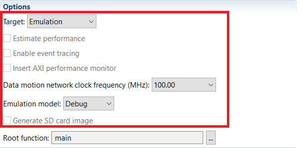
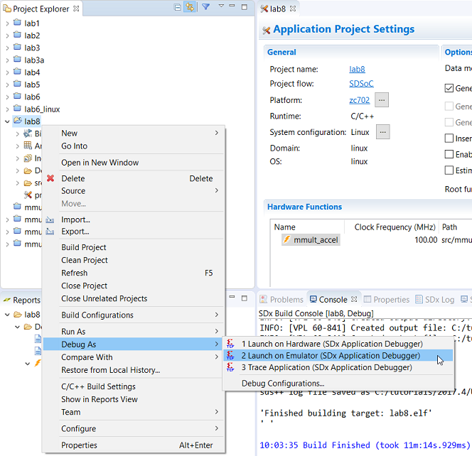

<a>English</a> | <a href="/docs-jp/README.md">日本語</a>

<table style="width:100%">
  <tr>
<td align="center" width="100%" colspan="6"><h1>2018.3 SDSoC™ Development Environment Tutorials</h1>
<a href="https://github.com/Xilinx/SDSoC-Tutorials/branches/all">See other versions</a>
</td>
  </tr>
  <tr>
    <td colspan="5" align="center"><h2>Introduction</h2></td>
  <tr>
    <td align="center"><a href="README.md">Introduction</a></td>
    <td align="center"><a href="lab-1-introduction-to-the-sdsoc-development-environment.md">Lab 1: Introduction to the SDSoC Development Environment</a></td>
    <td align="center"><a href="lab-2-performance-estimation.md">Lab 2: Performance Estimation</a></td>
    <td align="center"><a href="lab-3-optimize-the-application-code.md">Lab 3: Optimize the Application Code</a></td>
    <td align="center"><a href="lab-4-optimize-the-accelerator-using-directives.md">Lab 4: Optimize the Accelerator Using Directives</a></td>
  </tr>
  <tr>
    <td align="center"><a href="lab-5-task-level-pipelining.md">Lab 5: Task-Level Pipelining</a></td>
    <td align="center"><a href="lab-6-debug.md">Lab 6: Debug</a></td>
    <td align="center"><a href="lab-7-hardware-debug.md">Lab 7: Hardware Debug</a></td>
    <td align="center">Lab 8: Emulation</td>
    <td align="center"><a href="lab-9-installing-applications-from-github.md">Lab 9: Installing Examples from GitHub</a></td>
    </tr>
</table>

## Lab 8: Emulation  

This tutorial demonstrates how to use the emulation feature in the SDx IDE. Running your application on SDSoC emulator is a good way to gain visibility of data transfers with a debugger. You will be able to see issues such as a system hang, and can then inspect associated data transfers in the simulation waveform view, which gives you access to singals on the hardware blocks associated with the data transfer.  

First, you target your design to the desired OS and platform and run emulation on the program. In this tutorial you are debugging applications running on an accelerated system.  

**:pushpin: NOTE**  You can complete this tutorial even if you do not have a ZC702 board. When creating the SDx project, select your board and one of the available applications, even if the suggested template Emulation application is not found.  

<strong>Step 1: Creating a Project to Run Emulation</strong>
  

Create a new SDx project (`lab8`) for the ZC702 platform and Linux OS using the design template for Emulation Example. To create the project in the SDx IDE:  

  1. Launch the SDx IDE.  
  2. Select **File > New > SDx Project**.  
  3. In the Project Type page, **Application Project** is selected by default. Click **Next**.  
  4. Specify the name of the project (for example, `lab8`) in the Project name field. Click **Next**.  
  5. From the Platform list select zc702. Click **Next**.  
  6. From the System Configuration drop-down list, select **Linux**. Click **Next**.  
  7. From the list of application templates, select **Emulation Example** and click **Finish**.  
  8. Click on the tab labeled **lab8** to select the SDx Project Settings (if the tab is not visible, double click the `project.sdx` file in the Project Explorer). In the HW functions panel observe that the mmult_accel function is marked as a hardware function when the project was created.  
  9. If the hardware functions were removed or not marked, you would click on the Add HW Functions icon to invoke the dialog box to specify hardware functions.  
  10. In the SDx Project Settings, from the pull-down menu for the **Active build configuration**, select **Debug**, from the pull-down menu for **Target**, select **Emulation**. For the Emulation model there are two options: Debug and Optimized. Select the Debug option to enable capture of debug information. For faster emulation without debug information, select the Optimized pull-down menu option. For this lab, use the default option of Debug.  
  11. When you select the **Target** as **Emulation**, the **Generate SD card image** is greyed out.  

        

  12. With the **Generate emulation model** option selected, build the application by clicking on the build symbol.  

<strong>Step 2: Starting the Emulator</strong>

  1. From the menu select **Xilinx > Start/Stop Emulator**.  
  2. The Emulation dialog box appears. Select the appropriate Project and Configuration.  

       

  3. Select whether or not you want to show the waveform. Showing the waveform initiates a Vivado tools session with the simulation window open where you can view the waveform of the different signals within your design. Not showing the waveform results in faster emulation. Check the **Show the Waveform** option.  
  4. Click **Start**. This is equivalent to turning a board on.  
  5. Add the signals that need to be viewed in the Waveform viewer. This can be done by selecting the appropriate functions in the **Scope** window in Vivado, right-clicking and selecting **Add to Wave Window**. The signals within that function are then added to the waveform viewer.  

       

  6. Click on the **Run All** or **Run for** button to start the programmable logic simulation after selecting your signals.  

<strong>Step 3: Running the Application</strong>

The emulator will take a few seconds to start. To begin emulation:  

  1. In the SDx IDE, right-click on `lab8` and from the context menu that appears, select **Debug As > Launch on Emulator (SDx Application Debugger)**.  

       

  2. The Confirm Perspective Switch dialog box appears. Click **Yes** to switch perspective.  
  3. After the perspective is switched to Debug, you can debug your code just like you would while running on actual hardware.  
  4. Click on the **Resume** icon in the toolbar to execute the code.  
  5. Look at the state of different signals in the waveform viewer of the Vivado Xsim simulator.

### Summary  
After completing this tutorial, you should be able to do the following:

  * Use the SDx IDE to download and run your application in emulation mode.  
  * Optionally step through your source code in the SDx IDE (debug mode) and observe various registers and memories.  

Copyright&copy; 2019 Xilinx

