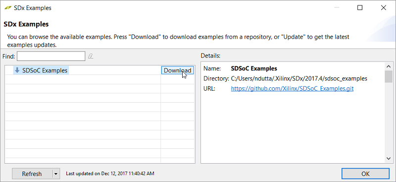


<table style="width:100%">
  <tr>
    <th width="100%" colspan="6"><h1>SDSoC 環境チュートリアル: 概要</h1>
</th>
  </tr>
  <tr>
    <td align="center"><a href="README.md">概要</a></td>
    <td align="center"><a href="lab-1-introduction-to-the-sdsoc-development-environment.md">演習 1: SDSoC 開発環境の概要</a></td>
    <td align="center"><a href="lab-2-performance-estimation.md">演習 2: パフォーマンスの見積もり</a></td>
    <td align="center"><a href="lab-3-optimize-the-application-code.md">演習 3: アプリケーション コードの最適化</a></td>
    <td align="center"><a href="lab-4-optimize-the-accelerator-using-directives.md">演習 4: 指示子を使用したアクセラレータの最適化  </a></td>
  </tr>
  <tr>
    <td align="center"><a href="lab-5-task-level-pipelining.md">演習 5: タスク レベルのパイプライン</a></td>
    <td align="center"><a href="lab-6-debug.md">演習 6: デバッグ</a></td>
    <td align="center"><a href="lab-7-hardware-debug.md">演習 7: ハードウェア デバッグ</a></td>
    <td align="center"><a href="lab-8-emulation.md">演習 8: エミュレーション</a></td>
    <td align="center">演習 9: GitHub からのサンプルのインストール</td>
</table>

##演習 9: GitHub からのサンプルのインストール  

このチュートリアルでは、ザイリンクス GitHub に含まれる SDx 環境の例をインストールする方法について説明します。  

まず、SDx IDE を使用して GitHub の例をインストールします。アプリケーションをインストールしたら、デザインの OS およびプラットフォームを指定し、新しくインストールしたサンプル アプリケーションを選択します。  

>**:pushpin: 注記:**  このチュートリアルは、ZC702 ボードがなくても終了できます。SDx プロジェクトを作成する際は、推奨されているエミュレーション アプリケーションのテンプレートが見つからない場合でも、ボードと使用可能なテンプレートの 1 つを選択してください。  

<strong>手順 1: GitHub からの例のダウンロードおよびインストール</strong>
  

  1. SDx Example ストアから例をダウンロードしてインストールするには、[Xilinx] → [SDx Example] をクリックします。  

       

  2. [SDx Example] ダイアログ ボックスが開きます。[Download] ボタンをクリックします。  

       

  3. 例は、次のようにインストールされます。  

       

  4. [SDx Example Store] ダイアログ ボックスで [OK] をクリックします。例は、  
     `<install_area>/Xilinx/SDx/20xx.x/examples` にインストールされます。  

  5. SDx ライブラリも同じ方法でダウンロードできます。  

<strong>手順 2: 例を実行するプロジェクトの作成</strong>

  1. [File] → [New] → [SDx Project] をクリックします。  
  2. [Project Type] ページでは、デフォルトで [Application Project] がオンになっています。[Next] をクリックします。  
  3. [Project name] フィールドにプロジェクト名を指定します (例: lab9)。[New] をクリックします。  
  4. [Platform] から [zc702] を選択します。[Next] をクリックします。  
  5. [System Configuration] ドロップダウン リストから [Linux] を選択します。[Next] をクリックします。  
  6. [Available Templates] から [Array Partitioning] を選択し、[Finish] をクリックします。  
  7. [lab9] タブをクリックして SDx プロジェクト設定を選択します (タブが表示されていない場合は、[Project Explorer] で `project.sdx` ファイルをダブルクリックします)。[HW functions] パネルで、プロジェクトが作成されたときに matmul_partition_accel 関数がハードウェア関数としてマークされていることを確認します。  
  8. ハードウェア関数が削除されていたり、マークされていない場合は、[Add HW Functions] アイコンをクリックして表示されたダイアログ ボックス内でハードウェア関数を指定します。  
  9. ツールバーの [Build] アイコンをクリックしてプロジェクトをビルドします。      

<strong>手順 3: アプリケーションの実行</strong>

  ビルドが終わったら、前の章で説明したように、その他の例を実行する場合と同じ方法でアプリケーションを実行できるようになります。    

### まとめ  
このチュートリアルを終了すると、次ができるようになります。

  * SDx IDE を使用して、ザイリンクス GitHub から例をダウンロードしてインストールします。  
  * ターゲット プラットフォームでデザイン例を実行します。  

Copyright&copy; 2018 Xilinx

