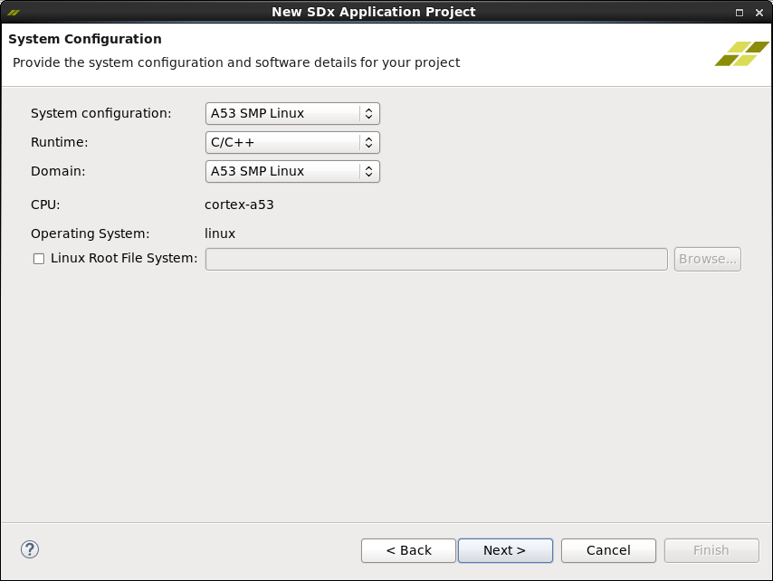
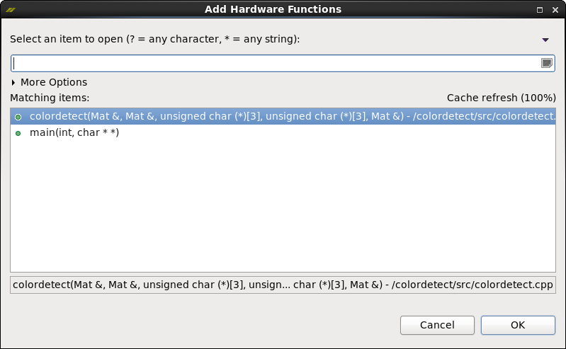
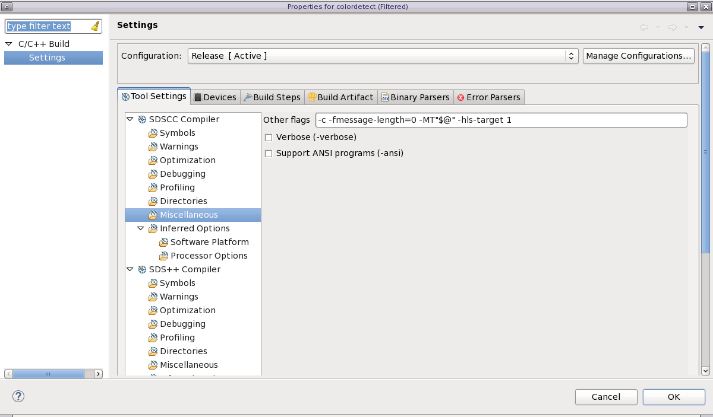

<p align="right">
<a>English</a> | <a href="/docs-jp/opencv-to-xfopencv-migration-tutorial/README.md">日本語</a>
</p>

<table style="width:100%">
  <tr>
<td align="center" width="100%" colspan="6"><h1>2018.3 SDSoC™ Development Environment Tutorials</h1>
<a href="https://github.com/Xilinx/SDSoC-Tutorials/branches/all">See other versions</a>
</td>

  </tr>
  <tr>
    <td colspan="4" align="center"><h2>Migrate OpenCV to xfOpenCV Labs</h2></td>
  </tr>
</table>

## Introduction

xfOpenCV is hardware-accelerated OpenCV functions optimized for Xilinx SoCs and FPGAs. The functions are written completely in C/C++ that is targeted for High-level Synthesis (HLS).  This lab is designed to be used with SDx 2018.3 and using the released ZCU102 reVISION Platform.

The major difference between OpenCV and xfOpenCV is that typical OpenCV is written for and run on CPUs (x86, Arm, etc), whereas xfOpenCV is written and optimized for running on Xilinx SoCs and FPGAs. By optimizing for SoCs and FPGAs the code is up to 40x faster than embedded GPUs and 100x faster than CPUs. Since all the code is written in C/C++ it is easier to customize to your own computer vision functions.

>**:pushpin: NOTE:**
>This tutorial assumes you are already familiar with OpenCV and the reVision platform as described at [reVISION Github](https://github.com/Xilinx/reVISION-Getting-Started-Guide/blob/master/Docs/software-tools-system-requirements.md). You may want to review this information before proceeding.

## Lab 1 - Migrate OpenCV to xfOpenCV

This lab helps you understand how to take an OpenCV program written for a CPU and migrate it to the xfOpenCV library, making use of hardware accelerated functions on the reVision platform. 

>**:pushpin: NOTE:**
>Not all OpenCV functions are replicated in the xfOpenCV library, and some functions were written to simplify certain procedures.

This tutorial includes source files and a test image for your use in the [sources.zip](./sources.zip) file. Download and extract the file to a location of your choosing. This includes the following files and folders:

* `colordetect.cpp` - C++ source file for you to edit in this tutorial. 
* `rock_landscape.jpg` - Test image for your use in testing the application. 
* `solution` folder - Source files for a completed conversion for your reference.

The source code is a very simple color detector for Blue, Green, and Orange on an input image of 1920x1080, such as the test image shown below. With the provided code and image, you will look at how to migrate the OpenCV functions and application flow using the xfOpenCV functions based on the ZCU102 reVISION platform. You should learn the following from this tutorial:

* Migrating OpenCV functions and flows to the xfOpenCV functions and flows.
* Identify functions for hardware acceleration.
* Setup the build environment for compilation of xfOpenCV code.
* Modifying code to be used on the ZCU102 reVISION platform.

Input Image:


### Step 1: Create and Edit the Source Files

With the source code open in a code editor, you can begin to convert it to run on the ZCU102 board.

1. After downloading and extracting the source files, open the `colordetect.cpp` source file in a code editor of your choice. 

    The `colordetect.cpp` file contains the the `colordetect()` function as described above, and the `main()` function for the application. In this tutorial you will create a hardware accelerated version of the colordetect function, `colordetect_accel()`, in a separate file and header file. 

2. At the top of the `colordetect.cpp` file, add the xfOpenCV include statements needed to support the reVISION platform. Replace the following three lines right below `#include <iostream>`: 

    ```c++
    #include <opencv2/opencv.hpp>
    #include <opencv2/highgui.hpp>
    #include <opencv2/imgproc.hpp>
    ```

    With the following lines of code:

    ```c++
    #if __SDSCC__
    #undef __ARM_NEON__
    #undef __ARM_NEON
    #include "opencv2/highgui/highgui.hpp"
    #include "opencv2/imgproc/imgproc.hpp"
    #include <opencv2/core/core.hpp>
    #define __ARM_NEON__
    #define __ARM_NEON
    #else
    #include "opencv2/highgui/highgui.hpp"
    #include "opencv2/imgproc/imgproc.hpp"
    #include <opencv2/core/core.hpp>
    #endif
    ```

    The first part related to `ARM_NEON` is to handle compilation of the OpenCV include/libraries for the Arm processor on the ZCU102. Below the `ARM_NEON` section is where you are defining the xfOpenCV includes the tool is going to use. Including these files will insure the compiler has access to all functions and datatypes needed. 

    >**:pushpin: NOTE:**
    >`__SDSCC__` is automatically set by the sds++ compiler. 

3. In the same code editor you are using to edit `colordetect.cpp`, create two new files: `colordetect_accel.cpp` and `colordetect_accel.hpp`. 

4. In the `colordetect_accel.cpp` file define the function signature for the new hardware accelerated function. Type the following at the top of the file: 

    ```c++
    void colordetect_accel() {}
    ```

5. In the `colordetect_accel.hpp` header file add the following lines of code:

    ```c++
    #include "hls_stream.h"
    #include "ap_int.h"
    #include "common/xf_common.h"
    #include "common/xf_utility.h"
    #include "imgproc/xf_colorthresholding.hpp"
    #include "imgproc/xf_rgb2hsv.hpp"
    #include "imgproc/xf_erosion.hpp"
    #include "imgproc/xf_dilation.hpp"
    ```

    The `hls_stream.h` and `ap_int.h` are Vivado HLS specific libraries for datatypes that are used in xfOpenCV. The remaining `xf_*.h` files are similar to OpenCV libraries and provide the functions, macros, and unique datatypes for xfOpenCV.

6. To make things more readable, and to support templating some of the xfOpenCV function calls and object instantiations, you will add the following macros to the `colordetect_accel.hpp` file, after the prior `#include` statements:

    ```c++
    #define MAXCOLORS 3
    #define WIDTH 1920
    #define HEIGHT 1080
    #define FILTER_SIZE 3
    #define KERNEL_SHAPE XF_SHAPE_RECT // Rectangle
    #define ITERATIONS 1
    ```

7. Save all the files, but keep them open for further editing.

### Step 2: Convert cv::Mat objects to xf::Mat

1. When migrating OpenCV code to a hardware accelerated platform you should identify all the objects being used in the conversion code. Look in the `main()` and `colordetect()` functions and identify the following `cv::Mat` objects: `in_img`, `out_img`, `mask1`, `mask2`, `mask3`, `_imgrange`, and `_imghsv`.

    When running on a CPU, these objects allow for dynamic allocation and deallocation of memory as needed. However, when targeting hardware acceleration, memory requirements need to be determined at compile time. To solve this, the xfOpenCV library provides the `xf::Mat` object which facilitates memory allocation in the FPGA device. Any `cv::Mat` object used by a hardware accelerated function, whether user defined or coming from the xfOpenCV library, should be replaced with a `xf::Mat` equivalent object.  
    
    In the `main()` function, you can continue to use `cv::Mat` for input/output to the Linux system, because the code in this function is running on the CPU. However, you must convert the data from the `cv::Mat` object(s) to the `xf::Mat` object(s) for the accelerated function.

2. In the `main()` function, create input and output `xf::Mat` objects for the accelerated function, after the following if-statement:

    ```C++
    if (!in_img.data) {
	    return -1;
	}
    ```

    Add the following code:

    ```c++
    xf::Mat<XF_8UC4, HEIGHT, WIDTH, XF_NPPC1> xfIn(in_img.rows, in_img.cols);
    xf::Mat<XF_8UC1, HEIGHT, WIDTH, XF_NPPC1> xfOut(in_img.rows, in_img.cols);
    ```

   These statements create templated `xf::Mat` objects for the input and output of the hardware accelerated function. General information related to the templated object can be found in the *Xilinx OpenCV User Guide* ([UG1233](https://www.xilinx.com/support/documentation/sw_manuals/xilinx2018_3/ug1233-xilinx-opencv-user-guide.pdf)).  

    The `xfIn` and `xfOut` objects you created have the following attributes:

    `XF_8UC4` - Defines an 8-bit unsigned-char 4-channel datatype.

    `XF_8UC1` - Defines an 8-bit unsigned-char 1-channel datatype.

    The input `xf:Mat` is declared as a 4-channel object to allow the `colorthresholding()` function to operate on the three color components (channels) of the image. The output object does not require three channels.

   `HEIGHT`/`WIDTH` - Defines the size of the input image. In the `colordetect_accel.hpp` header file, you have defined the HEIGHT and WIDTH macros for the image as **1920x1080**. Alternatively, you could statically define the maximum image size, and process variable image sizes using function parameters. 

    `XF_NPPC1` - This template parameter tells the compiler that the number of pixels processed per clock cycle is one.

<!-- 
    In OpenCV, there is no need to create multiple `cv::Mat` objects for this type of flow, because it can handle the read/writes as needed due to the dynamic aspect of the object. In acceleration, you need to know how the data is moving, and the size of this data, because things will not run in a procedural way that is typical in most C/C++ programs. With acceleration, things will run in parallel, meaning the read/writes may occur at the same time. -->

### Step 3: Create the Accelerated Function

With the `main()` function creating the `xf::Mat` objects needed as inputs and outputs to the accelerated function, you are ready to write the accelerated function.  The hardware accelerated `colordetect_accel()` function will duplicate the `colordetect()` function using the xfOpenCV functions that are accelerated on hardware. 

With this accelerated function, you need to pass everything by reference, and not by value. Passing by reference lets these parameters act as either streaming inputs or outputs to the function, but not as both at the same time. 

The `main()` function will call both the `colordetect` function and the accelerated function, `colordetect_accel`, so that you can compare the performance between Arm processing and FPGA acceleration.

1. In the `colordetect_accel.cpp` file, edit the function signature to add parameters specific to the `xf::Mat` objects you created earlier: 

    ```c++
    void colordetect_accel( xf::Mat<XF_8UC4, HEIGHT, WIDTH, XF_NPPC1> &_src, xf::Mat<XF_8UC1, HEIGHT, WIDTH, XF_NPPC1> &_dst) {}
    ```

    Like any other datatype, you must match the template values with what you pass into the function. If you mistype a parameter, the compiler will error out.

2. Since the `colordetect_accel()` function uses the HSV colorspace, you also need to pass the proper thresholds. Add `nLowThreshold`, `nHighThreshold` and the `accel_kernel` to the function signature as shown below:

    ```c++
    void colordetect_accel(xf::Mat<XF_8UC4, HEIGHT, WIDTH, XF_NPPC1> &_src,
    xf::Mat<XF_8UC1, HEIGHT, WIDTH, XF_NPPC1> &_dst,
    unsigned char nLowThresh[3][3],
    unsigned char nHighThresh[3][3],
    unsigned char accel_kernel[FILTER_SIZE*FILTER_SIZE]) {}
    ```

    Using acceleration with programmable logic, you need definitive array sizes at compile time, because the code defines an actual circuit with a fixed size. Here, you know that the threshold data is a 2D array of 3 elements in each dimension, and you will define it as such.

3. Since `xf::Mat` objects are not dynamic, you will need to declare the `xf::Mat` objects used to pass the data stream through the function. In the body of the function add the following objects:

    ```C++
    xf::Mat<XF_8UC4, HEIGHT, WIDTH, XF_NPPC1> _hsv;
    xf::Mat<XF_8UC1, HEIGHT, WIDTH, XF_NPPC1> _range;
    xf::Mat<XF_8UC1, HEIGHT, WIDTH, XF_NPPC1> _erode;
    xf::Mat<XF_8UC1, HEIGHT, WIDTH, XF_NPPC1> _dilate1;
    xf::Mat<XF_8UC1, HEIGHT, WIDTH, XF_NPPC1> _dilate2;
    ```

4. Now you will begin defining the operations of the `colordetect_accel` function. In the original `colordetect()` function, the first operation is the color conversion (`cv::cvtColor`) of the input image from the RGB color space to HSV. Looking through the *Xilinx OpenCV User Guide* ([UG1233](https://www.xilinx.com/support/documentation/sw_manuals/xilinx2018_2/ug1233-xilinx-opencv-user-guide.pdf)) you will not find a `cvtColor` function. However, in the "Color Detection" section you can see that the color detection algorithm uses four hardware functions from the xfOpenCV library, beginning with the `xf::RGB2HSV` function. You will use that function in the `colordetect_accel` function to perform the color conversion. 

    Add the `xf::RGB2HSV` function with the proper parameters to `colordetect_accel` after the other `xf::Mat` object definitions as follows:

    ```c++
        xf::RGB2HSV<XF_8UC4, HEIGHT, WIDTH, XF_NPPC1>(_src, _hsv);
    ```

    As you have probably noticed, functions and objects need to be templated with specific information. This is key to making sure the right datatypes/sizes are being used. The function template must match the `xf::Mat` templates, or you will hit an assert at runtime.

5. Next in the `colordetect()` function code is thresholding and combining the resulting masks together. Again, in xfOpenCV, there is no `cv::inRange` function; however, the `xf::colorthresholding` is created for just this purpose. Referring to the "Color Thresholding" section of *Xilinx OpenCV User Guide* ([UG1233](https://www.xilinx.com/support/documentation/sw_manuals/xilinx2018_3/ug1233-xilinx-opencv-user-guide.pdf)), there are a few things to notice:

    - The template parameter MAXCOLORS
    - `low_thresh` and `high_thresh` are one-dimensional arrays
    - The source template has to be `XF_8UC4`.

    For this function, the input `xf::Mat` object needs to be `XF_8UC4` because you are working with 3-channel data; the `MAXCOLORS` determines how many colors you're thresholding, and in the case of this code you are using 3. Lastly, the `low_thresh` and the `high_thresh` are needed to be a 1D array. This is because depending on how big of a `MAXCOLORS` you are using, you can tailor the array for the appropriate low and high values.

    There are two ways to convert a 2D array to one dimension: at instantiation time, or via FOR loops. For simplicity, you will use the FOR loop method here. Before the `xf::RGB2HSV` function that you just added, insert the following code:

    ```c++
    unsigned char low_thresh[9];
    unsigned char high_thresh[9];

    for(int i = 0; i < 3; ++i)
    for(int j = 0; j < 3; ++j) {
        low_thresh[i*3+j] = nLowThresh[i][j];
        high_thresh[i*3+j] = nHighThresh[i][j];		
    }
    ```

    Your `colordetect_accel` function should currently look something like this:

    ```c++
    void colordetect_accel(xf::Mat<XF_8UC4, HEIGHT, WIDTH, XF_NPPC1> &_src,
    xf::Mat<XF_8UC1, HEIGHT, WIDTH, XF_NPPC1> &_dst,
    unsigned char nLowThresh[3][3],
    unsigned char nHighThresh[3][3],
    unsigned char accel_kernel[FILTER_SIZE*FILTER_SIZE]) {

        //Define Matrix objects for operations
        xf::Mat<XF_8UC4, HEIGHT, WIDTH, XF_NPPC1> _hsv;
        xf::Mat<XF_8UC1, HEIGHT, WIDTH, XF_NPPC1> _range;
        xf::Mat<XF_8UC1, HEIGHT, WIDTH, XF_NPPC1> _erode;
        xf::Mat<XF_8UC1, HEIGHT, WIDTH, XF_NPPC1> _dilate1;
        xf::Mat<XF_8UC1, HEIGHT, WIDTH, XF_NPPC1> _dilate2;

        //Convert 2d Array to 1d
        unsigned char low_thresh[9];
        unsigned char high_thresh[9];

        for(int i = 0; i < 3; ++i)
        for(int j = 0; j < 3; ++j) {
            low_thresh[i*3+j] = nLowThresh[i][j];
            high_thresh[i*3+j] = nHighThresh[i][j];		
        }

        //Begin color conversion...
        xf::RGB2HSV<XF_8UC4, HEIGHT, WIDTH, XF_NPPC1>(_src, _hsv);

    }
    ```

    Now that you have one-dimensional arrays for the thresholds, you need to add the `xf::colorthresholding` function. Add the following code after the `xf::RGB2HSV` function:

    ```c++
    xf::colorthresholding<XF_8UC4, XF_8UC1, MAXCOLORS, HEIGHT, WIDTH, XF_NPPC1>(_hsv, _range, low_thresh, high_thresh);
    ```

    With this function, you are converting the input of `XF_8UC4` dataype to the output of `XF_8UC1` (grayscale) datatype, and you are thresholding for `MAXCOLORS` of 3. In comparison to the original `colordetect()` code, you are essentially doing the same set of `cv::inRange` and bitwise `OR` operations for the mask. In more complex code where more or less colors are being detected, this will be able to scale, just adjust `MAXCOLORS` and the `low_thresh` and `high_thresh` arrays as needed.

6.  With the last two color detection functions, `cv::erode` and `cv::dilate`, you have to determine what morphological type is being used, and what pixel area to take into account. In this function, `xf::erode` and `xf::dilate` use a kernel of 3x3 and of `XF_SHAPE_RECT`. 

    To add these functions similar to the OpenCV version, insert the following lines after the `colorthresholding` function:

    ```c++
	xf::erode<XF_BORDER_REPLICATE, XF_8UC1, HEIGHT, WIDTH, XF_SHAPE_RECT, FILTER_SIZE, FILTER_SIZE, ITERATIONS, XF_NPPC1>(_range, _erode, accel_kernel);
	xf::dilate<XF_BORDER_REPLICATE, XF_8UC1, HEIGHT, WIDTH, XF_SHAPE_RECT, FILTER_SIZE, FILTER_SIZE, ITERATIONS, XF_NPPC1>(_erode, _dilate1, accel_kernel);
	xf::dilate<XF_BORDER_REPLICATE, XF_8UC1, HEIGHT, WIDTH, XF_SHAPE_RECT, FILTER_SIZE, FILTER_SIZE, ITERATIONS, XF_NPPC1>(_dilate1, _dilate2, accel_kernel);
	xf::erode<XF_BORDER_REPLICATE, XF_8UC1, HEIGHT, WIDTH, XF_SHAPE_RECT, FILTER_SIZE, FILTER_SIZE, ITERATIONS, XF_NPPC1>(_dilate2, _dst, accel_kernel);
    ```

    Notice that there's a few new template parameters: `XF_BORDER_REPLICATE`, `XF_SHAPE_RECT`, `FILTER_SIZE` (twice), `ITERATIONS`. In the `cv::erode` and `cv::dilate` this parameter defines the border type, which has a default value of `BORDER_REPLICATE`, which will replicate the very edge (row or column) to provide an extra border. The `XF_SHAPE_RECT` is referring to the shape of the erosion or dilation. Lastly, the `FILTER_SIZE` tells us the size of the kernel you're applying with how many `ITERATIONS` of the kernel. With all these new parameters, they have very specific sets of memory usage that need to be defined at compile. 
    
    Finally, you need to make sure that all the template values in this function match the data input and output. Any variations will either cause compilation errors, or runtime errors.

    Your completed function should look like this:

    ```c++
    void colordetect_accel( xf::Mat<XF_8UC4, HEIGHT, WIDTH, XF_NPPC1> &_src,
    xf::Mat<XF_8UC1, HEIGHT, WIDTH, XF_NPPC1> &_dst,
    unsigned char nLowThresh[3][3],
    unsigned char nHighThresh[3][3],
    unsigned char accel_kernel[FILTER_SIZE*FILTER_SIZE]) {

        //Define Matrix objects for operations
        xf::Mat<XF_8UC4, HEIGHT, WIDTH, XF_NPPC1> _hsv;
        xf::Mat<XF_8UC1, HEIGHT, WIDTH, XF_NPPC1> _range;
        xf::Mat<XF_8UC1, HEIGHT, WIDTH, XF_NPPC1> _erode;
        xf::Mat<XF_8UC1, HEIGHT, WIDTH, XF_NPPC1> _dilate1;
        xf::Mat<XF_8UC1, HEIGHT, WIDTH, XF_NPPC1> _dilate2;

        //Convert 2d Array to 1d
        unsigned char low_thresh[9];
        unsigned char high_thresh[9];

        for(int i = 0; i < 3; ++i)
        for(int j = 0; j < 3; ++j) {
            low_thresh[i*3+j] = nLowThresh[i][j];
            high_thresh[i*3+j] = nHighThresh[i][j];		
        }

        //Begin color conversion...
        xf::RGB2HSV<XF_8UC4, HEIGHT, WIDTH, XF_NPPC1>(_src, _hsv);
        xf::colorthresholding<XF_8UC4, XF_8UC1, MAXCOLORS, HEIGHT, WIDTH, XF_NPPC1>(_hsv, _range, low_thresh, high_thresh);
        xf::erode<XF_BORDER_REPLICATE, XF_8UC1, HEIGHT, WIDTH, XF_SHAPE_RECT, FILTER_SIZE, FILTER_SIZE, ITERATIONS, XF_NPPC1>(_range, _erode, accel_kernel);
        xf::dilate<XF_BORDER_REPLICATE, XF_8UC1, HEIGHT, WIDTH, XF_SHAPE_RECT, FILTER_SIZE, FILTER_SIZE, ITERATIONS, XF_NPPC1>(_erode, _dilate1, accel_kernel);
        xf::dilate<XF_BORDER_REPLICATE, XF_8UC1, HEIGHT, WIDTH, XF_SHAPE_RECT, FILTER_SIZE, FILTER_SIZE, ITERATIONS, XF_NPPC1>(_dilate1, _dilate2, accel_kernel);
        xf::erode<XF_BORDER_REPLICATE, XF_8UC1, HEIGHT, WIDTH, XF_SHAPE_RECT, FILTER_SIZE, FILTER_SIZE, ITERATIONS, XF_NPPC1>(_dilate2, _dst, accel_kernel);
    }
    ```

7. With the accelerator completed, you can add the function definition to the `colordetect_accel.hpp` by adding this line after the `#define`:

    ```c++
    void colordetect_accel( xf::Mat<XF_8UC4, HEIGHT, WIDTH, XF_NPPC1> &_src, xf::Mat<XF_8UC1, HEIGHT, WIDTH, XF_NPPC1> &_dst, unsigned char nLowThresh[3][3], unsigned char nHighThresh[3][3], unsigned char accel_kernel[FILTER_SIZE*FILTER_SIZE]);
    ```

8. Include the `colordetect_accel.hpp` header file in the `colordetect_accel.cpp` code file. Insert the following at the top of the file: 

    ```c++
    #include "colordetect_accel.hpp"
    ```

This completes the definition of the `colordetect_accel` function and header file. 

### Step 4: Update the `main()` Function

It is time to add `colordetect_accel` to the `main` function. 

1. You will need to include the `colordetect_accel.hpp` to the `colordetect.cpp`. Add this at the top of the file, after the various OpenCV include statements:

    ```c++
    #include "colordetect_accel.hpp"
    ```

    Before calling the `colordetect_accel` function, you need to copy the input image, `in_img`, to the `xfIn` input object. Use an `xf::Mat` member function called `copyTo` which will copy the data from the `cv::Mat` object to the `xf::Mat` object. Do this after the instantiation of  `xfIn`. 

2.  Add the following line into `main()` after the creation of the `xfIn` object:

    ```c++
    xfIn.copyTo(in_img.data);
    ```

3. Next you will need to create the kernel that'll be used for `xf::erode` and `xf::dilate`. Only the data of a `cv::getStructuringElement` is needed, so you can write the code below the `nHighThresh[3][3]` as such:

    ```c++
    unsigned char accel_kernel[FILTER_SIZE*FILTER_SIZE] = {0};
    cv::Mat element = cv::getStructuringElement(cv::MORPH_ELLIPSE, cv::Size(FILTER_SIZE, FILTER_SIZE), cv::Point(-1,-1));

	for(int i = 0; i < (FILTER_SIZE*FILTER_SIZE); i++)
	    accel_kernel[i] = element.data[i];
    ```

4. Now you can instantiate the hardware accelerated function below the `colordetect()` function:

    ```c++
    colordetect_accel(xfIn,xfOut,nLowThresh,nHighThresh, accel_kernel);
    ```

5. In order to visually compare the outputs of processing on the ARM and programmable logic, you can copy the data from `xfOut` to a separate `cv::Mat` object using the `copyFrom` method. Add the following lines right after the `colordetect_accel` function:

    ```c++
    cv::Mat accel_out(height, width, CV_8U);
    accel_out.data = xfOut.copyFrom();
    ```

6. Save the output image using the `cv::imwrite` function. Add the following right after the other `cv::imwrite` functions:

    ```c++
    cv::imwrite("accel_out.png",accel_out);
    ```

    Your final changes should make the `main()` function look similar to the following:

    ```c++
    int main(int argc, char **argv)
    {
        //Create the input/output cv::Mat objects
        cv::Mat in_img, out_img;
        cv::Mat imghsv, imgrange, imgerode, imgdilate1, imgdilate2;

        // Define the low and high thresholds
        // Want to grab 3 colors (Blue, Green, Orange) for the input image
        unsigned char nLowThresh[3][3] = { { 110, 150, 20 }, // Lower boundary for Blue
                                        { 38, 0, 20 }, // Lower boundary for Green
                                        { 10, 150, 20 } }; // Lower boundary for Orange
        unsigned char nHighThresh[3][3] = { { 130, 255, 255 }, // Upper boundary for Blue
                                            { 75, 125, 255 }, // Upper boundary for Green
                                            { 25, 255, 255 } }; // Upper boundary for Orange

        unsigned char accel_kernel[FILTER_SIZE*FILTER_SIZE] = {0};
        cv::Mat element = cv::getStructuringElement(cv::MORPH_ELLIPSE, cv::Size(FILTER_SIZE, FILTER_SIZE), cv::Point(-1,-1));

        for(int i = 0; i < (FILTER_SIZE*FILTER_SIZE); i++)
            accel_kernel[i] = element.data[i];
            
        // Read in the commandline for an image
        in_img = cv::imread(argv[1], 1);
        if (!in_img.data) {
            return -1;
        }

        // Create input output images for the hardware function
        xf::Mat<XF_8UC4, HEIGHT, WIDTH, XF_NPPC1> xfIn(in_img.rows, in_img.cols);
        xfIn.copyTo(in_img.data);
        xf::Mat<XF_8UC1, HEIGHT, WIDTH, XF_NPPC1> xfOut(in_img.rows, in_img.cols);

        // Create the output image to match the input image (CV_8U)
        int height = in_img.rows;
        int width = in_img.cols;
        out_img.create(height, width, CV_8U);

        // Run the input and thresholds into the colordect function
        colordetect(in_img, out_img, nLowThresh, nHighThresh, element);

        // Call the hardware accelerated function
        colordetect_accel(xfIn,xfOut,nLowThresh,nHighThresh, accel_kernel);

        //Copy xfOut image to cv::Mat object
        cv::Mat accel_out(height, width, CV_8U);
        accel_out.data = xfOut.copyFrom();

        // Write out the input image and the output image
        cv::imwrite("output.png", out_img);
        cv::imwrite("input.png", in_img);
        cv::imwrite("accel_out.png",accel_out);

        return 0;
    }
    ```

7. Save and close your files.

### Conclusion of Lab 1

By looking at the OpenCV objects being used, and understanding how xfOpenCV templating works, you can easily identify what objects should be migrated from `cv::Mat` to `xf::Mat`, and how general functions like `xf::erode`, and complex functions like `xf::RGB2HSV` and `xf::colorthresholding` can be used to recreate the design and flow of the original OpenCV code.

Look at the original `colordetect()` and the new `colordetect_accel()` and notice that the flow is the same, but the functions used are different.

In this lab, you have taken an OpenCV function, `colordetect()`, and converted it to a hardware accelerated function, `colordetect_accel()`, using xfOpenCV functions. You have:

- Identified and modified OpenCV code to utilize the optimized xfOpenCV
- Transitioned the dynamic cv::Mat object to a templated xf:Mat object
- Call the templated xfOpenCV functions 


## Lab 2 - Build SDSoC Acceleration Project

This lab is to help you understand how to build an SDSoC application project using that hardware accelerated xfOpenCV functions running on the ZCU102 reVISION platform. It requires you to have 2018.3 SDx installed, and the ZCU102 reVision platform. Refer to this location to download the [reVision platform](https://www.xilinx.com/member/forms/download/design-license-xef.html?akdm=1&filename=zcu102-rv-ss-2018-3.zip).


### Step 1: Create SDSoC Application Project w/ ZCU102 reVISION

1. Open a terminal and source the `settings64.csh`/`settings64.sh` script from within the 2018.3 install area: `/path/to/SDx/2018.3/`

    **:pushpin: NOTE If you're using the 2018.2 platform, please use the 2018.2 version of this tutorial.**

2. Navigate to a directory in which you want add an SDx workspace, and launch SDx IDE using the following command:

	```bash
	sdx -workspace rv_lab
	```
    >**:pushpin: NOTE:**
    >You can use an existing SDx workspace if you prefer. 


4. Create an Application Project.

	

5. Project Name = **colordetect**

	

6. Add the reVISION platform by clicking gear button and navigate to the `zcu102_rv_ss` directory, select it, and click "OK". Then select the platform from the list and click "Next." This will add the platform to the workspace so that you can use it in other projects going forward.

	

7. In the "System Configuration" window make sure that the "System Configuration" is set to **A53 SMP Linux**, Runtime is set to **C/C++**, the domain is set to **A53 SMP Linux**. Click "Next".

	

8. In the "Templates" window you can select any example design that is installed with the platform. However, in this case select the **Empty Application** and click "Finish."

	

    The SDx environment creates an SDSoC application project based on the platform you have selected, and the various options you specified. The SDx IDE displays the "Application Project Settings" window. This window is where you can see and set options for the project, specify hardware functions that will be compiled, and what type of build configuration is in use. 

9.  Change the Active build configuration from "Debug" to "Release."
    - Changing from the Debug to Release configuration insures the compiled application running on the ARM will be optimized, without additional debug features.

	

### Step 2: Import the OpenCV code

1. With the project ready, you need to import source code to be used. Right-click on the "src" directory in the Project Explorer and select "Import Sources..." This will bring up the Import Wizard which will allow us to select the source code to use.

2. In the **From directory** navigate to the directory where you saved the colordetect.cpp file and click "OK".

	

3. Select the source file and make sure it is being copied into the "colordetect/src" directory.

4. Click "Finish" and make sure in the Project Explorer that under the "src" directory the imported source file are there.

### Step 3: Determining and Adding the Hardware Functions

With the addition of the xfOpenCV functions you have hardware optimized functions and objects that can be used in the programmable logic of the ZCU102 board. Now you need to identify these functions as hardware functions to the sds++ compiler.

1. In the Application Project Settings window, look for the section "Hardware Functions." This section is where you will be able to add the functions. Click the button that looks like a lightening bolt. This will bring up a dialog that will analyze the project code and provide suggestions on which function can be accelerated.

	

	As you can see, it has identified the `colordetect`, `colordetect_accel` and `main` functions as candidates for hardware acceleration. You could select the `colordetect_accel` function you created in Lab 1, but due to the use of templating to define that function, this will not work correctly. Instead, you need to select the individual xfOpenCV functions you used in your code.

    Generally, this is the dialog box where you would specify hardware functions. However, since sifting through the whole xfOpenCV library searching for functions is not very efficient, you will use another method to add hardware functions. 

2. Click "Cancel" on the `Add Hardware Functions` dialog box.

3. In the "Project Explorer" expand the "Includes" of the **colordetect** project, and expand the include path of `/<path>/<to>/zcu102_rv_ss/sw/a53_linux/a53_linux/inc/xfopencv`. 

4. The xfOpenCV functions are in the "imgproc" folder, so expand that folder.

5. Expand the `xf_rgb2hsv.hpp` file, locate and expand the "xf" namespace. This is where the `RGB2HSV` function lives.

6. Right-click on the function and you will see the option of "Toggle SW/HW". This will let you toggle the function between running on the Arm and being accelerated.

	

6. Repeat the previous steps from the "imgproc" directory and locate the functions: 
    - colorthresholding in the `imgproc/xf_colorthresholding.hpp`
    - erode in `imgproc/xf_erosion.hpp`
    - dilate in `imgproc/xf_dilation.hpp`

	

Now your Hardware Functions should show 4 accelerated functions. Once completed, collapse the "Includes" directory in the "Project Explorer".

### Step 4: Adding Performance Monitoring

Now that you know which functions will be accelerated in the programmable logic, you need to determine what kind of performance you're getting in comparison to the performance of the code running on the Arm processor. In order to capture performance measurements you need to modify your source code. 

1. Open your `colordetect` C++ source code in the SDSoC code editor by double-clicking the `colordetect.cpp` source file in the "Project Explorer" view (or right-click on it and select the "Open" command).

2. Add a new include called the `sds_lib.h`. 

    This header file contains two functions, `sds_clock_counter` and `sds_clock_frequency`, to help with measuring execution time. The `sds_clock_counter` returns the count of the free running clock on the ARM and the return type is an `unsigned long`. The `sds_clock_frequency` will return the operating frequency of the ARM processor. you know this will be 1.2GHz.

    >**:pushpin: NOTE:**
    >The `sds_lib.h` requires that the `stdio.h` header be included before it.

3. To simplify the timing code to be used you will use pre-defined macros for measuring time. Add the following lines to your source code after where you included the `colordetect_accel.hpp` statement:

	```C++
	#include "sds_lib.h"
	unsigned long clock_start, clock_end;
	#define TIME_STAMP_INIT clock_start = sds_clock_counter();
	#define TIME_STAMP  { clock_end = sds_clock_counter(); printf("elapsed time %lu \nelapsed real-time %f ms \n", clock_end-clock_start, (1000.0/sds_clock_frequency())*(double)(clock_end-clock_start)); clock_start = sds_clock_counter();  }
	```

	Looking at the code, you are recording the start time (`clock_start`) and end time (`clock_end`) using `sds_clock_counter`. The `sds_clock_frequency` function helps translate the values of `clock_end` and `clock_start` to wall clock time (milliseconds).

4. To use these macros, you need to add them around both the `colordetect()` and `colordetect_accel()` function calls in the `main()`. Add the following to your source code file:

    ```c++
	std::cout << "CPU" << std::endl;
	TIME_STAMP_INIT
	colordetect(in_img, out_img, nLowThresh, nHighThresh, element);
	TIME_STAMP

	std::cout << "Accelerator" << std::endl;
	TIME_STAMP_INIT
	colordetect_accel(xfIn,xfOut,nLowThresh,nHighThresh,accel_kernel);
	TIME_STAMP
	```

	You don't need to add the `std::cout`'s for separation, but it is a good idea so you know how long each process ran.

	By measuring the performance of the functions, you can know how long the Arm and hardware accelerator took in processing the same input file.

5. Save your source code file.

### Step 5: Adjusting C/C++ Build Options
Prior to building the project, there are a few remaining reVision libraries that must be referenced to successfully complete the build process. 

1. To adjust these build settings, from the Assistance view, right-click the Release configuration and select the "Settings" command.

2. From the Build Configuration Settings dialog box, click the "Edit Toolchain Settings" link to open the Settings dialog box. 

3. Also under both the SDSCC Compiler and SDS++ Compiler settings, select the "Miscellaneous" page and append the following text at the end of the "Other flags" field: 

    `-hls-target 1`  

    

    Under the SDS++ Linker options there is only one page that need to be modified: "Libraries".

4. Under SDS++ Linker settings, select "Libraries" and in the "Libraries (-l)" field click the "Add" button to add the following libraries:	
	- opencv_core
	- opencv_imgproc
	- opencv_highgui
	- opencv_imgcodecs
	
	These libraries relate to functions you used in the code.

	

6. Close the "Build Configuration Settings" dialog boxes. 

    After all the changes are made, you are ready to build the project. 

7. In the Assistant view, click the "Build" command (hammer icon).

During the build process, the functions marked for hardware will be compiled and processed for the programmable logic, and the process of building a bitstream for the device. This step will take the longest since it is building a bitstream.

### Step 6: Running the code on the platform

Once the build is complete, you need to program the board to run the application you just built.

1. Navigate to the `sd_card` directory and copy the contents of this directory to the SD Card of the board. The files listed are:
	- BOOT.BIN
	- colordetect.elf
	- image.ub
2. Copy the supplied image file (`rock_landscape.jpg`) to the SD card. 

    Once completed, your SD Card should be filled with the following files:
	- BOOT.BIN
	- colordetect.elf
	- image.ub
	- rock_landscape.jpg
3. Eject the SD Card from your machine and insert into the ZCU102 board.

    Next you need to setup serial communications to the board. Make sure you have the right driver and a program like Teraterm or PuTTy installed on your machine.

3. In your serial communication program, make sure your communication speed is set to 115200 and that it is an 8-n-1 format.
	- On Windows, make sure you are using a COM port associated with the "Interface 0" of the Silicon Labs Quad CP2108 USB to UART Bridge.

5. Turn on the ZCU102 platform board and the terminal you're using should start displaying boot information for Linux.

	- If no data is coming from the UART, check the LEDs on the board. If any LED is red, then the boot will have failed. It is best to double check the SD Card contents and try it again.

7. When a command prompt shows up, navigate to the SD Card mount point: `cd media/sd_card`.

	- If the command fails, run the command `mount` and locate the SD Card mount (it may be `mmblk0`)

8. In the mount point, run an `ls` command to make sure all the files are there. If any files are missing (like the input image) type: `halt` on the prompt and wait for the system to shutdown. Move the SD Card back to the machine and copy the missing files and restart the process again.

	>**:pushpin: NOTE:**
    >The board won't turn off, wait for the filesystem to unload and then power the boarPd off.

9. To run the application run the command: `./colordetect.elf rock_landscape.jpg`

    The performance differences between running on the Arm versus running accelerated on the programmable logic should be significant. You should see similar results to this:

    ```bash
    $ ./colordetect.elf rock_landscape.jpg
    CPU
    elapsed time 298321668
    elapsed real-time 248.626252 ms
    Accelerator
    elapsed time 12168372
    elapsed real-time 10.141324 ms
    ```

    >**:pushpin: NOTE:**
    >You can run the command as many times as you want to log more than one point of elapsed time.

1. Once the command prompt shows up the application has completed and you can stop the system. To stop it properly, you will need to type `halt` in the prompt. This will begin the shutdown procedure to make sure that the file system does not get corrupted.

2. After a few moments you should try to enter some random text or hit `enter` a few times in the terminal program and if nothing changes, go ahead and turn the board off.

3. Once off, pull out the SD Card and plug it into your computer so you can view the image results. The files you should see are:
	- input.png – The original image in PNG format
	- output.png – The CPU result of the color detection
	- accel_out.png – The Accelerated result of the color detection

The image results should appear as follows:

| CPU                           | Accelerated                        |
| :---------------------------: | :--------------------------------: |
|  |  |

As you can see in comparison, the programmable logic shows around a 24x improvement in run time over the code that ran on the Arm. Another thing to notice is that the CPU version may show slightly more detail, but the Accelerated version is very close in comparison. This shows that you can get very good quality results of outputs in faster runtime.

### Conclusion

In summary, you have taken an OpenCV program and converted it to a hardware accelerated program using xfOpenCV, and run it on the ZCU102 to compare results. You have learned to:

- Identify and modify OpenCV code to utilize the optimized xfOpenCV
- Call templated xfOpenCV functions
- Update build settings for a program to run on the reVISION Platform

Now that you have completed this tutorial, you can modify the threshold values to try and get different outputs, or begin migrating your own OpenCV to the reVISION Platform.

---
<p align="center"><sup>Copyright&copy; 2019 Xilinx</sup></p>
