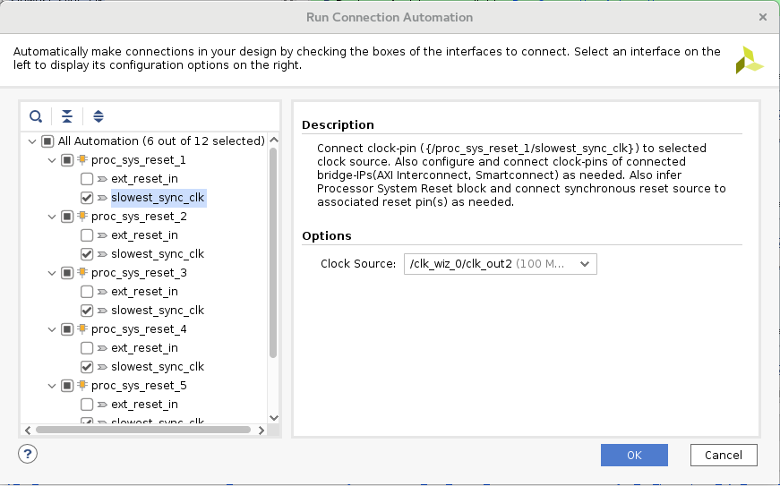

<p align="right">
<a>English</a> | <a href="/docs-jp/README.md">日本語</a>
</p>

<table style="width:100%">
  <tr>
<td align="center" width="100%" colspan="6"><h1>2018.3 SDSoC™ Development Environment Tutorials</h1>
<a href="https://github.com/Xilinx/SDSoC-Tutorials/branches/all">See other versions</a>
</td>

  </tr>
  <tr>
    <td colspan="4" align="center"><h2>Platform Creation Labs</h2></td>
  </tr>
  <tr>
     <td align="center"><a href="Lab1-Creating-DSA-for-Zynq-MPSoC-Processor-Design.md">Introduction</a></td>
     <td align="center">Lab1: Creating the DSA for a Zynq UltraScale+ MPSoC Processor Design</td>
     <td align="center"><a href="Lab2-Creating-Software-Components.md">Lab 2: Creating the SDSoC Platform</a></td>
     <td align="center"><a href="Lab3-Creating-Custom-Platform-Using-the-SDx-IDE.md">Lab 3: Using Your Custom Platform</a></td>
   </tr>
</table>

## Lab1: Creating the DSA for a Zynq UltraScale+ MPSoC Processor Design  

**NOTE:** This lab requires familiarity with the Vivado Design Suite and IP Integrator feature of the tool. If you are not familiar with the Vivado Design Suite, see the *Vivado Design Suite User Guide: Getting Started* ([UG910](https://www.xilinx.com/support/documentation/sw_manuals/xilinx2018_3/ug910-vivado-getting-started.pdf)).

In this lab you will use the Vivado&reg; Design Suite to create a Zynq&reg; UltraScale+ MPSoC processor design that uses the Arm&reg; dual-core Cortex&trade;-A53 and a dual-core Cortex-R5 real-time processing system (PS) as well as IP blocks in the programmable logic (PL) region. The Clocking Wizard IP is used to generate several clocks for possible use by the accelerated hardware functions.  Processor System Reset IP blocks will be added to synchronize resets of the various clock sources. A Concat IP that combines the source of all interrupts from the IP blocks in the programming logic to the PS is also included. Select hardware interfaces will be declared for use by the sds++ system compiler for attaching hardware accelerators. The hardware design and its interface meta-data will then be encapsulated in a Device Support Archive (DSA) file for later use in creating a custom SDSoC platform (see <a href="Lab3-Creating-Custom-Platform-Using-the-SDx-IDE.md">Lab 2: Creating the SDSoC Platform</a>).

<details>
<summary><big><strong>Step 1: Start the Vivado IDE and Create a Project</strong></big></summary>

#### On a Linux host machine:

At the shell prompt, type the following commands:

   1. `source <Xilinx_Install_Directory>/SDx/<Version>/settings64.{sh,csh}`
   2. `vivado`

The first command sets the environment variables before launching Vivado and the second command launches the Vivado IDE.

#### On a Windows host machine:

For a Windows host machine, use one of the following methods to launch Vivado:

   - Click the Vivado desktop icon.

   - From the Start menu, select Xilinx Design Tools \> Vivado 2018.3 \> Vivado 2018.3.

   - From a Command prompt window, type the following commands:

      1. `<Xilinx_Install_Directory>/SDx/<Version>/settings64.bat`
      2. `vivado`

     The first command sets the environment variables before launching Vivado and the second command launches the Vivado IDE.

#### Creating a Vivado project

Follow these steps to create a Vivado project:

1. From the **Quick Start** section, click **Create Project**, as shown in the following figure.

    

2. The New Project Wizard opens. Click **Next**.

    

   The **Project Name** dialog box opens.

3. Enter **zcu102_board** in the Project name text box.

4. Enter **/tmp** in the Project Location text box.

5. Select the **Create project subdirectory** check box.

   

6. Click **Next**. The **Project Type** dialog box appears.

7. Select **RTL Project**.

    

8. Click **Next**. The **Add Sources** dialog box appears.

7. Select **Verilog** from the Target language dropdown list.
8. Select **Mixed** from the Simulator language dropdown list.

    

9. Click **Next**. The **Add Constraints** dialog box appears.

    

10. Click **Next**. The **Default Part** dialog box appears.

11. Click the **Boards** tab at the top of the dialog box.

    For this tutorial, you will be using the ZCU102 evaluation board as a template for the platform that you are creating. Selecting an existing board provides the different parts and interfaces you will use in creating your custom platform.

11. Select **Zynq UltraScale+ ZCU102 Evaluation Board** from the available boards list.

    >**:information_source: TIP**
    >You can use the Search feature to filter for ZCU102.

     

12. Click **Next**.

    >**:warning: WARNING**
    > Multiple versions of each board are supported in Vivado. Ensure that you are targeting the design to the right hardware.

13. Review the project summary on the **New Project Summary** page, and then click **Finish** to create the project.

    

</details>

<details>
<summary><big><strong>Step 2: Create an IP Integrator Design</strong></big></summary>

1. In the **Flow Navigator** view, expand **IP INTEGRATOR** and select **Create Block Design**.
   The **Create Block Design** dialog box appears.

   

2. Specify a name for your IP subsystem design. For this example, use **zcu102_board**.

   >:pushpin: **NOTE:**
   >Do not change the default values in the **Directory** and the **Specify source set** dropdown lists.

    

    >**:information_source: TIP**
    > If the Vivado project contains multiple block designs, the IP integrator block design containing the SDSoC platform must have the same name as the SDSoC platform.

3.  Click **OK**.

#### Adding IP to the Block Design

You will now add several IP blocks to the IP integrator design. The following table list of the added IP blocks and a summary of their usage in an SDSoC platform:
<table style="width:100%; border: 1px solid black;" class="w3-table-all w3-small">
<tr>
<th>IP Block</th><th>Usage Summary</th>
</tr>
<tr>
<td>Zynq UltraScale+ MPSoC Processor System (PS)</td>
<td>
<ul>
<li>Dual-core Arm processor with cache hierarchy</li>
<li>Integrated I/O peripherals</li>
<li>DDR memory controller with external memory interface</li>
<li>PS to Programmable Logic (PL) interconnects</li>
<li>PL to PS interconnects</li>
</ul>
</td>
</tr>
<tr>
<td>
Processor System Reset Block (PL)
</td>
<td>
<ul>
<li>Reset sequencing and synchronization block for PL logic</li>
</ul>
</td>
</tr>
<tr>
<td>
Clocking Wizard (PL)
</td>
<td>
<ul>
<li> Multiple output clock generator to drive PL logic</li>
</ul>
</td>
</tr>
<tr>
<td>
Concat Block (PL)
</td>
<td>
<ul>
<li>PL interrupt structure that feeds Zynq UltraScale+ MPSoC PS interrupt request input</li>
</ul>
</td>
</tr>
</table>
<!-- end list -->

1. On the block design canvas, right-click and select **Add IP**.

    Alternatively, you can click the Add IP button (**+**) on the IP integrator canvas.

    

2. The IP catalog **Search** dialog box appears. In the Search field, type **zynq** to find the Zynq UltraScale+ MPSoC IP.

   

3. Select the **Zynq UltraScale+ MPSoC** and press the <kbd>Enter</kbd> key to add the IP to your design.

   You can also double-click the IP block to add it to the IP integrator canvas.

   

   The Zynq UltraScale+ MPSoC is added to the IP integrator canvas and the Tcl Console window also shows the command used to add the IP.

   `create_bd_cell -type ip -vlnv xilinx.com:ip:zynq_ultra_ps_e:3.2 zynq_ultra_ps_e_0`

   >**:pushpin: NOTE**
   >There is a corresponding Tcl command for most actions performed in the
   block design. Tcl commands are documented in the *Vivado Design Suite: Tcl Command Reference Guide* ([UG835]( https://www.xilinx.com/support/documentation/sw_manuals/xilinx2018_3/ug835-vivado-tcl-commands.pdf)).


4.  In the IP integrator window, click the **Run Block Automation** link.

    

    The **Run Block Automation** dialog box opens, as shown below. The default check in the **Apply Board Preset** field allows the tool to configure the PS to take advantage of the predefined board.

   

5.  Click **OK** to accept the default settings for the ZCU102 board.

    The IP integrator diagram is updated after running block automation on the Zynq UltraScale+ MPSoC IP block.

    

6.  Right-click the IP integrator diagram and select **Add IP** to add peripherals to the PL.

7.  In the **Search** field, type **proc sys res** to find the Processor System Reset, and then press <kbd>Enter</kbd> to add it to the design.
    A synchronized reset signal for each declared platform clock is created using a Processor System Reset IP block. Each reset will be associated with a clock generated by the Clocking Wizard.

    

9.  Add a **Clocking Wizard** IP block to provide PL clock(s) for the platform. You will customize the clock settings in a subsequent step.

    

10. Add the **Concat** IP to connect PL generated interrupts to the PS block. This provides a path for the hardware accelerator to interrupt the processor if needed.

    

    Your block design window should look similar to the figure below. The relative positions of the IP might vary.

    >**:information_source: TIP**
    >You can zoom in and out of the IP integrator diagram using the Zoom In and Zoom Out buttons or their equivalent keyboard shortcuts (**Ctrl**+**Equals** and **Ctrl**+**Minus**, respectively).

    


#### Configuring the ZYNQ MPSoC

1.  Double-click the ZYNQ UltraScale+ MPSoC IP block to open the Re-customize IP dialog box. 

2.  Recustomize the ARM configuration to enable a path for PL to PS interrupts exists.

    

2.  In the Re-customize IP dialog box, select the PS-PL Configuration page in the Page Navigator (on the left side of the dialog box), and expand the General Settings, Interrupts, and PL to PS sections. Make sure the **IRQ0[0-7]** and **IRQ1[0-7]** dropdown menu displays "1", as shown in the figure below. This allows up to 8 PL interrupts to be handled by each input port of the PS interrupt.

    This enables the PS-PL interrupt interface that will be connected to the PL Concat IP block. The input side of the Concat IP block is left open for the sds++ system compiler to route PL interrupts from the hardware accelerator into the PS as needed.

    

3.  On the same PS-PL Configuration page, expand the PS-PL Interfaces, and Master Interface sections. Uncheck the **AXI HPM0 FPD** and **AXI HPM1 FPD** chekboxes, as shown in the previous figure.

    Unchecking these boxes keeps the AXI HPM interfaces available for accelerator attachment by the sds++ system compiler. The default configuration reserves the M_AXI_HPM interfaces for use by the PS, so by un-checking these boxes you are freeing up the interface for use by the SDx tools.     

4.  Click **OK**.


#### Configuring the Clocking Wizard IP

1.  Re-customize the Clocking Wizard by double-clicking on its IP block.

2.  In the **Clocking Options** tab of the Re-customize IP dialog box, examine the **Input Frequency** check box for the **Primary Input Clock**. The ZCU102 pre-set for the PS block provides a 100 MHz clock (pl_clk0) which will be connected as an input to the Clocking Wizard IP.  When the Input Frequency is set to AUTO, the input clock frequency is automatically determined from the connected input clock source.

3.  Click the **Output Clocks** tab and check that the output frequency of clk_out1 is set to 100 MHz.

4.  With the **Output Clocks** tab still selected, scroll down to the bottom of the page, and set the **Reset Type** to **Active Low**, as shown in the following figure.

    

5.  Click **OK** to configure the Clocking Wizard IP.


#### Configuring the Concat Block

1. Double-click the **Concat** IP block to open the Re-Customize IP dialog box. PL interrupts will be routed into the PS by the sds++ system compiler through the Concat IP block.

2. Change the **Number of Ports** field to 1 and press <kbd>Enter</kbd>.

    This enables interrupts from the PL side that the sds++ system compiler may generate for the PS.

    

3. Click **OK** to configure the Concat IP.

#### Using Designer Assistance

Designer Assistance helps connect the Clocking Wizard and Processor System Reset blocks to the Zynq UltraScale+ MPSoC processing system.

1.  Click **Run Connection Automation**. The **Run Connection Automation** dialog box appears.

    

2.  Select the clock options for the IP as shown in the following dialog box. As you select each interface on which connection automation is run, the Description and Options available for the selected interface are shown on the right-hand side of the dialog box.

    

    Change the **slowest_sync_clk** setting to the **\/clk_wiz_0/clk_out1** as shown in the figure.   

4.  Click **OK** to save the settings and close the dialog box.

    The Vivado IP Integrator feature adds connections to the blocks based on the settings you provided for the **Run Connection Automation** command.


#### Manually Connecting the Rest of the Design

You will complete the design by manually wiring connections that could have multiple design dependent sources. In this example platform, you use a reset output generated by the PS block to control the reset inputs of logic on the PL-side. Specifically, the Processor System Reset IP block and the Clocking wizard’s clock sources are connected in this manner. You also keep the PL Processor System Reset blocks in their reset state until the clock sources have locked to their requested frequencies. Additionally, any PL generated interrupts are wired to the interrupt request inputs of the PS block.

1.  Connect the **pl_resetn0** output pin of the Zynq UltraScale+ MPSoC IP to the **resetn** input pin of the Clocking Wizard.

2.  Connect the **pl_resetn0** output pin of the Zynq UltraScale+ MPSoC IP to the **ext_reset_in** pin on the Processor System Reset IP block.

3.  Connect the **locked** output pin of the Clocking Wizard IP to the **dcm_locked** input pin on the Processor System Reset IP block.

4.  Connect the **dout[0:0]** output pin of the xclconcat_0 block to the **pl_ps_irq0[0:0]** input pin of the Zynq UltraScale+ MPSoC IP block.

5.  Click the **Regenerate Layout** command to re-draw the block design with a more optimal layout. At this point, the block diagram should look similar to the view in the figure below.

    

7.  Click the **Validate** button to validate the design.

    

8.  Click **OK** in the Validate Design dialog box.

9.  Save the block design by clicking on the floppy disk icon in the toolbar or by pressing the **Ctrl**+**S** keys.


#### Adding Clocks, Resets, and Interrupts

At this point, the block design represents the framework of your platform: the Zynq UltraScale+ MPSoC, clocking wizard and processor system reset, and interrupts managed through the concat block. The platform only has one clock and reset, and only has space available for 8 interrupts. However, this may be sufficient for your platform requirements, and you can move on to the next steps in this Lab.

For the purposes of this tutorial though, you will add some additional clocks, resets, and interrupts. Providing a variety of clock frequencies in the PL region adds design flexibility to the base platform. An SDx hardware accelerator can change input clock sources without having to re-define and re-build the base platform if multiple clock sources are available in the platform.

1.  Re-customize the Clocking Wizard by double-clicking on it.

2.  Click the **Output Clocks** tab and enable all output clocks, **clk_out1** to **clk_out7**, by clicking on their respective check-boxes. Set the output frequencies under the **Output Freq (MHz) Requested** column as follows:

    - clk_out1 -\> 75
    - clk_out2 -\> 100
    - clk_out3 -\> 150
    - clk_out4 -\> 200.000
    - clk_out5 -\> 300.000
    - clk_out6 -\> 400.000
    - clk_out7 -\> 600.000

3.  Click **OK** to close the Clocking Wizard dialog box.

4.  Select the **proc_sys_reset_0** block, and copy and paste it multiple times, for a total of seven reset IP blocks.

    **Note:** You can use keyboard shortcuts Ctrl-C and Ctrl-V to copy and paste on the design canvas.

5. Select the **xlconcat_0** block, and copy and paste it to create a second instance.

6. Select **Run Connection Automation**. The dialog box should appear as follows.

    

    Ensure that the automation options are set as in the table below.

    **Note:** Some of the elements in the table may have been previously connected, and will not appear in the table. The complete table is provided for your reference.

<div style="page-break-after: always;"></div>

<table style="width:100%; border: 1px solid black;" class="w3-table-all w3-small">
<thead>
<tr class="header">
<th><strong>Connection</strong></th>
<th><strong>Description</strong></th>
<th><strong>Setting</strong></th>
</tr>
</thead>
<tbody>
<tr class="odd">
<td><strong>clk_wiz_0</strong><br />
- clk_in1</td>
<td>The input clock to the clocking wizard</td>
<td><em><strong>/zynq_ultra_ps_e_0/pl_clk0 (99 MHz</strong></em>) is selected by default as the Clock Source option. Leave set to the default value.</td>
</tr>
<tr class="even">
<td><strong>proc_sys_reset_0<br />
</strong>- slowest_sync_clk</td>
<td>Clock source to which this reset is synchronized</td>
<td>Select <strong>/clk_wiz_0/clk_out1 (75 MHz)</strong> from the Clock Source options drop-down menu.</td>
</tr>
<tr class="odd">
<td><strong>proc_sys_reset_1<br />
</strong>- slowest_sync_clk</td>
<td>Clock source to which this reset is synchronized</td>
<td>Select <strong>/clk_wiz_0/clk_out2 (100 MHz)</strong> from Clock Source options drop-down menu.</td>
</tr>
<tr class="even">
<td><strong>proc_sys_reset_2<br />
</strong>- slowest_sync_clk</td>
<td>Clock source to which this reset is synchronized</td>
<td>Select <strong>/clk_wiz_0/clk_out3 (150 MHz)</strong> from the Clock Source options drop-down menu.</td>
</tr>
<tr class="odd">
<td><strong>proc_sys_reset_3<br />
</strong>- slowest_sync_clk</td>
<td>Clock source to which this reset is synchronized</td>
<td>Select <strong>/clk_wiz_0/clk_out4 (200 MHz)</strong> from the Clock Source options drop-down menu.</td>
</tr>
<tr class="even">
<td><strong>proc_sys_reset_4<br />
</strong>- slowest_sync_clk</td>
<td>Clock source to which this reset is synchronized</td>
<td>Select <strong>/clk_wiz_0/clk_out5 (300 MHz)</strong> from the Clock Source options drop-down menu.</td>
</tr>
<tr class="even">
<td><strong>proc_sys_reset_5<br />
</strong>- slowest_sync_clk</td>
<td>Clock source to which this reset is synchronized</td>
<td>Select <strong>/clk_wiz_0/clk_out6 (400 MHz)</strong> from the Clock Source options drop-down menu.</td>
</tr>
<tr class="even">
<td><strong>proc_sys_reset_6<br />
</strong>- slowest_sync_clk</td>
<td>Clock source to which this reset is synchronized</td>
<td>Select <strong>/clk_wiz_0/clk_out7 (600 MHz)</strong> from the Clock Source options drop-down menu.</td>
</tr>
</tbody>
</table>

1.  Manually connect the **pl_resetn0** output pin of the Zynq UltraScale+ MPSoC IP to the **ext_reset_in** pin on all of the Processor System Reset IP blocks.

2.  Connect the **locked** output pin of the Clocking Wizard IP to the **dcm_locked** input pin on all of the Processor System Reset IP blocks.

3.  Manually connect the **dout[0:0]** output pin of the xclconcat_1 block to the **pl_ps_irq1[0:0]** input pin of the Zynq UltraScale+ MPSoC IP block.

4.  Validate and save the block design again. The block design you have created now matches the released ZCU102 platform, and should look similar to the figure below.

    

</details>

<details>
<summary><big><strong>Step 3: Declaring the Platform Hardware Interfaces</strong></big></summary>

After you complete the IP integrator hardware platform design, you must declare the hardware interfaces that will be available as attachment points for SDSoC accelerators and the data movers that will communicate with them. These declarations are added to the design by setting platform (PFM) properties that define the platform name and indicate which specific clocks, interrupts, and bus interfaces are available for the sds++ system compiler as it generates the hardware accelerators. These properties are stored in the project.

As the PFM properties persist within the block design (BD), if you are starting a new platform from an existing platform project, there may be existing properties that are not intended for the new platform and can lead to invalid hardware platforms. In these cases, you must unset any conflicting PFM properties.

In this lab, you use the Platform Interfaces window of the Vivado IP Integrator feature to declare the hardware interfaces.  These PFM properties will be added to the block design.  You can also use the Vivado Block Properties tab or the TCL console to set the PFM properties that declare the hardware interfaces.  At the end of this section the TCL commands are provided that you can use to define the PFM properties.

Your block design contains seven different clocks generated through the Clocking Wizard. While only one of the clocks is enabled in this lab, the others are available for use with the SDx IDE. Through the SDx IDE you will be able to select which functions to accelerate in hardware, and specify clock sources for the hardware accelerators. Likewise, you will declare the AXI ports that are available for moving data between the processor (PS) the hardware functions (PL). Although, these AXI ports may or may not be directly visible on your block design, the PFM property settings define them for use in the SDx environment.

#### Enabling the Platform Interfaces Tab

1.  On the Vivado main menu select **Window -\> Platform Interfaces**.

2.  Click the **Enable platform interfaces** link to enable the Platform Interfaces tab.

  
    
The Platform Interfaces window shows the Platform name, and lists all the interfaces available in the block design that can be enabled/disabled for use by the SDx environment in creating hardware accelerators. Right-clicking on an interface or a group of selected interfaces and then selecting Enable, changes the greyed-out icon in front of the interface name to a solid colored icon. An enabled interface means it is available for use by the SDx tools.

  

#### Platform Name
In the Platform Interfaces window, select the top-level Platform to open the Platform Properties window, as shown in the following figure. Enabling the Platform Interfaces tab automatically sets the platform name property on the block design in the Platform Properties window. You can edit the Name, Vendor, Board, and Version of the platform from the Properties window. For the purpose of this tutorial, use the defaults that have already been set.

  

#### Platform Clocks

The seven output clocks generated by the Clocking Wizard are declared as available for the sds++ system compiler to use when each of the **clk_wiz_0** clocks are enabled in the Platform Interfaces tab, as shown in the figure below.

Each declared clock must have an associated synchronized reset signal using the Processor System Reset IP block. The **proc_sys_reset** property in the Platform Interface Properties dialog box is used to make this association for each declared clock. Providing multiple platform clock frequencies allows you to select an accelerator clock source that has a high-probability of being routed and meeting timing constraints when the Vivado implementation tools are invoked. If a particular clock frequency selection does not meet timing, selecting a lower frequency clock source may remedy the issue.

   >**:pushpin: NOTE**
   >To select a range, click a line, then hold the <kbd>Shift</kbd> key down and click on another line to select the lines in between.


1. Right-click on each clock of the **clk_wiz_0**, and select **Enable** for **clk_out1** through **clk_out7**.

2. Select **clk_out2** in the Platform Interfaces window.

3.  In the Platform Interfaces Properties window, select the **Options** tab and click the **is_default** option box to enable the checkbox, marking this as the default clock for accelerators.

    

#### Platform AXI Ports

In this custom platform, all the Zynq UltraScale+ MPSoC PS-side AXI ports (master and slave) are declared as available for the sds++ system compiler to use, as shown by the enabled **zynq_ultra_ps_e_0** interfaces below. The pl_clk0 interface is not enabled for SDx accelerator use, since it is already in use by the hardware design to provide the 100.000 MHz input clock to the Clocking Wizard IP.

1. Select all of **zynq_ultra_ps_e_0** interfaces, except pl_clk0, S_AXI_ACP_FPD, and S_AXI_LPD. Right-click and select **Enable**.

    **NOTE:** Remember, you can hold down <kbd>Shift</kbd> or <kbd>Ctrl</kbd> to select multiple interfaces.


#### Platform Interrupts

Interrupt sources from the hardware accelerator in the PL logic will be connected through the **Concat** IP block to the Zynq UltraScale+ MPSoC IRQ input ports (**pl_ps_irq0** and **pl_ps_irq1**). The figure below shows that 8 interrupt sources are enabled on each concat block for the sds++ system compiler to use.

1. Right-click on **xlconcat_0** inputs **In0** to **In7** and select **Enable**.

2. Right-click on **xlconcat_1** inputs **In0** to **In7** and select **Enable**.


Selecting an object in the Platform Interfaces window, such as the **xclconcat_0** object, lets you view the PFM property of the object in the Block Properties window, as shown in the figure below.


#### Tcl Console Commands (For Reference)

These commands are provided for reference and do not need to be executed if the platform properties are set through enabling and disabling selections in the **Platform Interfaces** tab, as presented in the preceding section. The Vivado journal or log files can be examined to view a history of the Tcl commands issued by actions performed in the **Platform Interfaces** tab.

1.  PFM NAME
    ```
    set_property PFM_NAME “vendor:lib:zcu102_board:1.0”\  
    [get_files [get_property FILE_NAME [get_bd_designs]]]
    ```
2.  PFM CLOCK
    ```
        set_property PFM.CLOCK {\  
        clk_out1 {id “1” is_default “false”\  
        proc_sys_reset “proc_sys_reset_0”}\  
        clk_out2 {id “2” is_default “true”\
        proc_sys_reset “proc_sys_reset_1”}\  
        clk_out3 {id “3” is_default “false”\  
        proc_sys_reset “proc_sys_reset_2”}\  
        clk_out4 {id “4” is_default “false”\  
        proc_sys_reset “proc_sys_reset_3”}\  
        clk_out5 {id “5” is_default “false”\  
        proc_sys_reset “proc_sys_reset_4”}\  
        clk_out6 {id “6” is_default “false”\  
        proc_sys_reset “proc_sys_reset_5”}\  
        clk_out7 {id “7” is_default “false”\  
        proc_sys_reset “proc_sys_reset_6”}\  
        } [get_bd_cells /clk_wiz_0]
    ```
3.  PFM AXI Ports
    ```
        set_property PFM.AXI_PORT {\  
        M_AXI_HPM0_FPD {memport “M_AXI_GP” sptag “” memory “”}\  
        M_AXI_HPM1_FPD {memport “M_AXI_GP” sptag “” memory “”}\  
        M_AXI_HPM0_LPD {memport “M_AXI_GP” sptag “” memory “”}\  
        S_AXI_HPC0_FPD {memport “S_AXI_HPC” sptag “” memory “”}\  
        S_AXI_HPC1_FPD {memport “S_AXI_HPC” sptag “” memory “”}\  
        S_AXI_HP0_FPD {memport “S_AXI_HP” sptag “” memory “”}\  
        S_AXI_HP1_FPD {memport “S_AXI_HP” sptag “” memory “”}\  
        S_AXI_HP2_FPD {memport “S_AXI_HP” sptag “” memory “”}\  
        S_AXI_HP3_FPD {memport “S_AXI_HP” sptag “” memory “”}\  
        } [get_bd_cells /zynq_ultra_ps_e_0]
    ```
4.  PFM Interrupts
    ```
        set_property PFM.IRQ {\  
        In0 {} In1 {} In2 {} In3 {} In4 {} In5 {} In6 {} In7 {}\
        } [get_bd_cells {/xlconcat_0 /xclconcat_1}]
    ```
</details>

<details>
<summary><big><strong>Step 4: Generating HDL Design Files</strong></big></summary>

You can now generate the HDL files for the design.

1. In the Sources window, right-click the **zcu102_board.bd** block design and select **Generate Output Products**.

    

2. Click **Generate**.

    

3. Observe zcu102_board output generation completed as indicated by the status column: **Submodule Runs Complete** in the Design Runs view. The running output products generation can be set to run in the background to access the Design Runs view if necessary.

    

5. Right-click on **zcu102_board.bd** in the Sources window and click on **Create HDL Wrapper** to create a top-level HDL wrapper for the platform design.

   

6. Click **OK**.

    

7. In the Flow Navigator, click **Generate Bitstream**.

8. The Vivado tool reports that there are no implementation results available, and ask if you would like the tool to generate those as well. Click **Yes** to continue.  

9. In the Launch Runs dialog box, leave the default settings and select **OK**.

    Synthesis and Implementation runs are kicked off in sequence to synthesize the netlist for the platform design, place and route the logic in the design, and finally generate the bitstream you requested.

10. After the Bitstream Generated dialog box is displayed, click **Cancel** to close it, and select the **File > Export > Export Hardware** command from the main menu.

11. Select the **Include Bitstream** checkbox, as shown below.

    

    You now have a Zynq UltraScale+ MPSoC bitstream that includes a hardware design without any SDSoC accelerators. This bitstream can be used as a check of hardware functionality before running the design through the SDx IDE to generate hardware accelerators.
</details>

<details>
<summary><big><strong>Step 5: Writing Out the DSA</strong></big></summary>

At this point, you can encapsulate the IP integrator hardware design, along with the PFM properties design metadata, into a Device Support Archive (DSA) that becomes part of the SDSoC platform definition.

1.  In the Tcl Console, type the following command and press the <kbd>Enter</kbd> key.

    `write_dsa -force -include_bit /tmp/zcu102_board/zcu102_board.dsa`

    **NOTE:** If your project is named differently, you will need to modify the command to match your design.

2.  Validate the DSA by entering the following command in the Tcl console.

    `validate_dsa /tmp/zcu102_board/zcu102_board.dsa`

3.  Close the Vivado GUI after validating DSA.

</details>

### Conclusion

In completing Lab 1, you have used the Vivado Design Suite to create a Zynq UltraScale+ MPSoC hardware design using Vivado IP integrator to target a ZCU102 board. In addition to the PS Zynq UltraScale+ MPSoC IP, you added key PL IP blocks for clocks, resets, and interrupts to define the base hardware platform. After declaring select hardware interfaces for use by the sds++ system compiler, you created the DSA to define the hardware component of an SDSoC platform.

## Related information
 - <a href="Lab2-Creating-Software-Components.md">Lab 2: Creating the SDSoC Platform</a>
 - <a href="Lab3-Creating-Custom-Platform-Using-the-SDx-IDE.md">Lab 3: Using Your Custom Platform</a>

<hr/>
<p align="center"><sup>Copyright&copy; 2019 Xilinx</sup></p>
