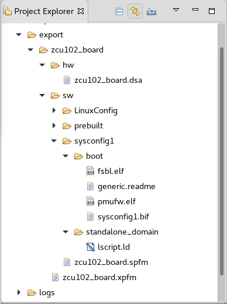



<a>English</a> | <a href="/docs-jp/README.md">日本語</a>

<table style="width:100%">
  <tr>
<td align="center" width="100%" colspan="6"><h1>2018.3 SDSoC™ Development Environment Tutorials</h1>
<a href="https://github.com/Xilinx/SDSoC-Tutorials/branches/all">See other versions</a>
</td>

  </tr>
  <tr>
    <td colspan="4" align="center"><h2>Platform Creation Labs</h2></td>
  </tr>
  <tr>
     <td align="center"><a href="Lab1-Creating-DSA-for-Zynq-MPSoC-Processor-Design.md">Introduction</a></td>
     <td align="center"><a href="Lab1-Creating-DSA-for-Zynq-MPSoC-Processor-Design.md">Lab1: Creating the DSA for a Zynq UltraScale+ MPSoC Processor Design</a></td>
     <td align="center">Lab 2: Creating the SDSoC Platform</td>
     <td align="center"><a href="Lab3-Creating-Custom-Platform-Using-the-SDx-IDE.md">Lab 3: Using Your Custom Platform</a></td>
   </tr>
</table>

## Lab 2: Creating the SDSoC Platform  
In Lab 1 you created the hardware component of the SDSoC platform: the DSA file which contains the framework for the Zynq UltraScale+ MPSoC hardware design. In this lab, you will create an SDSoC platform project to define the **zcu102_board** platform, while also generating the elements of the software for a standalone (or baremetal) operating system. The required software components are:

-  **First Stage Boot Loader (FSBL)**:  The FSBL initializes the processor (PS) block, configures the programmable logic (PL) with a bitstream if needed, and loads either a second stage boot loader, or loads an application as specified in the boot file.

- **Linker Script**: The linker script specifies the memory address space used for the code and data regions present within the executable software application file. The executable file is formatted in the executable and linkable format (ELF). The stack and heap sizes are also specified within the linker script.

- **Boot Image Format (BIF) File**: The BIF file specifies how the Zynq&reg; UltraScale MPSoC boot file (BOOT.BIN) is constructed. The boot file contains the FSBL and the executable application ELF file. It can also contain a bitstream as well as additional program and data files.

>:pushpin: **NOTE**
>For more information on creating a boot image, see Zynq UltraScale+ MPSoC Software Developer Guide ([UG1137](https://www.xilinx.com/support/documentation/user_guides/ug1137-zynq-ultrascale-mpsoc-swdev.pdf)).

<big><strong>Step 1: Launching the SDx&trade; IDE</strong></big>

#### On a Linux host machine:

At the shell prompt, type the following commands:
   
   1. `source <Xilinx_Install_Directory>/SDx/<Version>/settings64.{sh,csh}`
   2. `sdx`
    
The first command sets the environment variables before launching the SDx IDE, and the second command launches the tool. 

#### On a Windows host machine:

For a Windows host machine, use one of the following methods to launch Vivado&reg;

- Click the Vivado desktop icon

- From the Start menu, select Xilinx Design Tools \> Vivado 2018.2 \> Vivado 2018.2

- From a Command prompt window, type the following commands:
   
1. `<Xilinx_Install_Directory>/SDx/<Version>/settings64.bat`
2. `sdx`
    
    The first command sets the environment variables before launching the SDx IDE, and the second command launches the tool. 

After the SDx IDE opens, you will be prompted to specify an SDx workspace. The SDx workspace will contain the platform and application projects you develop in the SDx tool. You can change the workspace when creating new platforms or application projects. 

1. For this lab enter **/tmp/sdx_workspace** for the Workspace as shown in the figure below.

   

1. Click **OK**.

1. In the SDx IDE Welcome screen, select **Create Platform Project**.

   As an alternative, the SDx IDE menu selection **File \> New \> SDx Platform Project** can be used.

   

   In this lab you will create the software components necessary for the SDSoC platform, and in the next lab you will combine the hardware and software components in a Platform project to define the SDSoC platform.

<big><strong>Step 2: Creating a New Platform Project</strong></big>

1. In the New Platform Project dialog, type **zcu102_board** as the Project name.

    

2. Click **Next**.

3. On the Platform dialog, select the **Create from hardware specification (DSA)** option.

    

4. Click **Next**.

5. Click the **Browse** button to add a **DSA file**.

6. Navigate to the **zcu102_board.dsa** file written in Lab 1. 

    **Note:** It should be located at /tmp/zcu102_board/zcu102_board.dsa.

    The SDx tool will read the selected DSA file and populate the Platform Project dialog box with available software specifications, as shown in the following figure.  

    

7. In the Software Specification select:

    - Operating system: **standalone**
    - Processor: **psu_cortex53_0**

     

8. Click **Finish**.

<big><strong>Step 3: Defining the System Configuration and Generating the Platform</strong></big>

The platform project is created, and the **Platform Configuration Settings** opens in the Editor area of the SDx IDE as shown in the figure below. The SDx tool automatically creates a system configuration, called **sysconfig1**, and processor domain with a name based on the operating system and processor you selected. 

   

At this point, you will edit the platform project to add new configurations and domains.

1. Select the top-level platform project, **zcu102_board**, in the Platform Configuration Settings tree view. You can edit the description for the platform. The fields of the platform project are edited by selecting the Edit command (pencil icon). 

2. You can browse for sample application files to add to the ./samples folder of the platform. These files are optional, and the folder is not created unless you populate it. 

3. Enable **Generate prebuilt data** to populate the prebuilt folder for the platform. You can also select **Use existing prebuilt data** to specify prebuilt data from another platform, for instance. 

    Providing a platform with prebuilt data containing software files with port interface specifications and a bitstream allows platform users to quickly compile and run software applications that do not invoke hardware accelerated functions.

   

1. Select the **System configuration:sysconfig1** in the tree view, as displayed in the image above. You can enter a description for the system configuration by selecting the **Edit** command (pencil icon). 

2. You can add a **Readme** file for the system configuration if you have one. 

3. For this lab, enable the **Generate software components** radio button to have the SDx IDE automatically generate the files required for the current system configuration of the platform.  Alternativley you can enable **Use pre-built software components** to specify the required files.

   

4. Select the **standalone on psu_cortexa53_0** domain in the tree view, as displayed in the image above. This view is where you would specify the
board support package, the application linker script, and included libraries. You will not make any changes to the selections on this page. Just examine the fields, and refer to the *SDSoC Environment Platform Development Guide* ([UG1146](https://www.xilinx.com/support/documentation/sw_manuals/xilinx2018_3/ug1146-sdsoc-platform-development.pdf)) for more information. 

You have just completed the first system configuration that was automatically defined from your choices when you set up the SDSoC platform project. However, in this tutorial, you will also be defining a second system configuration for the Linux operating system. This way, your custom platform can be used in standalone applications, or in Linux based applications. 

1. In the Project Editor, select the Add command (green '+' icon) to add a new **System Configuration**. 

   

    This opens the **New System Configuration** dialog box, as shown above, letting you specify the Name, Display Name, and Description of the configuration. 
    
    **Note:** Generating the software components for the Linux Operating System requires the PetaLinux tool to be installed and accessible to the SDSoC development environment. PetaLinux provides a complete, reference Linux distribution that has been integrated and tested for Xilinx devices. Refer to the *PetaLinux Tools Documentation: Reference Guide* ([UG1144](https://www.xilinx.com/support/documentation/sw_manuals/xilinx2018_3/ug1144-petalinux-tools-reference-guide.pdf)) for more information. After installing PetaLinux on your system, you must also set the **PetaLinux Install Location** in your SDSoC development environment, using the **Windows > Preferences** command, and selecting the  **Xilinx SDx > Platform Project** in the Preferences dialog box.
    
2. Enter the following:

- Name: LinuxConfig
- Display Name: Linux Config
- Description: Add a suitable description. 

3. Click **OK** to add the new system configuration to the platform project. 

4. In the Project Editor, select the Add command (green '+' icon) to add a new **Domain**.

   

    This opens the **New Domain** dialog box, as shown above, letting you specify the Name, Display Name, and Description of the configuration. 
    
5. Enter the following:

- Name: **linux_domain**
- Display Name: **linux_domain**
- OS: Select **linux** from the drop down menu. 
- Processor: **psu_cortexta53**
- Supported Runtimes: Select **C/C++**
- Enable the **Generate software components** radio button

6. Click **OK** to add the new domain to your platform project. 

7. Select the **3: Generate Platform** command, under the Quick Links at the bottom of the page, to generate the platform files from the current project.

   

    The SDx tool compiles the ./sw folder to generate the required files for FSBL, linker script (lscript.ld), and the BIF file for each system configuration. In addition, prebuilt application files are generated to let you test the platform if specified. Finally, the hardware platform DSA file from Lab 1 is copied into the ./hw folder in the platform. The contents of the exported platform are shown in the following figure. 

   

### Conclusion

In completing Lab 2, you used the DSA file you created in the Vivado Design Suite in Lab 1 and brought it into a Platform Project in the SDx environment. Using the SDx IDE, you specified a Standalone system configuration and a Linux system configuration for your platform. With the details of the platform specified, you generated the actual platform files for use in SDSoC application projects. In Lab 3 you will use the platform you have created. 
## Related information
 - <a href="Lab1-Creating-DSA-for-Zynq-MPSoC-Processor-Design.md">Lab 1: Creating the DSA for a Zynq UltraScale+ MPSoC Processor Design</a>
 - <a href="Lab3-Creating-Custom-Platform-Using-the-SDx-IDE.md">Lab 3: Using Your Custom Platform</a>

Copyright&copy; 2019 Xilinx

