<div style="page-break-after: always;"></div>
<div style="display: none;" media="print">
<table style="width:100%">
  <tr>

<th width="100%" colspan="6"><h1>SDSoC Platform Creation Labs</h2>
</th>

  </tr>
  <tr>
    <td width="17%" align="center"><a href="README.md">Introduction</a></td>
    <td width="16%" align="center"><a href="Lab1-Creating-DSA-for-Zynq-7000-SoC-Processor-Design.md">Lab1: Creating the DSA for a Zynq-7000 SoC Processor Design</a></td>
    <td width="17%" align="center">Lab 2: Creating Software Components for the Platform</td>
    <td width="17%" align="center"><a href="Lab3-Creating-Custom-Platform-Using-the-SDx-IDE.md">Lab 3: Creating a Custom Platform Using the SDx IDE</a></td>
  </tr>
</table>
</div>


## Lab 2: Creating Software Components for the Platform  
In this lab we will create the files used to define the software components of an SDSoC platform for a standalone target. The software components created are:

-  **First Stage Boot Loader (FSBL)**:  The FSBL initializes the PS block, configures the PL with a bitstream if needed, and loads either a second stage bootloader or the end application as specified in the boot file

- **Linker Script**: The linker script specifies the memory address space used for the code and data regions present within the executable software application file. The executable file is formatted in the executable and linkable format (ELF). The stack and heap sizes are also specified within the linker script

- **Boot Image Format (BIF) File**: The BIF file specifies how the Zynq boot file (BOOT.BIN) is constructed. The boot file contains the FSBL and the executable application ELF file. It can also contain a bitstream as well as additional program and data files.

>:pushpin: **NOTE**
>See [UG821](https://www.xilinx.com/support/documentation/user_guides/ug821-zynq-7000-swdev.pdf), the Zynq-7000 SoC Software Developers Guide, for further details on creating a boot image.

<details>
<summary><big><strong>Step 1: Launching the SDx IDE and Creating an Application Project</strong></big></summary>


#### On a Linux host machine:

At the shell prompt, type the following commands:
   
   1. `source <Xilinx_Install_Directory>/SDx/<Version>/settings64.{sh,csh}`
   2. `sdx`
    
The first command sets the environment variables prior to launching the SDx IDE and the second command launches the SDX IDE. 

#### On a Windows host machine:

For a Windows host machine, use one of the following methods to launch Vivado

   - Click the Vivado desktop icon

   - From the Start menu, select Xilinx Design Tools \> Vivado 2018.2 \> Vivado 2018.2

   - From a Command prompt window, type the following commands:
   
      1. `<Xilinx_Install_Directory>/SDx/<Version>/settings64.bat`
      2. `sdx`
    
     The first command sets the environment variables prior to launching the SDx IDE and the second command launches the SDX IDE. 

After the SDx IDE opens it will prompt you to set a directory location for an SDx workspace. The SDx workspace will contain the platform and application projects we will develop.

1. For this lab enter **/tmp/sdx\_workspace** for the Workspace as shown in the figure below.

1. Click **OK**.

   

1. In the SDx IDE Welcome screen, select **Create SDx Project**.

   As an alternative, the SDx IDE menu selection **File \> New \> SDx Project** can be used.

   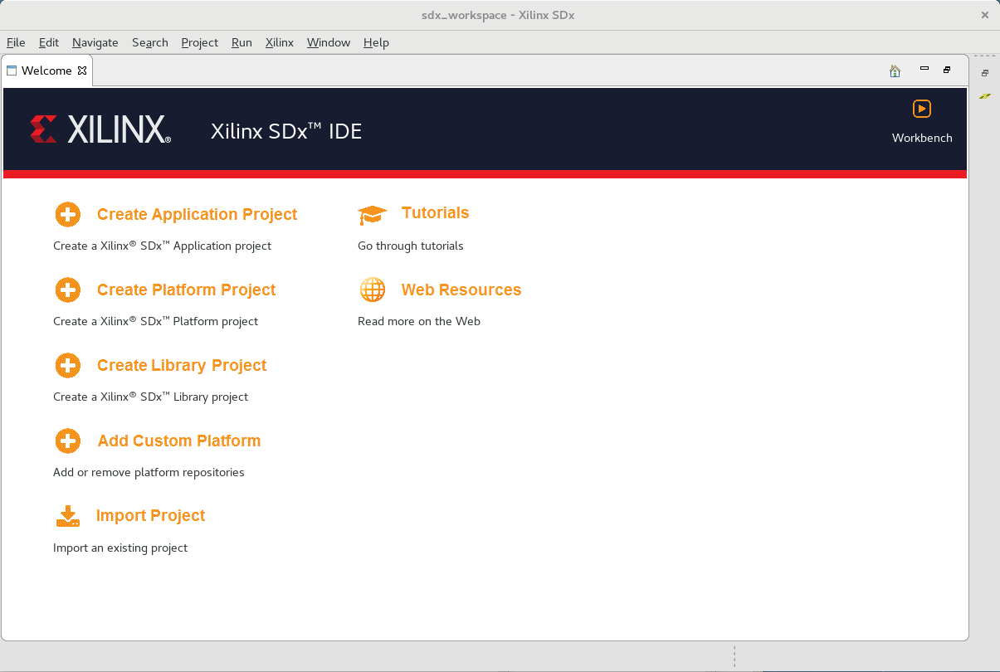

1. Select **Application** on the Project Type dialog.

   We will first create the software application components necessary for the SDSoC platform and then in a later lab we will create a Platform project to utilize this software.

1. Click **Next**.

   
</details>

<details>
<summary><big><strong>Step 2: Creating an FSBL Application</strong></big></summary>


1. In the Create a New SDx Project dialog, type **fsbl** as the Project name.

1. Click **Next**.

    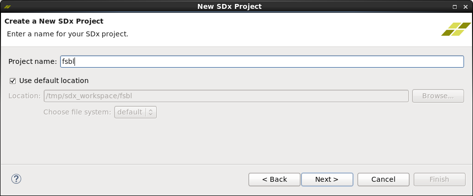

1. In Platform dialog, select **Hardware specification (DSA/HDF)**.

1. Click **Add New DSA/HDF…**.

    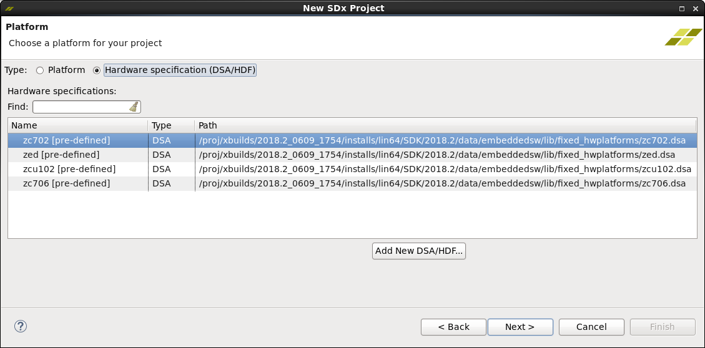

1. In the Add New DSA/HDF dialog, navigate to the HDF exported in Lab 1.

1. Select **/tmp/zynq7\_board/zynq7\_board.sdk/zynq7\_board\_wrapper.hdf**.

1. Click **OK**.

   A new platform name is added to the Platform selection dialog choices

    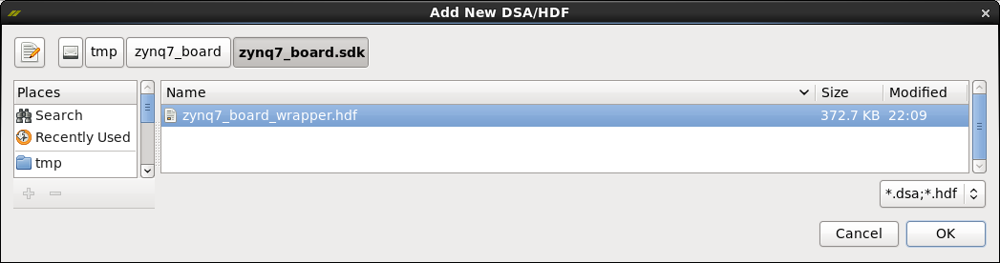

1. Select the **zynq7\_board\_wrapper** of type HDF.

1. Click **Next** to read in this hardware specification file.

   

1. In the System configuration dialog, retain the following default settings and click **Next**.

   - OS Platform: **standalone**

   - Processor: **ps7\_cortexa9\_0**

   - Language: **C**

   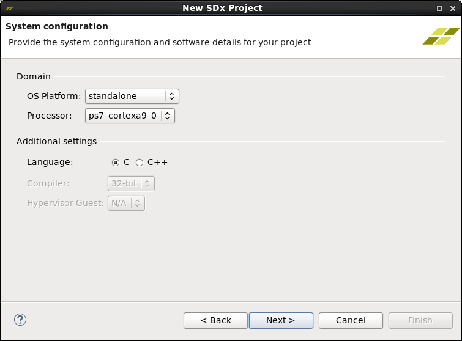

1. In the Templates dialog, select the **Zynq FSBL** and click **Finish**.

    

   A Zynq-7000 SoC FSBL application is created as seen in the SDx IDE shown below.

    

8. In the **Assistant** view, expand **fsbl [Application]**. The **Assistant** view appears in the bottom left corner below the **Project Explorer** view in the SDx IDE.

<a name="buildfsbl"></a>
  
9. Right-click on **Debug** and select **Build**.

   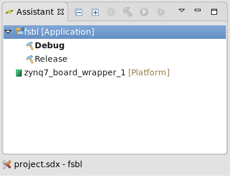

   The SDx Console window shows the FSBL compilation steps and the size of the resulting **fsbl.elf** executable software file.

    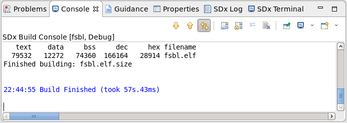
</details>
<details>
    <summary><big><strong>Step 3: Creating a “Hello World” Software Application with an updated Linker Script</strong></big></summary>


The “Hello World” application serves as a baseline of basic hardware and software functionality to observe that our design and board are functional prior to creating an SDSoC platform and any hardware accelerated functions. The Zynq-family boot process consists of a first stage bootloader that loads either application software, in this case our hello\_world code, or a second stage bootloader such as U-Boot. Next, the FSBL configures the PL with a bitstream and then loads the application code into memory as defined by the application’s linker script. Program control is then passed to the application code.

1. Create a new Application project by selecting **File > New > SDx Project** on the SDx IDE menubar.

2. Select **Application** in Project Type dialog.

3. Type **hello_world** for the Project name in the Create a New SDx Project dialog and click **Next**.

    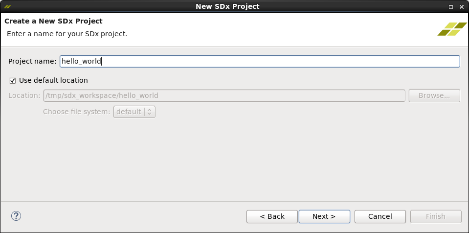

4. In the Platform dialog, click Platform and select the `zynq7_board_wrapper_1[custom]` platform.

5. Click **Next**.

   

6. On the System configuration dialog, retain the following default settings and click **Next**.

   - System configuration: **systemconfig**

   - Runtime: **C/C++**

   - Domain: **standalone\_domain**

   - CPU: **ps7_cortexa9_0**

   - OS: **standalone**

   - Output type: **Executable (elf)**

   - Language: **C**

   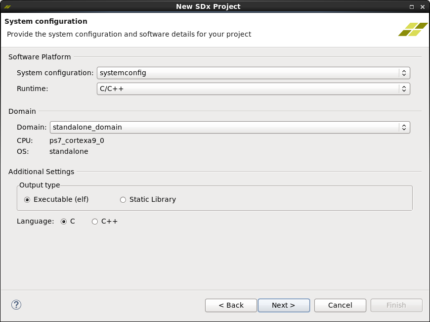

7. Select the **Hello World** application template in the Templates dialog box.

8. Click **Finish**.
   An SDK application project will be created.

   

9. In the Assistant view, right-click `hello_world [Application]` and select **Generate Linker Script**.

    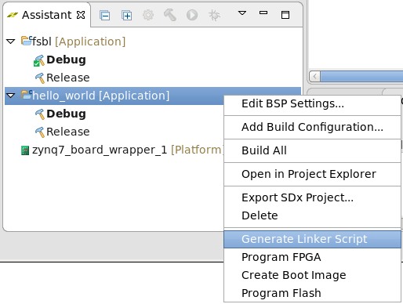

8. In the Generate linker script dialog go to the **Basic** tab on the right and change the Heap and Stack sizes. The default values are too small for a typical SDx application that uses the heap for input and output data buffers.

   >:pushpin: **NOTE:**
   >Commas and other formatting is not accepted when entering values into the Generate linker script dialog.

   1. Set Heap Size to **805306368**.
      This is 768 MB.

   1. Set Stack Size to **262144**.
      This is 256 KB.

9. Click **Generate**.

10. Click on **Yes** to overwrite existing linker script.

    

9.  In the Assistant view, expand `hello_world [Application]`

10. Right-click **Debug** and select **Build**.

    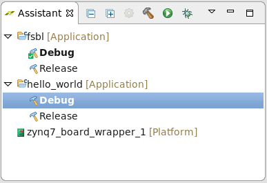

The SDx Console window shows the hello\_world compilation steps and the size of the resulting **hello\_world.elf** executable software file.

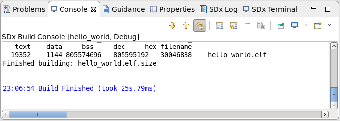
</details>

  <details>
    <summary><big><strong>Step 4: Generating the Boot Image</strong></big></summary>

We now have a set of hardware and software components that we can use to boot a Zynq-7000 SoC system. The SDx IDE provides the ability to create the boot image and its associated boot image file (BIF) that defines the boot image components. The order of partitions listed in the BIF is important. The generated **BOOT.bin** file located in the **hello_world/_sdx/bootimage** directory can be placed onto a FAT32 formatted SD card and used to boot the ZC702 with the “Hello World” text string output to the UART and the PL configured with a bitstream.

1.  In the Assistant view, right-click `hello_world [Application]`and select **Create Boot Image**.

    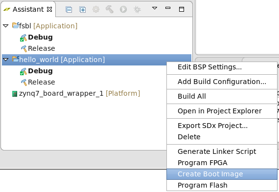

2.  On the Create Boot Image dialog box accept the following defaults.

    >:pushpin: **NOTE**
    > Prior to clicking on the Create Image button, make sure the Boot image partitions are in the order shown below. You may need to select the bitstream partition and click the Up button in order to match the order shown below.

    1. Select the **Zynq** architecture.

    2. Select **Create new BIF file**.

    3. Provide the Output BIF file path. For example, ``/tmp/sdx_workspace/hello_world/_sdx/bootimage/hello_world.bif``

    4. Provide the Output path. For example, ``/tmp/sdx_workspace/hello_world/_sdx/bootimage/BOOT.bin``

    5. Add boot image partitions in the following sequence:

       1. `/tmp/sdx_workspace/zynq7_board_wrapper_1/export/zynq7_board_wrapper_1/sw/systemconfig/boot/fsbl.elf`

       2. `/tmp/sdx_workspace/_sdx/bitstream/zynq7_board_wrapper.bit`

       3. `/tmp/sdx_workspace/hello_world/Debug/hello_world.elf`

      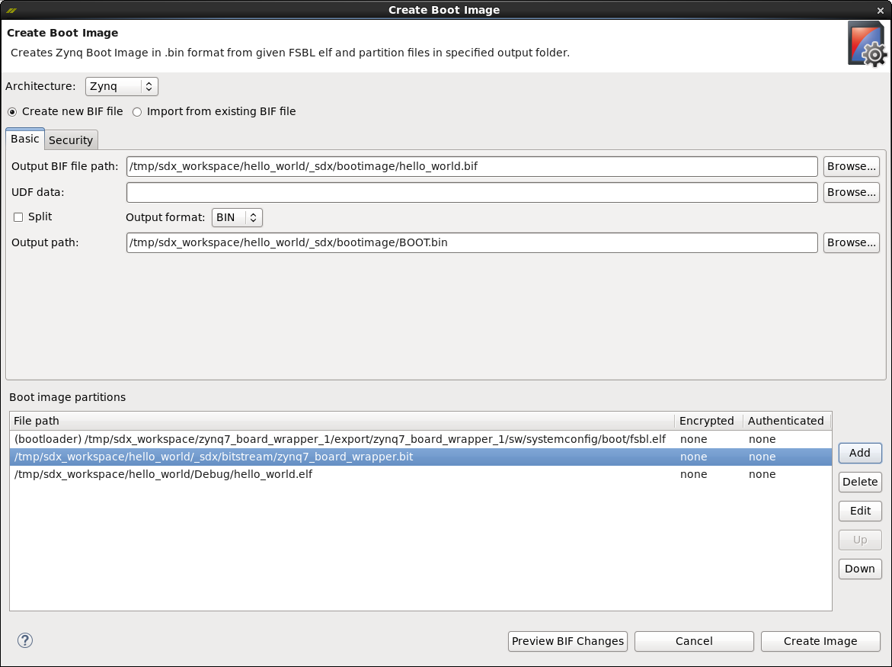

      >:pushpin:**NOTE:**
      >If an fsbl.elf is not present by default in the boot image partitions list above, you can use the FSBL that was built in [Step 2](#buildfsbl)  (/tmp/sdx_workspace/fsbl/Debug/fsbl.elf) by adding it to the partition list. To replace a partition, select it, then click the **Delete** button. Click the **Add** button and browse to new file for the partition list. Use the **Up**/**Down** buttons for setting order.
      
    6. Click **Create Image**.
    
       The boot image and its associated boot image file (BIF) that defines the boot image components is created.

</details>
<details>
<summary><big><strong>Step 5: Booting the ZC702 with the generated Boot Image (BOOT.bin)</strong></big></summary>


1. Copy the `BOOT.bin` file from `/tmp/sdx_workspace/hello_world/_sdx/bootimage/BOOT.bin` to the root directory of a FAT32 formatted SD card inserted on the host machine.

2. Safely eject or unmount the SD card.

3. Power off the ZC702 (SW11) board.

4. Insert SD card, with `BOOT.bin` at root directory, into ZC702 metallic SD card holder (J64).

5. Ensure that the ZC702 boot mode DIP switch (SW16) is set for SD card boot. The following is a list of the recommended DIP switch position settings:

   - 1 - Away from number 1 printed on switch.

   - 2 - Away from number 2 printed on switch.

   - 3 - Towards the number 3 printed on switch.

   - 4 - Towards the number 4 printed on switch.

   - 5 - Away from number 5 printed on switch.

6.  Plug the mini-USB cable end into the ZC702 USB-UART connector (J17).

7.  Plug the other end of the USB Host Type A connector into the USB port of the host machine.

8.  Power-up the ZC702 (SW11) board.

9.  On the host machine run a terminal program, such as TeraTerm, using the COM port associated with the Silicon Labs CP210x USB-to-UART device that is on the ZC702.

    1. Ensure Silicon Labs CP210x VCP drivers are already loaded on Host machine.

    2. Attach to COM port containing “Silicon Labs CP210x USB to UART Bridge” identifier.

       The ZC702 needs board power applied to activate the COM port.

    3. Serial port settings are 115200 baud, 8-N-1, no hardware flow control.

10.  Once the terminal program is connected to the COM port, you can reboot by:

     - Pushing the POR\_B pushbutton (SW1) or

     - Power cycling (SW11) the ZC702

11. After the ZC702 board is successfully configured with a bitstream, the DONE LED (DS3) turns green.

    This usually takes up to 30 seconds.

12. The text Hello World appears on the terminal window after a successful boot.

    

</details>
    <details>
    <summary><big><strong>Step 6: Preparing a Staging Area for Platform Creation</strong></big></summary>


We now have all the components necessary to create a standalone SDSoC platform that targets a ZC702. In preparation for providing input files to the SDx IDE’s platform creation dialogs we create a directory that serves as a staging area. The name or location of the directory is user selectable. We will create the staging area in our SDx workspace directory. Below is a description of the steps we perform to populate the staging area, followed by the Linux commands used to complete the described actions.

1.  Change directory to the location of the SDx workspace

2.  Copy the DSA created in Lab 1 into the SDx workspace

3.  Create the boot directory in the SDx workspace

4.  Change directory to boot

5.  Copy the FSBL ELF file into the boot directory

6.  Copy the `hello_world` linker script into the boot directory

7.  Copy the `hello_world` BIF file into the boot directory

8.  Copy the `hello_world` BOOT.bin file into the boot directory
    ```
    cd /tmp/sdx_workspace
    cp /tmp/zynq7_board/zynq7_board.dsa .
    mkdir boot
    cd boot
    cp /tmp/sdx_workspace/fsbl/Debug/fsbl.elf .
    cp /tmp/sdx_workspace/hello_world/src/lscript.ld .
    cp /tmp/sdx_workspace/hello_world/_sdx/bootimage/hello_world.bif .
    cp /tmp/sdx_workspace/hello_world/_sdx/bootimage/BOOT.bin .
    ```
9.  Copy the `hello_world.bif` file to a file named **platform.bif**

10. Edit **platform.bif**.

    

An SDSoC boot image format file looks similar to a standard BIF file, with tokens specified in angle brackets (< >) rather than direct paths to boot files. The BIF tokens are replaced at SDSoC compile time with actual file names and generated content. This is done since the bitstream file for the PL region will be procedurally generated in the course of running the SDx tools and also because some of the elements listed in the BIF file do not have known file names at the time the BIF file is created.
</details>

### Conclusion

In completing Lab 2, you used the Lab 1 exported hardware design from the Vivado Design Suite and brought it into the SDx environment. Using the SDx IDE, you created an FSBL software application and a hello\_world software application. The linker script for the hello\_world application was updated to reflect the resources needed for the SDx environment. These applications were then used to create a boot image (BOOT.bin). By writing the boot image to an SD card and using it to boot a ZC702 board, you validated the application on hardware. A staging area directory was then created and you moved the relevant files into the staging area in preparation for Lab 3.

<hr/>
<p align="center"><sup>Copyright&copy; 2018 Xilinx</sup></p>
