

<table style="width:100%">
  <tr>

<th width="100%" colspan="6"><h1>SDSoC Platform Creation Labs</h2>
</th>

</tr>
  <tr>
    <td width="17%" align="center"><a href="README.md">Introduction</a></td>
    <td width="16%" align="center"><a href="Lab1-Creating-DSA-for-Zynq-7000-SoC-Processor-Design.md">Lab1: Creating the DSA for a Zynq-7000 SoC Processor Design</a></td>
    <td width="17%" align="center"><a href="Lab2-Creating-Software-Components.md">Lab 2: Creating Software Components for the Platform</a></td>
    <td width="17%" align="center">Lab 3: Creating a Custom Platform Using the SDx IDE</td>
  </tr>
</table>

## Lab 3: Creating a Custom Platform Using the SDx IDE

<big><strong>Step 1: Invoking the SDx&trade; IDE and Creating a Platform Project</strong></big>

#### On a Linux host machine:

At the shell prompt, type the following commands:
   
   1. `source <Xilinx_Install_Directory>/SDx/<Version>/settings64.{sh,csh}`
   2. `sdx`
    
The first command sets the environment variables before launching the SDx IDE and the second command launches the SDx IDE. 

#### On a Windows host machine:

For a Windows host machine, use one of the following methods to launch Vivado&reg;

   - Click the Vivado desktop icon.

   - From the Start menu, select Xilinx Design Tools \> Vivado 2018.2 \> Vivado 2018.2.

   - From a Command prompt window, type the following commands:
   
      1. `<Xilinx_Install_Directory>/SDx/<Version>/settings64.bat`
      2. `sdx`
    
     The first command sets the environment variables prior to launching the SDx IDE and the second command launches the SDx IDE. 
   
   SDx IDE prompts you to set a directory location for an SDx workspace. The SDx workspace contains the platform and application projects developed by you.
   
1.  For this lab enter `/tmp/sdx_workspace` for the Workspace as shown in the following figure.

    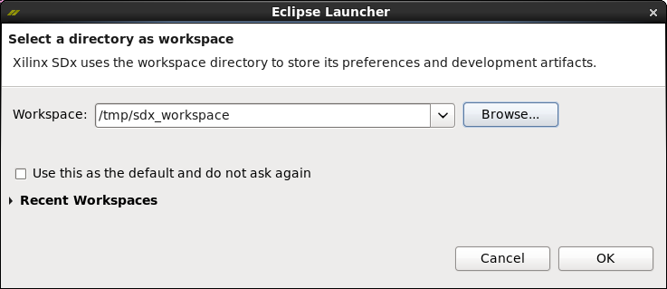
    
    >:pushpin: **NOTE:**
    >We are re-using the same SDx workspace as in Lab 2.

1.  Click **OK**.

1. In the SDx IDE Welcome screen, select **Create SDx Project**.

   As an alternative, the SDx IDE menu selection **File \> New \> SDx Project** can be used.

1.  Select **Platform** on the Project Type dialog.

   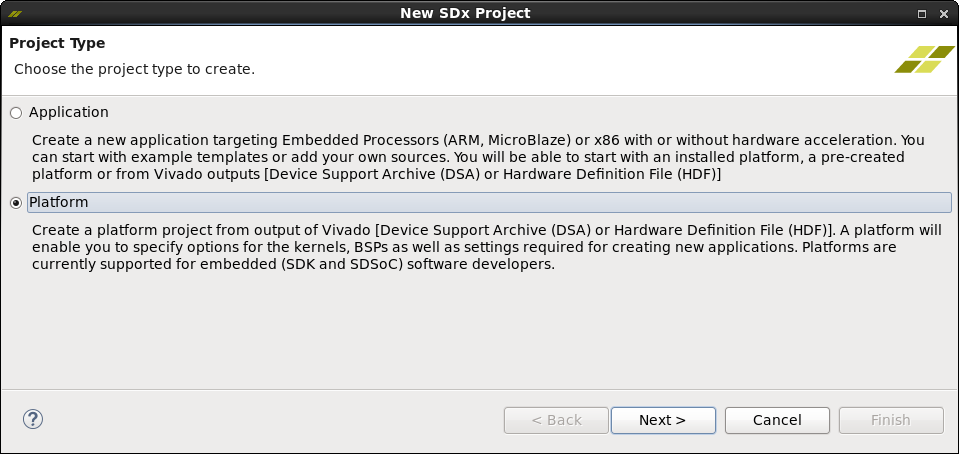

    We will create an SDSoC&trade; platform and populate it with the hardware and software components we created in the earlier labs.

2. Click **Next**.

3.  On the Platform Specification dialog.

    1. Click **Browse** to select **/tmp/sdx\_workspace/zynq7\_board.dsa** for the Hardware specification file.

    1. Leave the default to select Import software platform components.

4. Click **Finish**.

   

<big><strong>Step 2: Defining System Configuration</strong></big>

The zynq7\_board project is created and can be accessed through the Project Explorer or Assistant windows. The Editor Area window shows the four steps that we will use to generate the zynq7\_board platform.

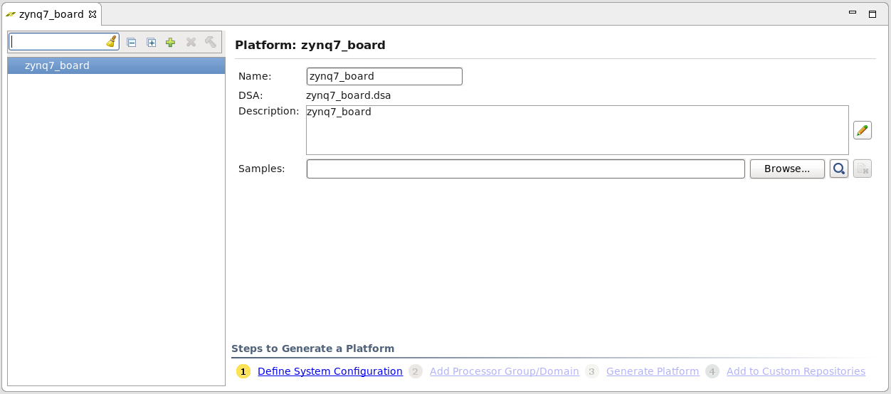

1.  Click **(1) Define System Configuration**.

    1.  Enter **standalone** in the Name text box.

    2.  Display Name will be auto-filled with same name.

    3.  Enter **standalone configuration for the zynq7\_board** in the Description text box.

    4.  For Boot Directory, click **Browse** to navigate to the **/tmp/sdx_workspace/boot** folder.

    5.  For Bif File, click **Browse** to navigate to the **/tmp/sdx_workspace/boot/platform.bif** file path.

        

    6.  Click **OK**.

        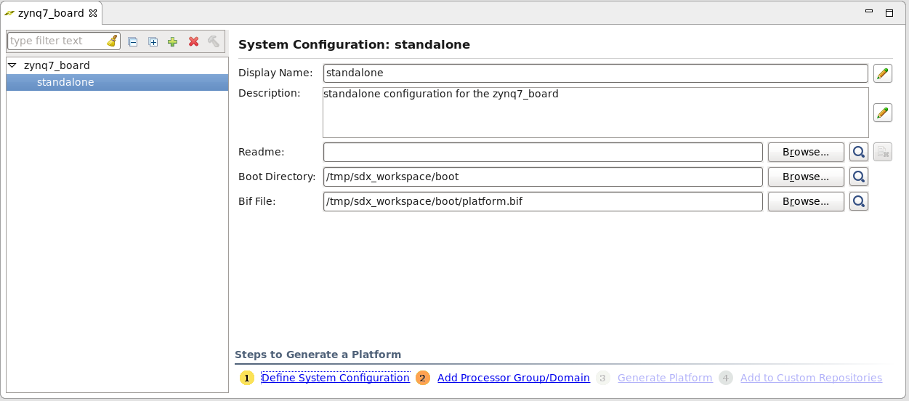

<big><strong>Step 3: Adding Processor Domain</strong></big>

1.  Click **(2) Add Processor Group/Domain**.

    1.  Enter **a9_standalone** in the Name text box.

    2.  Display Name will be auto-filled with same name.

    3.  Select **standalone** from the OS dropdown list.

    4.  Select **ps7_cortexa9_0** from the Processor dropdown list.

    5.  Select **C/C++** from the Supported Runtimes dropdown list.

    6.  For Linker Script, click **Browse** to navigate to the **/tmp/sdx_workspace/boot/lscript.ld** file path.

        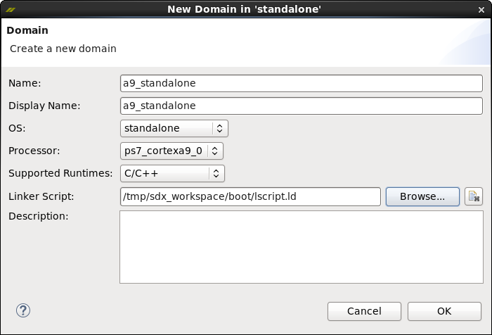

    7.  Click **OK**.

        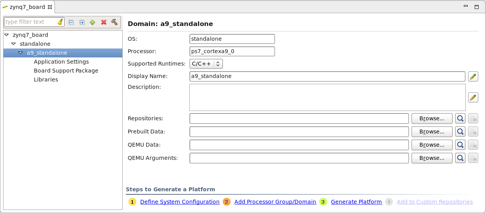

<big><strong>Step 4: Generating Platform</strong></big>

1.  Click **(3) Generate Platform**.
    The following message is displayed.
    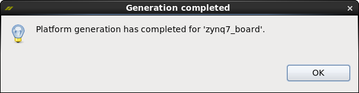

2.  Click **OK**.
    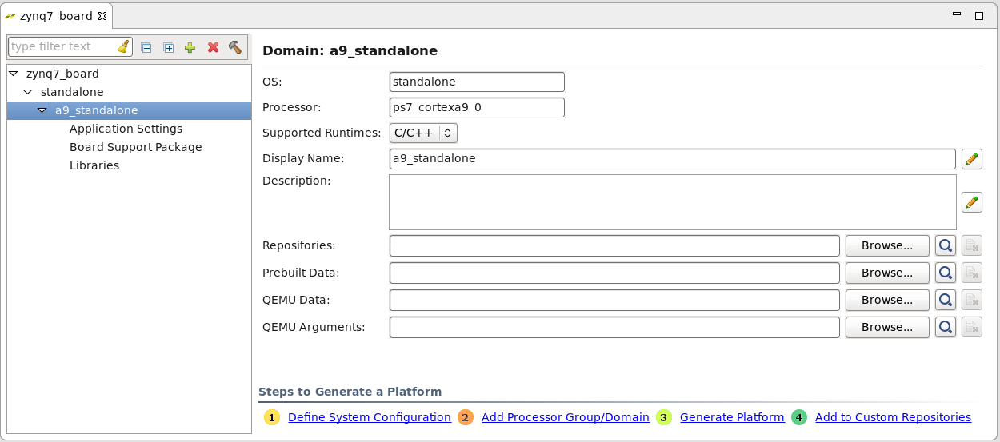

<big><strong>Step 5: Adding Custom Platform to Repository</strong></big>

1.  Click **(4) Add to Custom Repositories**.

    This will add the newly created platform to the list of platform choices we can use to build SDSoC applications.

      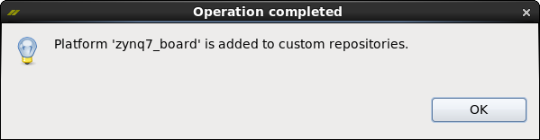

2.  Project Explorer and Assistant windows show the new zynq7_board platform.

    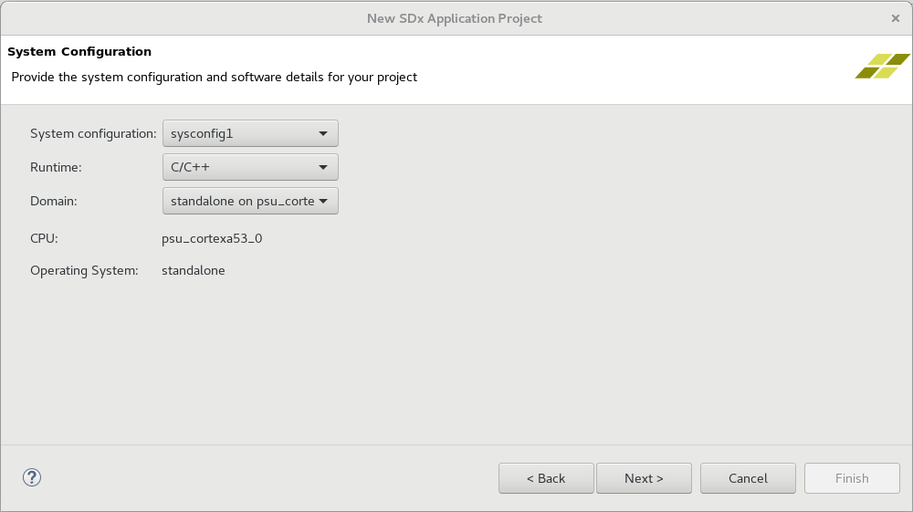

<big><strong>Step 6: Creating an SDx Application Targeting the Custom Platform</strong></big>

1.  On the SDx IDE menu, select **File \> New \> SDx Project** to begin creating a new Application project.

1.  Select **Application** on the Project Type dialog.

    You will now create an SDx application for the custom SDSoC platform we generated.

    

1.  Click **Next**.

1.  In the Create a New SDx Project dialog, type **sdx\_app1** as the Project name.

1.  Click **Next**.

    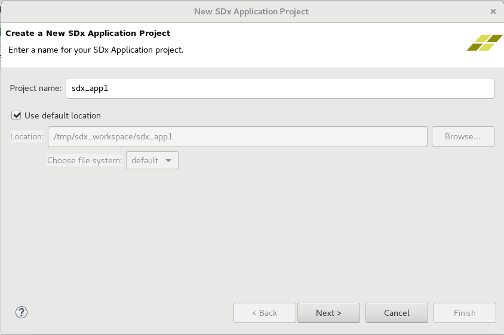

1.  In the Platform dialog, select **Platform**.

1.  Click the **zynq7_board [custom]** platform name.

    

1.  Accept the default settings in the System configuration dialog box.

    - System configuration: **standalone**
    - Runtime: **C/C++**
    - Domain: **a9_standalone**
    - CPU: ps7_cortexa9_0
    - OS: standalone
    - Output type: **Executable (elf)**
    - Check **Allow hardware acceleration**

1. Click **Next**.

   

1.  On the Templates dialog, click the **SDx Examples** button to update available templates.

    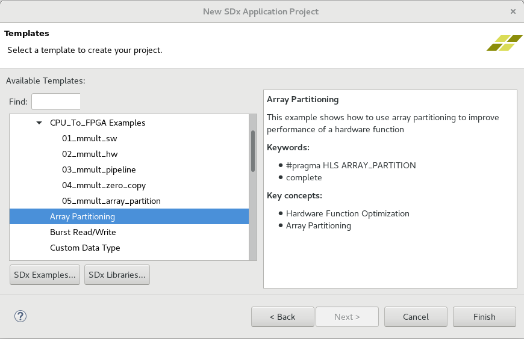

1.  On the SDx Examples dialog, you can browse the available examples. Downloaded templates will be available as templates while creating a new project.

    

1.  Click **Download** to download the **SDSoC Examples** from a repository.

    

1.  Click **OK**.

    

1. Select **Array Partitioning** and Click **Finish**.

    

   The newly created SDSoC application `sdx_app1` is shown in the Project Explorer view and the Assistant view.

   >:pushpin: **NOTE:**
   >The Assistant view shows a hardware accelerated function named `matmul_partition_accel` which is part of the Array Partitioning example.

    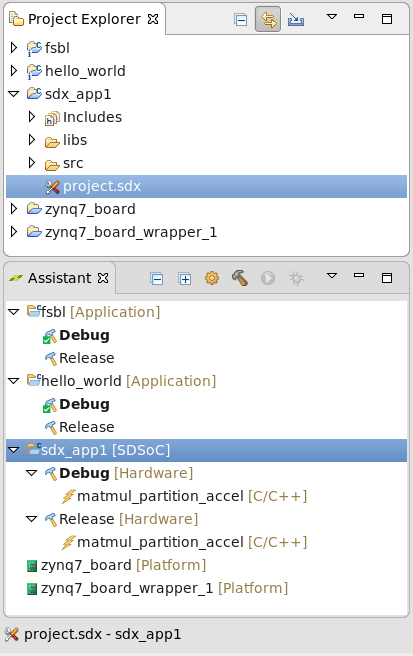

1. The Editor view show settings for `sdx_app1` in the Application Project Settings window.

    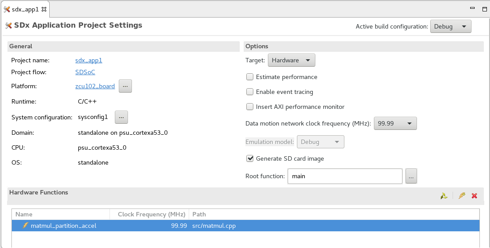

1. In the Assistant view, expand **sdx_app1 [SDSoC]**.

1. Right-click **Debug [Hardware]** and select **Build**.

   

1. Assistant view provides build results through links to the following:

   - Compilation log

   - Data motion report for accelerator

   - Generated SD card image contents

   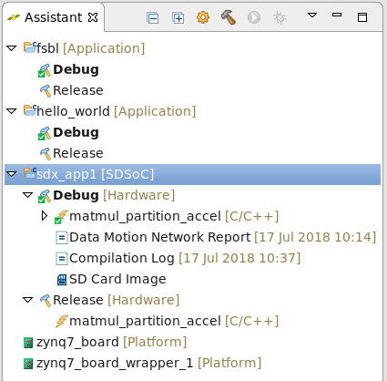

1. You can also scroll through the Console window to view the individual build steps which are captured in the **sds.log**.

    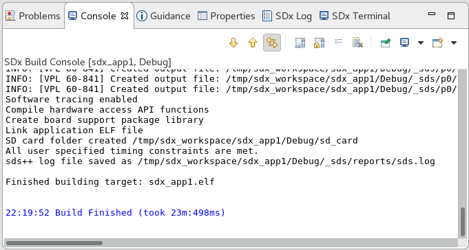

1. In the Assistant view, right-click **SD Card Image** and select **Open > Open in File Browser** to open a view to the SD Card contents on the disk. The `sd_card` directory is located in the SDx workspace at `/tmp/sdx_workspace/sdx_app1/Debug/sd_card`.

1. Copy SD card directory contents to the root directory of a FAT32 formatted SD card and boot a ZC702 board using this SD card to run and view the sdx\_app1 UART output on a terminal program.

1. You can use the same board setup and boot procedure as in the hello\_world example in Lab 2.

   

### Conclusion

In completing Lab 3, you have successfully created a custom SDSoC platform that targets the ZC702 board with a standalone software runtime environment. You have also built the SDSoC array partitioning example on top of the custom SDSoC platform (zynq7\_board). A ZC702 board was used to validate the array partitioning hardware accelerator by booting the board from an SD card and observing the application output messages.

Copyright&copy; 2018 Xilinx

