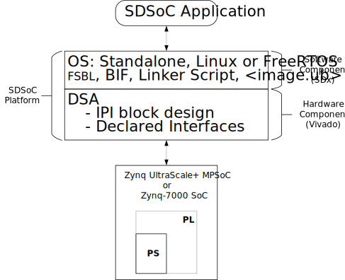

<table style="width:100%">
  <tr>

<th width="100%" colspan="6"><h1>SDSoC Platform Creation Labs</h2>
</th>

  </tr>
  <tr>
    <td width="17%" align="center">Introduction</a></td>
    <td width="16%" align="center"><a href="Lab1-Creating-DSA-for-Zynq-7000-SoC-Processor-Design.md">Lab1: Creating the DSA for a Zynq-7000 SoC Processor Design</a></td>
    <td width="17%" align="center"><a href="Lab2-Creating-Software-Components.md">Lab 2: Creating Software Components for the Platform</a></td>
    <td width="17%" align="center"><a href="Lab3-Creating-Custom-Platform-Using-the-SDx-IDE.md">Lab 3: Creating a Custom Platform Using the SDx IDE</a></td>
  </tr>
</table>

## Introduction

The SDSoC&trade; development environment provides the tools necessary for implementing heterogeneous embedded systems using the Zynq&reg;-7000 SoC or the Zynq UltraScale+&trade; MPSoC devices. 

This tutorial shows how to create an SDSoC platform on which an example SDSoC application is created and run. The Vivado&reg; Design Suite is used to create the hardware platform and the SDx&trade; Integrated Design Environment (IDE) is used to build the software platform including an SDSoC application.

The concept of a platform is integral to the SDSoC environment and it defines the hardware, software, and meta-data components that SDSoC applications build upon. An SDSoC platform defines a base hardware and software architecture along with an application context, including the processing system, external memory interfaces, custom input/output, and software runtime. The software runtime may include an operating system (possibly “bare metal”), boot loaders, drivers for platform peripherals and a root file system. Every project you create within the SDx environment targets a specific hardware platform and utilizes tools such as the sds++/sdscc (referred to as sds++) system compiler to customize the platform’s application-specific hardware accelerators and data motion networks.

  

In this tutorial, you will be guided through three labs that target a Zynq-7000 SoC-based ZC702 board operating in a standalone or bare metal software runtime environment. Step-by-step instructions are provided on how to build the hardware and software components that constitute a platform:

1.  Create the hardware component known as the Device Support Archive (DSA) for a platform.

      1. The DSA contains the IP integrator hardware design and the design meta-data properties.

2.  Create the software components for a platform, including the following:

      1. First Stage Boot Loader (FSBL)

      1. “Hello World” executable software application (ELF)

      1. Linker script that defines the heap, stack, and memory layout of an executable file (ELF)

      1. Boot Image File (BIF) that defines the files and partitions of a boot image (BOOT.bin)

         1. Boot the SD card boot image to verify hardware functionality.

3.  Create the SDSoC platform by assembling its hardware and software components

    1. Use the SDx IDE and its four (4) step process to create a custom platform.

    1. Create and run an SDSoC hardware accelerated application on the new platform.

Platforms supported by the Zynq family of devices combine an Arm-based processor system (PS) with high performance programmable logic (PL) to develop products that can be optimized by partitioning the system design across hardware and software. The figure below shows the high-level Zynq device features on which platforms are created.

  

Zynq-based platforms can utilize the PS Arm processor cores, the integrated PS I/O (MIO) peripheral blocks, the PS external DDR memory controller, the multitude of configurable PS to PL and PL to PS interfaces, as well as logic blocks designed for the PL.

For more information on the SDSoC environment, see the *SDSoC Environment User Guide* ([UG1027](https://www.xilinx.com/support/documentation/sw_manuals/xilinx2018_2/ug1027-sdsoc-user-guide.pdf)) and the *SDSoC Environment Platform Development Guide* ([UG1146](https://www.xilinx.com/support/documentation/sw_manuals/xilinx2018_2/ug1146-sdsoc-platform-development.pdf)).

<big><strong>Hardware and Software Requirements</strong></big>

This tutorial requires that you have the 2018.2 SDx tools installed. See [UG1294](https://www.xilinx.com/support/documentation/sw_manuals/xilinx2018_2/ug1294-sdsoc-rnil.pdf) for installation instructions, release notes, and licensing. All SDx environments include the Vivado Design Suite for programming the target devices and for developing custom hardware platforms. Although all the build steps can be accomplished without a target board, a ZC702 board is required for testing on hardware.

Following the instructions of this platform creation tutorial generates a ZC702 SDSoC platform for standalone target applications. For information on creating applications that run within a Linux operating system target environment, see the SDSoC Environment Platform Development Guide ([UG1146](https://www.xilinx.com/support/documentation/sw_manuals/xilinx2018_2/ug1146-sdsoc-platform-development.pdf)). Linux target applications must be built on a Linux host machine, whereas standalone target applications can be built on either a Windows or a Linux host machine.

The following is a list of minimum software and hardware requirements for this tutorial:  

  - [SDSoC 2018.2 Development Environment](https://www.xilinx.com/support/download.html)

      - [UG1294](https://www.xilinx.com/support/documentation/sw_manuals/xilinx2018_2/ug1294-sdsoc-rnil.pdf): Release Notes, Installation, and Licensing Guide

  - [ZC702 Evaluation board](http://www.xilinx.com/zc702)

      - FAT32 formatted SD card

      - USB Host Type-A to mini-USB cable for ZC702 USB to UART interface

      - Host PC USB to UART driver for Silicon Labs CP210x

          - See [XTP310](https://www.xilinx.com/support/documentation/boards_and_kits/zc702_zvik/xtp310-zc702-quickstart.pdf), the ZC702 Quick Start Guide

## Related information
 - <a href="Lab1-Creating-DSA-for-Zynq-7000-SoC-Processor-Design.md">Lab 1: Creating DSA for a Zynq-7000 SoC Processor Design</a>
 - <a href="Lab2-Creating-Software-Components.md">Lab 2: Creating Software Components for the Platform</a>
 - <a href="Lab3-Creating-Custom-Platform-Using-the-SDx-IDE.md">Lab 3: Creating a Custom Platform Using the SDx IDE</a>

Copyright&copy; 2018 Xilinx

