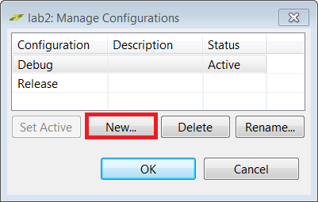

<table style="width:100%">
  <tr>
    <th width="100%" colspan="6"><h1>SDSoC Environment Tutorial: Introduction</h1>
</th>
  </tr>
  <tr>
    <td align="center"><a href="README.md">Introduction</a></td>
    <td align="center"><a href="lab-1-introduction-to-the-sdsoc-development-environment.md">Lab 1: Introduction to the SDSoC Development Environment</a></td>
    <td align="center">Lab 2: Performance Estimation</td>
    <td align="center"><a href="lab-3-optimize-the-application-code.md">Lab 3: Optimize the Application Code</a></td>
    <td align="center"><a href="lab-4-optimize-the-accelerator-using-directives.md">Lab 4: Optimize the Accelerator Using Directives</a></td>
  </tr>
  <tr>
    <td align="center"><a href="lab-5-task-level-pipelining.md">Lab 5: Task-Level Pipelining</a></td>
    <td align="center"><a href="lab-6-debug.md">Lab 6: Debug</a></td>
    <td align="center"><a href="lab-7-hardware-debug.md">Lab 7: Hardware Debug</a></td>
    <td align="center"><a href="lab-8-emulation.md">Lab 8: Emulation</a></td>
    <td align="center"><a href="lab-9-installing-applications-from-github.md">Lab 9: Installing Examples from GitHub</a></td>
</table>

## Lab 2: Performance Estimation  

This tutorial demonstrates how to obtain an estimate of the expected performance of an application, without going through the entire build cycle.  

>**:pushpin: NOTE:**  You can complete this tutorial even if you do not have a ZC702 board. When creating the SDSoC environment project, select your board and one of the available templates, if the suggested template **Matrix Multiplication and Addition** is not found. For example, boards such as the MicroZed with smaller Zynq-7000 devices offer the **Matrix Multiplication and Addition (area reduced)** application as an available template. A different application can be used to learn the objectives of this tutorial, as long as the application exits (this is a requirement to run the instrumented application on the board to collect software runtime data). Consult your board documentation for setup information.

<strong>Step 1: Setting Up the Board</strong>

You need a mini USB cable to connect to the UART port on the board, which talks to a serial terminal in the SDx IDE. This link is needed to see output (including informative messages) from the application software. You also need a micro USB cable to connect to the Digilent port on the board to allow downloading the bitstream and binaries. This is connection is needed to program the FPGA when the application is launched on the target board. You will also need an Ethernet cable. The Linux TCF agent needs an Ethernet link for communicating with the target board. Finally, you need to ensure that the jumpers to the side of the SD card slot are set correctly to allow booting from an SD card.  

  1. Connect the mini USB cable to the UART port.  

  2. Ensure that the JTAG mode is set to use the Digilent cable and that the micro USB cable is connected.  

         

  3. Set the DIP switch (circled in red above) to SD-boot mode but do not plug in an SD card.  

  4. Power on the board.  

     Ensure that you allow Windows to install the USB-UART driver and the Digilent driver to enable the SDx IDE to communicate with the board.  

     >**:warning: IMPORTANT!:** Make sure that the jumper settings on the board correspond to SD-boot or JTAG-boot. Otherwise the board may power up in some other mode such as QSPI boot, and attempt to load something from the QSPI device or other boot device, which is not related to this lab.

<strong>Step 2: Setting Up the Project for Performance Estimation and Building the Project</strong>

To create a project and use the Estimate Performance option in a build configuration:  

  1. Create a new project in the SDx™ IDE 2018.2 (`lab2`) for the ZC702 platform and Standalone as System configuration using the design template for Matrix Multiplication and Addition.  

  2. Click on the tab labeled lab to view the SDx Project Settings. If the tab is not visible, in the Project Explorer double click on the project.sdx file under the lab2 project.  

  3. In the HW Functions panel, observe that the `madd` and `mmult` functions already appear in the list of functions marked for hardware - template projects in the SDx environment include information for automating the process of marking hardware functions.

  4. If the HW Functions panel did not list any functions, you would click on the Add HW Function icon  to invoke a dialog for specifying hardware functions. Ctrl-click (press the Ctrl key and left click simultaneously) on the `madd` and `mmult` functions in the Matching elements: list and notice that they appear in the Qualified name and location: list.  

  5. You can choose an available configuration or you can create a new configuration. New configuration can be created from an existing configuration (as a starting point) or it can be created from scratch. Using the Debug build configuration or another build configuration copied from Debug will compile the code with -O0 using GCC, so the software performance will be significantly degraded. For this lab we will use the Debug configuration.  

     >**:pushpin: NOTE**  Performance estimation can be run using any build configuration. Instead of selecting Debug or Release as the Active Configuration, you could instead click on the Manage build configuration for the project icon next to the **Active build configuration**.  

       

  6. In the SDx Project Settings in the Options panel, check the Estimate Performance box. This enables the estimation flow.  

  7. The Build toolbar button provides a drop-down menu for selecting the build configuration and building the project. Clicking the Build icon builds the project. If the Estimate Performance option is checked, then performance estimation also occurs. Click the Build button on the toolbar.  

     The SDx IDE builds the project. A dialog box displaying the status of the build process appears.  

     After the build is over, you can see an initial report. This report contains a hardware-only estimate summary and has a link that can be clicked to obtain the software run data, which updates the report with comparison of hardware implementation versus the software-only information. At this point the hardware function has not been run on the hardware.  

        

<strong>Step 3: Comparing Software and Hardware Performance</strong>

>**:warning: IMPORTANT!** Ensure that the board is switched on before performing the instructions provided in this section.  

To collect software run data and generate a performance estimation report:  

  1. After the build completes, the **SDSoC Report Viewer** tab opens.  

  2. Click the **Click Here** hyperlink on the viewer to launch the application on the board.   
     The Run application to get its performance dialog box appears.  

  3. Select a pre-existing connection, or create a new connection to connect to the target board.  
       

  4. Click **OK**.  
     The debugger resets the system, programs and initializes the FPGA, and runs a software-only version of the application. It then collects performance data and uses it to display the performance estimation report.  
       

     >**:pushpin: NOTE**  As can be seen from the Summary section, the overall estimated speedup by accelerating the functions in hardware is 2.14. The Details section highlight the fact that if the functions in itself were run in hardware versus software, there would be a 56x speedup.  

<strong>Step 4: Changing Scope of Overall Speedup Comparison</strong>
  

In the Performance, speedup and resource estimation report, the Summary section shows the estimated speedup for the top-level function (referred to as perf root). This function is set to "main" by default. However, there might be code that you would like to exclude from this comparison, for example allocating buffers, initialization and setup. If you wish to see the overall speedup when considering some other function, you can do this by specifying a different function as the root for performance estimation flow. The flow works with the assumption that all functions selected for hardware acceleration are children of the root.  

  1. In case, you want to change the root function to some other function, in the SDx Project Settings window, click the browse button on the Root function field to change the root for the estimate flow to some other function instead of **main**.  
     A small R icon appears on the top left of that function listed as shown below. The selected function is a parent of the functions that are selected for hardware acceleration.  

       

  2. In the Project Explorer, right-click on the project and select Clean Project, then Build Project. In the SDx Project Settings, click on **Estimate performance** to generate the estimation report again and you get the overall speedup estimate based on the function that you selected.    

<strong>Step 5: Additional Exercises</strong>

>**:pushpin: NOTE:**  Instructions provided in this section are optional.  

You can learn how to use the performance estimation flow when Linux is used as the target OS for your application. To use the performance estimation flow with Linux:  

  1. Create a new project in the SDx™ IDE (`lab2_linux`) for the ZC702 platform and System Configuration set to Linux using the design template for Matrix Multiplication and Addition.  

  2. Click on the tab labeled lab2_linux (if the tab is not visible, in the Project Explorer tab under the lab2_linux project double click on project.sdx). In the HW Functions panel, observe that the `madd` and `mmult` functions already appear in the list of functions marked for hardware - template projects in the SDx environment include information for automating the process of marking hardware functions.  

  3. If the HW Functions panel did not list any functions, you would click on the Add HW Functions icon  to invoke a dialog for specifying hardware functions. Ctrl-click (press the Ctrl key and left click simultaneously) on the `madd` and `mmult` functions in the Matching elements: list, and notice that they appear in the Qualified name and location: list below.   

  4. In the SDx Project Settings in the Options panel, check the Estimate performance box. This enables the performance estimation flow for the current build configuration.  

  5. The Build icon provides a drop-down menu for selecting the build configuration and building the project. Clicking on the Build icon builds the project and with the Estimate performance option checked, the performance estimation flow runs. Click Build.  

     The SDx IDE builds the project. A dialog box displaying the status of the build process appears.  

  6. For this lab, you will also need an Ethernet cable to connect to the board. Ensure that the board is connected to an Ethernet router or directly to the Ethernet port on your computer using the Ethernet cable. First, copy the contents of the sd_card folder under the build configuration to an sd card and boot up the board. Then make sure that a serial terminal is also connected.  

     >**:pushpin: NOTE:**  Settings for the serial port are 115200, 8-N-1, no hardware flow control. For the ZC702, apply these settings to the Host PC COM port associated with the Silicon Labs CP210x USB to UART Bridge as seen in the Windows Device Manager or TeraTerm terminal emulation program.  

  7. Note the Linux boot log displayed on the terminal. Next, configure the Ethernet on the board.  

     1. If you have the board connected to the network, look for a line that says Sending select for 172.19.73.248…Lease of 172.19.73.248 obtained or something similar, where the IP address assigned to your board is reported. You can also type ifconfig on the terminal to obtain the IP Address of the target board. When using the command ifconfig eth0, the number displayed next to the inet addr field is the Linux IP address of the target board.  
     2. If you have connected the Ethernet cable directly to your computer, you will need to set up the IP address appropriately. Your computer must be configured so the Ethernet adapter is on the same subnetwork as the ZC702 board. On a Windows host system, open Control Panel\Network and Sharing Center, and click the Ethernet link to open the Ethernet Status dialog box for the Ethernet Adapter. Click the Properties button. Select Internet Protocol Version 4 (TCP/IPv4) and click on the Properties button. On the General tab, select Use the Following IP Address and enter `192.168.0.1`. For the Subnet mask enter 255.255.255.0. Click **OK**. Close all the dialog boxes. To set the IP address on the target board, connect to the Terminal by clicking the Terminal 1 tab towards the bottom right of the window. Click the green connection icon to connect the terminal to the target board. Settings for the serial port are the appropriate COM port, Baud Rate of 115200, Data bits 8, Stop Bits 1, Parity None and Flow Control None, the Linux boot log is displayed on the terminal. When you see the terminal prompt, set the IP address by entering ifconfig eth0 192.168.0.2  

        >**:pushpin: NOTE:**  This address is for use in the next step. If you miss this statement in the log as it scrolls by, you can obtain the IP address of the board by running the command `ifconfig` in the terminal window at the prompt.  

  8. Back in the SDx IDE in the Target Connections view, expand Linux TCF Agent and right-click on **Linux Agent (default)**, then select **Edit**.  

  9. In the Target Connection Details dialog set up the IP address (that is the IP address of the target board such as the one shown below or 192.168.0.2 if the target board was connected directly to your computer) and port (1534) and click **OK**.  

       

     >**:pushpin: NOTE**  The Host field contains target board IP address that is running the TCF agent.  

  10. Open the SDSoC Report Viewer.  

  11. Click the Click Here hyperlink on the viewer to launch the application on the board.  
      The Run application to dialog box appears.  

  12. Select the Linux Agent connection and click **OK**.  
      The SDx IDE runs a software-only version of the application. It then collects performance data and uses it to display the performance estimation report.

### Summary  

After completing this tutorial, you should be able to use the SDSoC environment to obtain an estimate of the speedup that you can expect from your selection of functions implemented in hardware.  

Copyright&copy; 2018 Xilinx

