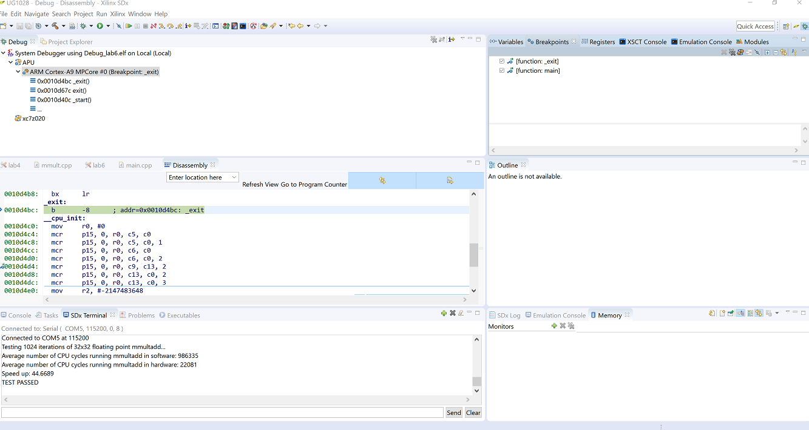

<table style="width:100%">
  <tr>
    <th width="100%" colspan="6"><h1>SDSoC Environment Platform Creation Tutorial</h1>
</th>
  </tr>
  <tr>
    <td align="center"><a href="README.md">Introduction</a></td>
    <td align="center"><a href="lab-1-introduction-to-the-sdsoc-development-environment.md">Lab 1: Introduction to the SDSoC Development Environment</a></td>
    <td align="center"><a href="lab-2-performance-estimation.md">Lab 2: Performance Estimation</a></td>
    <td align="center"><a href="lab-3-optimize-the-application-code.md">Lab 3: Optimize the Application Code</a></td>
    <td align="center"><a href="lab-4-optimize-the-accelerator-using-directives.md">Lab 4: Optimize the Accelerator Using Directives</a></td>
  </tr>
  <tr>
    <td align="center"><a href="lab-5-task-level-pipelining.md">Lab 5: Task-Level Pipelining</a></td>
    <td align="center">Lab 6: Debug</td>
    <td align="center"><a href="lab-7-hardware-debug.md">Lab 7: Hardware Debug</a></td>
    <td align="center"><a href="lab-8-emulation.md">Lab 8: Emulation</a></td>
    <td align="center"><a href="lab-9-installing-applications-from-github.md">Lab 9: Installing Applications from GitHub</a></td>
</table>

## Lab 6: Debug  

This tutorial demonstrates how to use the interactive debugger in the SDx IDE.  

First, you target your design to a standalone operating system or platform, then, run your standalone application using the SDx IDE, and finally, debug the application.  

In this tutorial you are debugging applications running on an accelerated system.  

>**:pushpin: NOTE**  You can complete this tutorial even if you do not have a ZC702 board. When creating the SDx project, select your board and one of the available applications if the suggested template **Matrix Multiplication and Addition** is not found. For example, boards such as the MicroZed with smaller Zynq-7000 devices offer the **Matrix Multiplication and Addition (area reduced)** application as an available template. Any application can be used to learn the objectives of this tutorial.  

<strong>Step 1: Setting Up the Board</strong>

You need a mini USB cable to connect to the UART port on the board, which talks to a serial terminal in the SDx IDE. This link is needed to see output (including informative messages) from the application software. You also need a micro USB cable to connect to the Digilent port on the board to allow downloading the bitstream and binaries. This is connection is needed to program the FPGA when the application is launched on the target board. You will also need an Ethernet cable. The Linux TCF agent needs an Ethernet link for communicating with the target board. Finally, you need to ensure that the jumpers to the side of the SD card slot are set correctly to allow booting from an SD card.  

  1. Connect the mini USB cable to the UART port.  

  2. Ensure that the JTAG mode is set to use the Digilent cable and that the micro USB cable is connected.  

         

  3. Set the DIP switch (circled in red above) to SD-boot mode but do not plug in an SD card.  

  4. Power on the board.  

Ensure that you allow Windows to install the `USB-UART` driver and the `Digilent` driver to enable the SDx IDE to communicate with the board.  

>**:information_source: IMPORTANT!** Make sure that the jumper settings on the board correspond to SD-boot or JTAG-boot. Otherwise the board may power up in some other mode such as QSPI boot, and attempt to load something from the QSPI device or other boot device, which is not related to this lab.

<strong>Step 2: Creating a Standalone Project</strong>

  Create a new SDx™ project (lab6) for the ZC702 platform and Standalone OS using the design template for Matrix Multiplication and Addition.  

  To create a standalone project in the SDx IDE:  

 1. Launch the SDx IDE.  
 2. Select **File > New > SDx Project**.  
 3. In the Project Type page, Application Project is selected by default. Click **Next**.  
 4. Specify the name of the project (for example, lab6) in the Project name field. Click **Next**.  
 5. From the Platform list, select zc702. Click **Next**.  
 6. From the System Configuration drop-down list, select Standalone. Click **Next**.  
 7. From the list of application templates, select **Matrix Multiplication and Addition** and click **Finish**.  
 8. Click on the tab labeled lab6 to select the SDx Project Settings (if the tab is not visible, double click the project.sdx file in the Project Explorer) and in the HW functions panel, observe that the `mmult` and `madd` functions were marked as hardware functions when the project was created.  
 9. If hardware functions were removed or not marked, you would click on the Add HW Functions icon  to invoke the dialog box to specify hardware functions. Ctrl-click (press the Ctrl key and left click) on the `mmult` and `madd` functions to select them in the Matching Elements list. Click OK and observe that both functions have been added to the Hardware Functions list.  
 10. In the Project Explorer right-click the project and select Build Project from the context menu that appears.  
     SDx builds the project. A dialog box displaying the status of the build process appears.  

<strong>Step 3: Setting up the Debug Configuration</strong>

  To set up the debug configuration:  

  1. In the Project Explorer view click on the top level project (`lab6`) in the Debug folder in the lab6 project and in the toolbar click on the Debug icon or use the Debug icon pull-down menu to select **Debug As > Launch on Hardware (SDx Application Debugger)**. Alternatively, right-click the project and select **Debug As > Launch on Hardware (SDx Application Debugger)**.
     The Confirm Perspective Switch dialog box appears.  

    >**:information_source: IMPORTANT!** Ensure that the board is switched on before debugging the project.  

  2. Click Yes to switch to the debug perspective.  
     You are now in the Debug Perspective of the SDx IDE. Note that the debugger resets the system, programs and initializes the device, then breaks at the `main` function. The source code is shown in the center panel, local variables in the top right corner panel and the SDx log at the bottom right panel shows the Debug configuration log.  

  3. Before you start running your application you need to connect a serial terminal to the board so you can see the output from your program. Use the following settings: (Connection Type: Serial, Port: COM<n>, Baud Rate: 115200 baud).  

<strong>Step 4: Running the Application</strong>

  Click the Resume icon  to run your application, and observe the output in the terminal window.  

  >**:pushpin: NOTE:**  The source code window shows the `_exit` function, and the terminal tab shows the output from the matrix multiplication application.  

    

<strong>Additional Exercises</strong>

>**:pushpin: NOTE**  Instructions provided in this section are optional.  

  You can learn how to debug/step through the application and debug a Linux application.    

  

  
<strong>Stepping Through the Code</strong>
  

  The Debug perspective has many other capabilities that have not been explored in this lab. The most important is the ability to step through the code to debug it.  

  1. Continuing in lab6, right-click debug hierarchy in the Debug view (System Debugger using Debug_lab6.elf), and click Disconnect in the menu.  
  2. Right-click the top-level debug folder again, and click Remove all Terminated in the menu.  
  3. Click on the BUG icon to launch the debugger. Then step through the code using the step-into, step-over, and step-return buttons.  
  4. As you step through the code, examine the values of different variables.  

  

  

  
<strong>Debugging Linux Applications</strong>

  To debug a Linux application in the SDSoC environment:  

  1. Create a project, for example lab6_linux, targeted to the Platform ZC702 and the System Configuration Linux. From the list of application templates, select Matrix Multiplication and Addition.  
     For details, see [Creating a New Project](drw1517355484536.md).  

  2. Observe that the functions mmult and madd are marked for hardware implementation in the HW functions table of the SDx Project Settings.  
     For details, see [Marking Functions for Hardware Implementation](mey1517355484594.md).  

  3. Build a project and generate executable, bitstream, and SD card boot png. For the Active build configuration, use Debug.  
     For details, see [Building a Design with Hardware Accelerators](rof1517355816863.md).  

  4. Here we are using the SDSoC environment Terminal view invoked from Window > Show View > Other and selecting Terminal > Terminal. Click the Terminal tab near the bottom of the Debug window and confirm the settings (Connection Type: Serial, Port: COM<n>, Baud Rate: 115200 baud).  
     For the COM port settings to be visible,the board must be powered up:  

      * Power up the board without an SD card plugged in.  
      * Click on the Terminal Settings icon , set the configuration and click OK.  
      * The terminal indicates it is connected. Click the red disconnect icon  to disconnect the terminal from the board, and power off the board.  

  5. Copy the contents of the generated `sd_card` directory to an SD card, and plug the SD card into the ZC702 board.  
  6. Ensure that the board is connected to your computer via an Ethernet cable.
     1. Power on the board.
     2. Click on the Terminal tab and click the green connection icon to connect the terminal to the board.
        The Linux boot log is displayed on the terminal.
     3. When you see the terminal prompt, set the IP address by entering `ifconfig eth0 192.168.0.2`. Your computer must be configured so the Ethernet adapter is on the same subnetwork as the ZC702 board.
        1. On a Windows host system, open **Control Panel > Network and Sharing Center**.
        2. Click the **Ethernet** link to open the Ethernet Status dialog box for the Ethernet Adapter.
        3. Click the Properties button.
        4. Select Internet Protocol Version 4 (TCP/IPv4) and click on Properties button.
        5. On the General tab, select Use the Following IP Address and enter `192.168.0.1`. For the Subnet mask, enter 255.255.255.0.
        6. Click OK. Close all the dialog boxes.  

      If your subnetwork already has a device at `192.168.0.1`, you can choose another address, as long as it begins with `192.168.0.x`.  

  7. Back in the SDx environment in the Target Connections panel, expand Linux TCF Agent and right-click on Linux Agent (default), then select Edit.  
  8. In the Target Connection Details dialog set up the IP address and port (1534).  

       

  9. Click OK.  
  10. In the Project Explorer click on the ELF file to select it and click on the Debug icon in the toolbar (or use the Debug icon pull-down menu to select Debug As > Launch on Hardware (SDx Application Debugger)) to go to the Debug perspective, and run or step through your code.  

  >**:pushpin: NOTE**  Your application output displays in the Console view instead of the Terminal view.

### Summary

After completing this tutorial, you should be able to do the following:

  * Use the SDx IDE to download and run your standalone application.  
  * Optionally step through your source code in the SDx IDE (debug mode) and observe various registers and memories. Note that this is limited to code running on the ARM A9, and does not apply to code that has been converted into hardware functions.  

Copyright&copy; 2018 Xilinx

