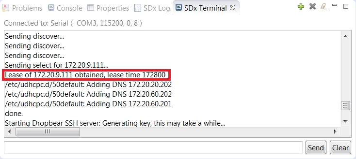

<table style="width:100%">
  <tr>
    <th width="100%" colspan="6"><h1>SDSoC Environment Platform Creation Tutorial</h1>
</th>
  </tr>
  <tr>
    <td align="center"><a href="README.md">Introduction</a></td>
    <td align="center"><a href="lab-1-introduction-to-the-sdsoc-development-environment.md">Lab 1: Introduction to the SDSoC Development Environment</a></td>
    <td align="center"><a href="lab-2-performance-estimation.md">Lab 2: Performance Estimation</a></td>
    <td align="center"><a href="lab-3-optimize-the-application-code.md">Lab 3: Optimize the Application Code</a></td>
    <td align="center"><a href="lab-4-optimize-the-accelerator-using-directives.md">Lab 4: Optimize the Accelerator Using Directives</a></td>
  </tr>
  <tr>
    <td align="center"><a href="lab-5-task-level-pipelining.md">Lab 5: Task-Level Pipelining</a></td>
    <td align="center"><a href="lab-6-debug.md">Lab 6: Debug</a></td>
    <td align="center">Lab 7: Hardware Debug</td>
    <td align="center"><a href="lab-8-emulation.md">Lab 8: Emulation</a></td>
    <td align="center"><a href="lab-9-installing-applications-from-github.md">Lab 9: Installing Applications from GitHub</a></td>
</table>

## Lab 7: Hardware Debug  

This lab provides step-by-step instructions to create a project, enable trace, run the application, and view the trace visualization. This tutorial assumes that the host PC is connected directly to the Zynq-7000 board, and that the board is a Xilinx ZC702 board. This tutorial is applicable to other boards and configurations. However, the details of the steps might differ slightly. The  
tutorial assumes you have already installed and started the SDx IDE and chosen a workspace.   

>**:pushpin: NOTE**  You can complete this tutorial even if you do not have a ZC702 board. When creating the SDx environment project, select your board and one of the available templates, if the suggested template **Matrix Multiplication** is not found. For example, boards such as the MicroZed with smaller Zynq-7000 devices offer the **Matrix Multiplication (area reduced)** application as an available template. Any application can be used to learn the objectives of this tutorial.  

### Tracing a Standalone or Bare-Metal Project  

You can learn how to create a new project, configure the project to enable the  
SDSoC trace feature, build the project, and run the application on the board.  

<strong>Step 1: Creating a New Project</strong>
  

1. Select **File > New > SDx Project**.  
2. In the Project Type page, **Application Project** is selected by default. Click **Next**.   
3. In the Create a New SDx Project page, name the project `mmult_trace` and click **Next**.  
4. In the Platform page, select **zc702** and click **Next**.  

   >**:pushpin: NOTE**  Select the appropriate platform if you are using something other than the ZC702 board.  

5. Select **Standalone OS** as the System Configuration.  
6. Select **Matrix Multiplication Data Size** as the template for this project and click **Finish**.  
7. In the Project Explorer, expand the various folders by clicking on the arrow, then open the `mmult.cpp` file.

     

8. Change the number of tests symbol NUM_TESTS from 256 to 10, then save and close the file.  

     

9. In the SDx Project Settings (in the mmult_trace tab), notice that mmult_accel in the HW Functions section of the project overview is already marked for implementation in hardware.  

     

<strong>Step 2: Configuring the Project to Enable the Trace Feature in the Options Section</strong>
  

In the Project Settings window, click the checkbox for Enable event tracing.   

  

<strong>Step 3: Building the Project</strong>

Click the Build button to start building the project. (This will take a while.)  

After all the hardware functions are implemented in Vivado HLS, and after the Vivado IP integrator design is created, you will see `Inserted # hardware monitor cores` displayed in the console. This message validates that the trace feature is enabled for your design and tells you how many hardware monitor cores have been inserted automatically for you.  

  

<strong>Step 4: Running the Application on the Board</strong>
  

  1. When the build is finished, right-click on the project in the Project Explorer and select **Run As > Trace Application (SDx Application Debugger)**.  

     >**:pushpin: NOTE**  Be sure not to select **Debug As** because it will enable breakpoints. If your program breakpoints during execution, the timing will not be accurate (because the software will stop, the hardware will continue running, and the trace timer used for timestamping will continue to run).  

     When you click on the **Trace Application (SDx Application Debugger)** option, the GUI downloads the bitstream to the board followed by the application ELF, starts the application, and then begins collecting the trace data produced until the application exits. After the application finishes (or any error in collecting the trace data occurs) the trace data collected is displayed.  

     >**:pushpin: NOTE**  The application must exit successfully for trace data to be collected successfully. If the application does not exit normally (i.e., hangs in hardware or software, or the Linux kernel crashes), the trace data might not be collected correctly.  

       

  2. After the application exits, and all trace data is collected and displayed, you will see two main areas in the trace visualization: the event textual listing on top (yellow highlighted border), and the event timeline on the bottom (purple highlighted border). Both areas display the same information. The top textual listing orders event by time in a descending order. The bottom event timeline shows the multiple axes for each trace point in the design (either a monitor core or a region of software that is being traced).   

       

     The first thing you should notice is that the 10 iterations of the application are clearly visible as repeated groups of events. Orange events are software events, green events are accelerator events, and blue events are data transfer events. You can also click the **Show Legend** icon to see the transactions specified by different colors.

       

     This opens the **State Transition Visualizer** dialog box as shown below.

       

  3. If the names of the trace points in the event timeline are abbreviated with an ellipsis ("...") you can expand the panel by clicking on the border between the grey on the left and the white on the right (the border turns red when you hover the cursor over the right spot), and then clicking and dragging to the right.  

         

  4. If you hover the cursor over one of the events, you will see a detailed tool-tip appear displaying the detailed information about each trace. The example below shows the first accelerator event, which corresponds to the start/stop of the `mmult_accel` function that we chose to implement in hardware (via Vivado HLS). The start time is at 0.002122960 seconds (2,122 ns) and the stop time is at 0.003850640 seconds (3,850 ns). It also shows the duration of the event (which is the runtime of the accelerator in this case) as 0.001727680 seconds (1,727 ns).   

       

<strong>Step 5: Tracing a Linux Project</strong>
  

You can learn how to create a new project, configure the project to enable the SDx trace feature, build the project, run the application on the board, and view the trace data.  

  1. Create a new project.  
     1. Select **File > New > SDx Project**.  
     2. In the Project Type page, **Application Project** is selected by default. Click **Next**.  
     3. In the New Project wizard, name the project `mmult_linux_trace` and click **Next**.  
     4. Select zc702 as the Hardware Platform. Click **Next**.  
     5. For System configuration select **Linux**.  
     6. Click **Next**.  
     7. Select **Matrix Multiplication Data Size** as the template for this project and click **Finish**.  
     8. In the Project Explorer, expand the various folders by clicking on the arrow icon, then open the `mmult.cpp` file under the src folder.  

              

     9. Change the number of tests symbol NUM_TESTS from **256** to 10, then save and close the file.  

            

     10. In the SDx Project Settings (in the mmult_linux_trace tab), notice that the mmult_accel in the HW Functions section of the project overview is already marked for implementation in hardware.  

  2. Configure the project to enable the Trace feature in the SDx IDE.  
     In the Project Overview window, click the checkbox for Enable Event Tracing under the Options section.  

  3. Build the project.  
     Click the Build button to start building the project. (This will take a while.)  

     After all the hardware functions are implemented in the Vivado HLS, and after    the Vivado IP integrator design is created, you will see `Inserted # hardware monitor cores` displayed in the console. This message validates that the trace feature is enabled for your design and tells you how many hardware monitor cores have been inserted automatically for you.    

         

       

  4. Run the application on the board.  
     1. When the build is finished, copy the files in the sd_card directory onto an SD card and insert into the SD card socket on the board.  
     2. Connect an Ethernet cable to the board (connected to your network, or directly to the PC).  
     3. Connect the USB/UART port to the PC and open a serial console by clicking the + button on the SDx Terminal tab.  
     4. Connect the USB/JTAG port to the PC and boot Linux on the board.  
     5. Check the IP address of the zc702 board by looking at the SDx Terminal log.

          

  6. From the Target Connections view, set up the Linux TCF Agent as in [Using the Performance Estimation Flow With Linux](lab-2-performance-estimation.md).  

  7. Right-click on the project in the Project Explorer and select **Run As > Trace Application (SDx Application Debugger)**.  

     >**:pushpin: NOTE**  Be sure not to select Debug As, because it will enable breakpoints. If your program breakpoints during execution, the timing will not be accurate (because the software will stop, the hardware will continue running, and the trace timer used for timestamping will continue to run).  

     When you click on the Trace Application (SDx Application Debugger) option, the GUI downloads the ELF over the Ethernet TCF Agent connection, starts the application, and then begins collecting the trace data produced until the application exits. After the application finishes (or any error in collecting the trace data occurs) the trace data collected is displayed.  

     >**:pushpin: NOTE**  The application must exit successfully for trace data to be collected successfully. If the application does not exit normally (i.e., hangs in hardware or software, or the Linux kernel crashes), the trace data might not be collected correctly.  

  5. View the trace data. After the application exits, all trace data is collected and displayed.

<strong>Step 6: Viewing Traces</strong>

  1. After you have run the application and collected the trace data, an archive of the trace is created and stored in the build directory for that project in `<build_config>/_sds/trace`.  
  2. To open this trace archive, right click on it and select Import and Open AXI Trace.  
     The other files in the `_sds/trace folder are metadata and sdsoc_trace.tcl`. These files are produced during the build. They are used to extract the trace data and create the trace visualization archive. If you remove or change these files, you will not be able to collect the trace data and will need to perform a Clean and Build to regenerate them.  

Copyright&copy; 2018 Xilinx

